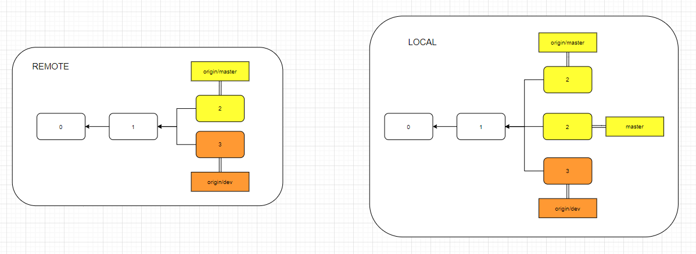
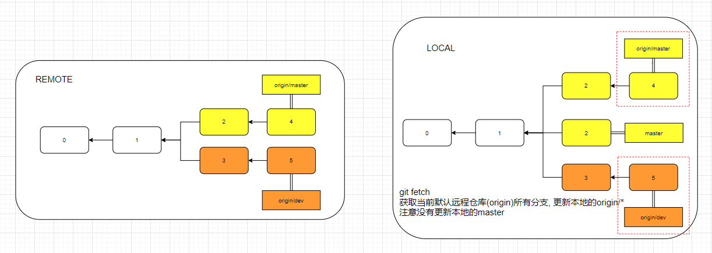
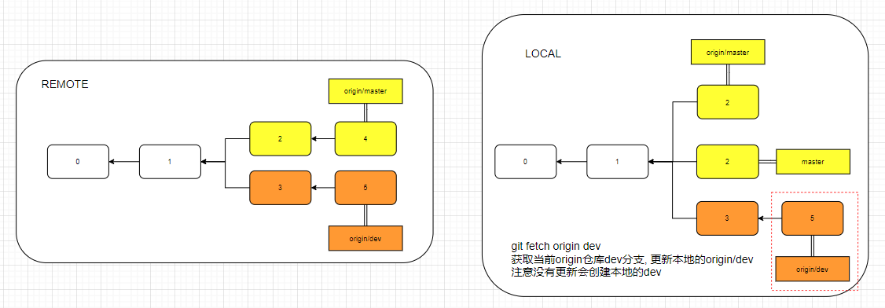

# fetch


`git fetch`只负责将远程分支复制到本地，比如将`remote/master`复制到本地的`origin/master`
## api说明
更新本地的远程分支(origin/*)
`get fetch [ORIGIN] [R-BRANCH] [L-BRANCH]`
- `git fetch` 不带参数则是默认拉取远程ORIGIN仓库, 所有分支(origin/*)
- `ORIGIN` 拉取远程仓库的名称, 默认origin
- `R-BREANCH` 拉取远程仓库的分支名, 在本地的名称为(origin/R-BRANCH)
- `L-BRANCH` 来取远程残酷的分支,并更新本地对应的分支
## 应用

1. git fetch |这将更新git remote 中所有的远程repo 所包含分支的最新commit-id, 将其记录到.git/FETCH_HEAD文件中
2. git fetch remote_repo |这将更新名称为remote_repo 的远程repo上的所有branch的最新commit-id，将其记录。 
3. git fetch remote_repo remote_branch_name |这将这将更新名称为remote_repo 的远程repo上的分支： remote_branch_name
4. git fetch remote_repo remote_branch_name:local_branch_name |这将这将更新名称为remote_repo 的远程repo上的分支： remote_branch_name ，并在本地创建local_branch_name 本地分支保存远端分支的所有数据。

总结起来, fetch的应用就是:
```s
git fetch origin master //从远程的origin仓库的master分支下载代码到本地的origin/master
git log -p master.. origin/master //比较本地的仓库和远程参考的区别
git merge origin/master //把远程下载下来的代码合并到当前的分支
```
注意是当前的分支,而不是对应名字的分支。也就是说，如果当前的分支是`dev`，执行`git merge`，则是将`origin/master`与`dev`合并，而不是和本地的`master`合并。

另一个简单的写法是：
```s
git fetch origin branch1:branch2
```
首先执行上面的fetch操作，使用远程branch1分支在本地创建branch2(但不会切换到该分支).
如果本地存在branch2分支, 则是使用`fast forward'方式合并分支


## 原理
1. 假设以下仓库, 通过`git clone`到本地

本地会创建`origin/master`,`origin/dev`及`master`(`origin/master`复制的)三个分支, 且`HEAD`指针指向`master`分支.

2. 远程仓库的两个分支`origin/master`和`origin/dev`都有了更新.
   - `git fetch`命令进行本地更新.
   `git fetch`是对所有`origin/*`(这里是`origin/master`,`origin/dev`)远程分支进行更新, 比如但不会对本地`master`分支进行更新
   
   如果需要更新本地的`master`分支, 则需要使用`git merge origin master`

   - 本地使用`git fetch origin dev`更新, 指定分支.
   本地没有`dev`分支, 不会创建, 即使有也不会更新. 因为`fetch`只更新`origin/*`的分支
   


理解`fetch`的关键, 是理解`FETCH_HEAD`. 它的含义是某个`branch`在远程服务器上的最新状态. 这个列表保存在`.Git/FETCH_HEAD`文件中, 每一行对应一个分支.
- 当使用`git fetch`时, 远程分支的`master`将作为`FETCH_HEAD`
- 当使用`git fetch origin dev`时, 远程分支的`dev`将作为`FETCH_HEAD`
`* branch  dev     -> FETCH_HEAD`

* branch            source     -> FETCH_HEAD

参考:
https://www.cnblogs.com/todototry/p/4095626.html