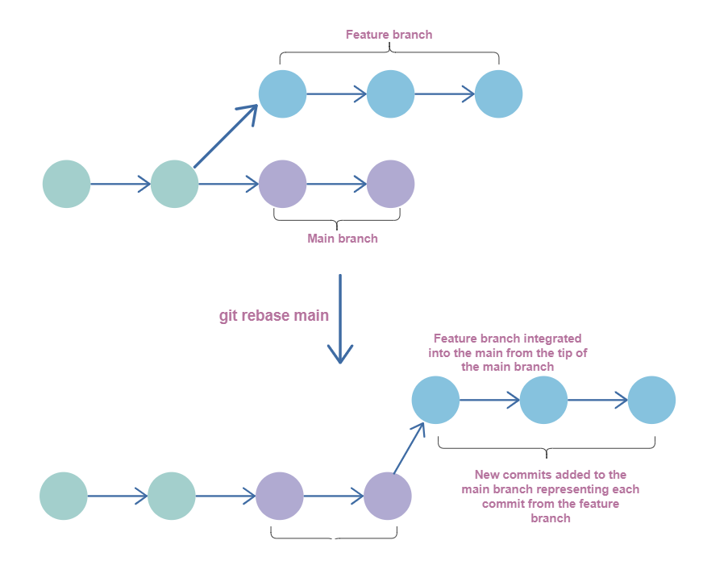

# rebase


git rebase: 更改当前分支的根基(Move the base of a branch)


## 命令
`git rebase -i [<upstream> [<branch>]]`

参数|描述
--|--
`branch`|默认停留在当前的分支, 如果指定`branch`, 则自动执行`git switch <branch>`
`<upstream>`|默认指向输入的`<branch>`, 如果不指定`<branch>`或`<upstream>`, 则会退出


## 应用
### 替换`merge`

`git rebase branch`




### 更改指定提交的信息

假设有提交`A-B-C-D-E-F`, `HEAD`指向`F`, 需要修改`C`和`D`的 author.

1. `git rebase -i B`, 将`C-D-E-F`取出, 并将`B`作为base

2. 将`C`和`D` 之前的`pick` 更改为`edit`

3. 退出编辑器(在`vim`中是`:wq`)

4. `rebase`会在`C`暂停

5. 使用`git commit --amend --author="Author Name <email@address.com>"` 重新提交`C`

6. 再次执行`git rebase --continue`

7. `rebase`会在`D`暂停

8. `git commit --amend --author="Author Name <email@address.com>"` 重新提交`D`

9. `rebae`完成

10. `git push -f` 更新`origin`


### 更改提交顺序

假设有提交`A-B-C-D-E-F`, `HEAD`指向`F`, 需要修改`C`和`D`的顺序

1. `git rebase -i B`, 将`C-D-E-F`取出, 并将`B`作为base

2. `C`和`D` 两行进行替换即可


### 合并多次提交
假设有提交`A-B-C-D-E-F`, `HEAD`指向`F`, 需要将`C`,`D`,`E`进行合并

1. `git rebase -i B`, 将`C-D-E-F`取出, 并将`B`作为base

2. 将`C`,`D`,`E`之前的个`pick`更改为`squash`


### 分开一次提交


### 替代`--amend`

`--amend`只能合并上一次的提交, 而`git rebase`可以合并指定的提交

假设有提交`A-B-C-D-E-F`, `HEAD`指向`F`, 需要使用`F`的提交和`C`的提交进行合并


1. `git rebase -i B`, 将`C-D-E-F`取出, 并将`B`作为base

2. 将`F`提交放在`C`后, 并将`F`前面的`pick`更改为`fixup`(修复上面的的)


## `--root`

当我们进行3次提交后, 使用`git rebase -i HEAD^3`会报错, 因为第一个提交是`root`, 也就是说只能`git rebase -i HEAD~2`, `root commit`不能获得, 如果想获得, 需要执行`git rebase -i --root`


## continue

`git reabse --continue --abort`
在使用-i交互模式时,处理conflict会中断,要使用--continue来恢复交互模式


## 命令

```sh
pick：保留该commit（缩写:p）
reword：保留该commit，但我需要修改该commit的注释（缩写:r）
edit：保留该commit, 但我要停下来修改该提交(不仅仅修改注释)（缩写:e）
squash：将该commit和前一个commit合并（缩写:s）
fixup：将该commit和前一个commit合并，但我不要保留该提交的注释信息（缩写:f）
exec：执行shell命令（缩写:x）
drop：我要丢弃该commit（缩写:d）
```


https://git-rebase.io/
https://www.educative.io/answers/what-is-the-git-rebase-branch-name-command
https://stackoverflow.com/questions/3042437/how-to-change-the-commit-author-for-one-specific-commit
https://git-scm.com/docs/git-rebase