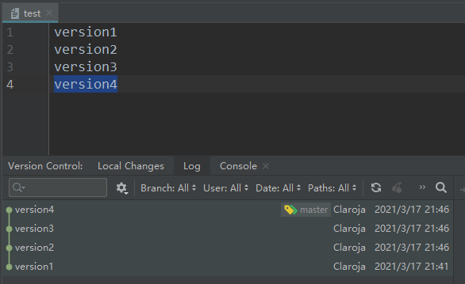
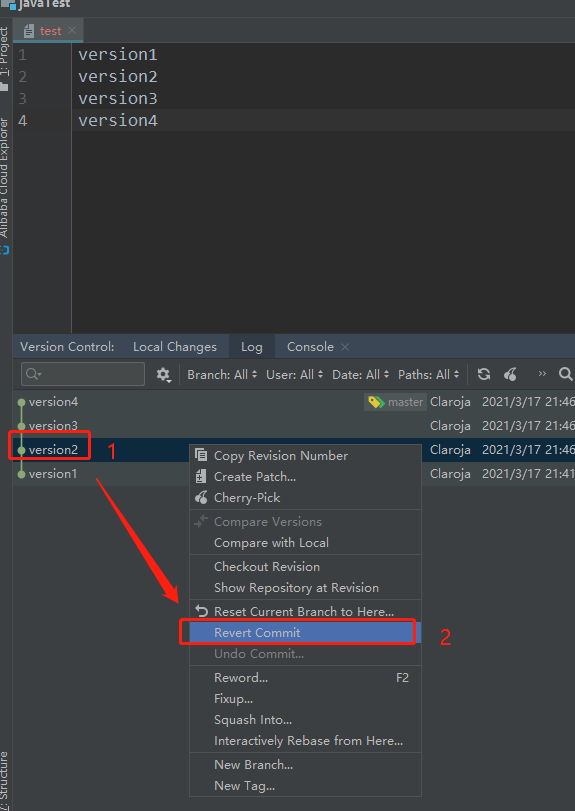
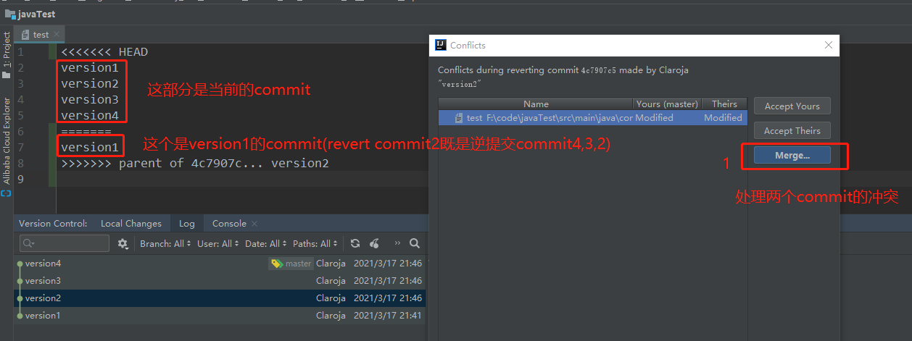
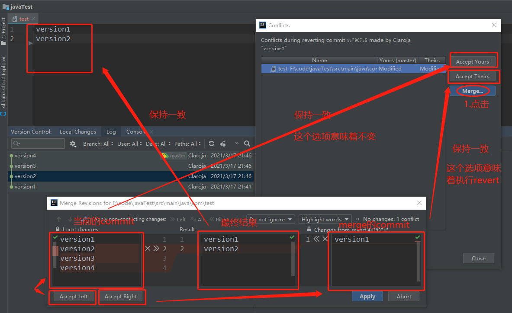
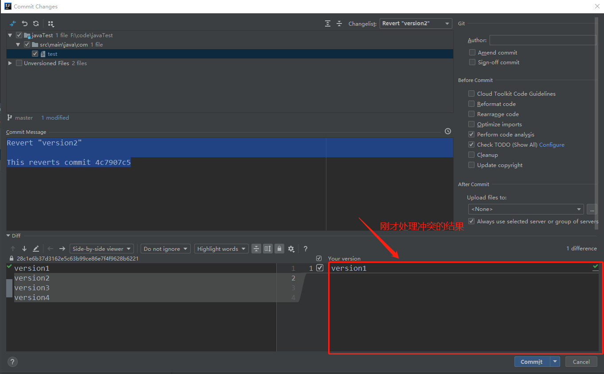

# revert


## idea演示
1.准备数据,每次提交一行

2.revert 到version2

3.弹出冲突

4.处理冲突

5.跳出正常的commit处理界面



## git 命令操作
以上操作相当于
```shell
//1.指定revert的commit,HEAD~2是自身以0为起点,数三个commit(version2),然后用下一个(version1)的commit来merge
git revert HEAD~2//或者git revert 4c7907(version的id)
//2.处理冲突
处理冲突
//3.继续
git revert --continue
//4.冲突后的文件修改
git add ./
//5.提交
git commit -m 'Revert Version2'
```
