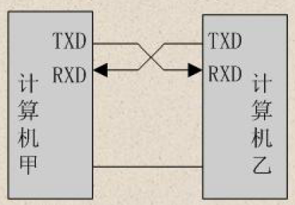

# 连续_分位点

1. keil_v5：是程序编写的ide
  - 安装
  - 激活keil：
    点击`File`
    点击`license Management`
    根据`Computer ID` 获得 `New License ID Code`
    点击 `Add LIC`

2. stc-isp：烧录程序，绿色软件

3. ch340：驱动
  - 连接usb, 给板子供电
  - 双击驱动安装程序UsbToUartDriver
  - `设备管理器`中可以在`端口(COM和LPT)`看到`USB-SERIAL CH340(COM6)`

4. vscode
  - 下载`Keil Assistant`和`c/c++`
  - 配置`Keil Assistant`的Keil 51执行路径 `D:\Program Files\Keil_v5\UV4\UV4.exe`
  - 配置依赖(.h文件)。打开当前工程`.vscode`目录下`c_cpp_properties.json`文件, 在`includePath`中加入Keil的头文件目录`D:\\Program Files\\Keil_v5\\C51\\INC\\Atmel`
  - 使用vscode打开文档目录
  - 点击`KEIL UVISION PROJECT`栏，添加keil工程文件`.uvproj`

单片机，英文Micro Controller Unit，简称MCU
内部集成了CPU（运算控制）、RAM（Random Access Memory，内存）、ROM（Read Only Memory，硬盘）、输入和输出设备（IO）、定时器、中断系统等一系列电脑的常用硬件功能
单片机的任务是信息采集（依靠传感器）、处理（依靠CPU）和硬件设备（例如电机，LED等）的控制
单片机跟计算机相比，单片机算是一个袖珍版计算机，一个芯片就能构成完整的计算机系统。


51单片机是指80年代Intel开发的8051单片机内核的统称，就是因为这个“8051”有个51，所以凡是与“8051”内核一样的单片机都统称为51系列单片机。
51单片机是对所有兼容 Intel 8031指令系统的单片机的统称。


## 命名规则


## 单片机管脚图


1. 所有P*都是IO口，有四组，每组八个引脚(8位CPU)
2. Vcc是电源正极，Gnd是电源负极，这两个口用来给CPU供电
3. XTAL1和XTAL2外接晶振给单片机提供时钟
4. RST(reset)复位


## 单片机最小系统


所属系列：51单片机系列
公司：STC公司
位数：8位
RAM：512字节
ROM：8K（Flash）
工作频率：12MHz（本开发板使用）


TTL 高电平 5V 等价1 低电平0V等价0
RS232 高电平 12V 低电平-12V

VOH： 输出 逻辑电平1
VOL： 输出 逻辑电平0
VIH： 输入 逻辑电平1
VIL： 输入 逻辑电平0

TTL 电平临界值： ①VOHmin=2.4V，VOLmax=0.4V。 VIHmin=2.0V，VILmax=0.8V。


## LED
中文名：发光二极管
外文名：Light Emitting Diode
简称：LED
用途：照明、广告灯、指引灯、屏幕

它具有单向导电性，通过 5mA 左右电流即可发光，电流越大，其亮度越强，但若电流过大，会烧毁二极管，一般我们控制在 3 mA-20mA之间，通常我们会在 LED 管脚上串联一个电阻，目的就是为了限制通过发光二极管的电流不要太大，因此这些电阻又可以称为“限流电阻”。
当发光二极管发光时，测量它两端电压约为 1.7V，这个电压又叫做发光二极管的“导通压降”。
发光二极管正极又称阳极，负极又称阴极，电流只能从阳极流向阴极。

### 硬件设计


### 电路原理图

相同网络标号表示它们是连接在一起的，
该模块独立，可自由连接单片机 IO 口，因此 D1-D8 可连接到单片机的 P20-P27口。
图中 LED 采用共阳接法，即所有 LED 阳极管脚接电源 VCC，阴极管脚通过一个 470 欧的限流电阻接到 P2 口上。根据前面 LED 的介绍我们知道，要让 LED 发光即对应的阴极管脚应该为低电平，若为高电平则熄灭。就必须通过单片机管脚在 P2 口上输出低电平。

**电阻标志**
RP表示电阻，RP9表示第9组限流电阻，471表示电阻大小为470欧($47*10^1$)


### 创建工程
1. 手动创建工程目录
2. 打开keil5，点击project，进入工程目录，保存工程名称为project
3. 选择设备：选择Atmel，选择AT89C52
4. 不拷贝`STARTUP.A51`
5. 选中`SourceGroup1`，右键选择`Add new Item to Group Source Group 1`，选择`C File(.c)`，保存名称为`main.c`
6. 点击魔法棒`Options for target`, 点击`Output`, 勾选`Create HEX File`


code：表示程序所占用 FLASH 的大小。
data：数据储存器内部 RAM 占用大小。
xdata：数据储存器外部 RAM 占用大小。


### 代码
```c
#include <REGX52.H>
void main()
{
	P2=0xFE; //1111 1110
	while(1)
	{
	}
}
```
1. P2是寄存器地址，在`<REGX52.H>`中定义`sfr P2 = 0xA0;`
2. 8bit位正好控制8个灯(D1~D8),bit位为0的灯会点亮(电压为0，LED灯有电流通过)
3. `while`的作用是让程序不终止, 如果没有`while`的话，会返回调用`main()`函数。

```C
#include <REGX52.H>
sbit LED1=P2^7;
void main()
{
	LED1 = 0;
	while(1)
	{
	}
}
```
4. sbit是按bit位取得变量类型，代表该bit位。 `P2^7`取第7-7bit位
5. 建议不要使用sbit，还是按16进制比较方便

### 烧录程序
1. 打开STC-ISP, 
2. 单片机型号选择`STC89C516RD+`(必须和CPU型号一致)，串口号选择`USB-SERIAL CH340`(连上USB后会自动识别)
3. 点击`打开程序文件`
4. 点击`下载/编程`按钮
5. 开关板子电源，冷启动才能烧录


## LED闪烁


```C
#include <REGX52.H>
#include <INTRINS.H>

void Delay500ms()		//@12.000MHz
{
	unsigned char i, j, k;

	_nop_();
	i = 4;
	j = 205;
	k = 187;
	do
	{
		do
		{
			while (--k);
		} while (--j);
	} while (--i);
}

void main()
{
	while(1)
	{
		P2 = 0xFE; 
		Delay500ms();
		P2 = 0xFF;
		Delay500ms();
	}
}
```
`Delay500ms`函数是由`STC-ISP`软件自动生成的, 
1. 打开`STC-ISP`, 右上方框中选择`软件延时计算器`
2. `系统频率` 12.000 MHz
3. `定时长度` 500 ms
4. `8051指令集` STC-Y1
5. 点击`复制代码`


## 流水灯

```C
#include <REGX52.H>

void Delay1ms(unsigned int xms)	
{
	unsigned char i, j;
	while(xms){ // 循环xms次1ms的时间
		i = 2;
		j = 239;
		do
		{
			while (--j);
		} while (--i);
		xms = xms- 1;
	}

}

void main()
{
	unsigned int xms = 500;
	while(1)
	{
		Delay1ms(xms);
		P2 = 0xFE;//1111 1110
		Delay1ms(xms);
		P2 = 0xFD;//1111 1101
		Delay1ms(xms);
		P2 = 0xFB;//1111 1011
		Delay1ms(xms);
		P2 = 0xF7;//1111 0111
		Delay1ms(xms);
		P2 = 0xEF;//1110 1111
		Delay1ms(xms);
		P2 = 0xDF;//1101 1111
		Delay1ms(xms);
		P2 = 0xBF;//1011 1111
		Delay1ms(xms);
		P2 = 0x7F;//0111 1111
	}
}
```
`Delay1ms`由`STC-ISP`软件生成, 我们通过`while(xms)`来实现自定义延迟的时间


## 独立按键模块
电子开关, 按下时开关接通, 松开时开关断开, 原理是通过内部的金属弹片来实现接通和断开

CPU的IO口默认都是高电平

可以将JP1的IO口和CPU的P3的IO口对应连接起来

按下按键时, 会将CPU对应的IO口的电压变为0, 本例中和P3口相连, 既`P3_X=0`


```c
#include <REGX52.H>
void main()
{
	
	while(1)
	{
		if(P3_0 ==0){   // K1 按下
			P2_0 = 0;	// D8 亮
		}else{	//K1 松开
			P2_0 = 1;  // D8 灯灭
		}
	}
}

```


### 模仿正常的开关

```c
#include <REGX52.H>

void Delay(unsigned int xms)	
{
	unsigned char i, j;
	while(xms){ // 循环xms次1ms的时间
		i = 2;
		j = 239;
		do
		{
			while (--j);
		} while (--i);
		xms = xms- 1;
	}

}


void main()
{
	
	while(1)
	{
		if(P3_0 ==0){   // K1 按下
			Delay(20);  // 等待电压稳定
			while (P3_0 == 0){}; // 等待按键松开(松开后程序继续往下走)
			Delay(20); // 等待电压稳定
			P2_0 =~ P2_0;	// 切换led的状态
		}
	}
}

```

#### 按键的抖动
当机械触点断开、闭合时，由于机械触点的弹性作用，在开关闭合及断开的瞬间会伴随一些的抖动

所以会在程序里写一个`Delay()`函数, 用来消除按键抖动的影响.


### 二进制累加

```c
#include <REGX52.H>

void Delay(unsigned int xms)	
{
	unsigned char i, j;
	while(xms){ // 循环xms次1ms的时间
		i = 2;
		j = 239;
		do
		{
			while (--j);
		} while (--i);
		xms = xms- 1;
	}

}


void main()
{
	unsigned char ledNum = 0; // 方法3的实现需要用到	
	while(1)
	{

		if(P3_0 ==0){   // K1 按下
			Delay(20);  // 等待电压稳定
			while (P3_0 == 0){}; // 等待按键松开(松开后程序继续往下走)
			Delay(20); // 等待电压稳定

			// 1. 这个实现是最初所有的灯都亮, 因为P2默认高电平是1111 1111, 每次按一下最低位的灯会灭
			// P2++;

			// 2. 这个是错误实现, 因为P2默认是1111 1111, 加1后溢出变成 0000 0000 然后取反是1111 1111. 死循环
			// P2++; // 默认是1111 1111, 第一次加1, 变成0000 0000
			// P2 = ~P2; // 取反变成1111 1111

			// 3. 在while循环外定义一个变量
			ledNum++;
			P2 = ~ledNum;
		}
	}
}
```


### led移动
利用位左移加取反的方法完成效果
1代表了亮灯的位置(注意单片机是0,低电压表示灯亮, 所以最后要取反)

0000 0001    0x01 << 0
0000 0010    0x01 << 1
0000 0100    0x01 << 2
0000 1000    0x01 << 3
0001 0000    0x01 << 4
0010 0000    0x01 << 5
0100 0000    0x01 << 6
1000 0000    0x01 << 7


```c
#include <REGX52.H>

void Delay(unsigned int xms)	
{
	unsigned char i, j;
	while(xms){ // 循环xms次1ms的时间
		i = 2;
		j = 239;
		do
		{
			while (--j);
		} while (--i);
		xms = xms- 1;
	}

}


void main()
{
	unsigned char ledNum = 0; // 方法3的实现需要用到
	P2 = ~0x01;
	while(1)
	{
		
		if(P3_0 ==0){   // K1 按下
			Delay(20);  // 等待电压稳定
			while (P3_0 == 0){}; // 等待按键松开(松开后程序继续往下走)
			Delay(20); // 等待电压稳定
			ledNum++;
			if(ledNum>=8){
				ledNum = 0;
			}
			P2 = ~(0x01 << ledNum);
		}

		if(P3_1 ==0){   // K1 按下
			Delay(20);  // 等待电压稳定
			while (P3_1 == 0){}; // 等待按键松开(松开后程序继续往下走)
			Delay(20); // 等待电压稳定
			
			if(ledNum==0){
				ledNum = 7;
			}else{
				ledNum--;
			}
			P2 = ~(0x01 << ledNum);
		}
	}
}
```

## 数码管
### 1段数码管


数码管是一种半导体发光器件，其基本单元是发光二极管。 数码管也称 LED数码管.

数码管按段数可分为七段数码管和八段数码管，八段数码管比七段数码管多一个发光二极管单元，也就是多一个小数点（DP），这个小数点可以更精确的表示数码管想要显示的内容；
按能显示多少个（8）可分为 1 位、 2 位、 3 位、 4 位、 5 位、6 位、7 位等数码管。
按发光二极管单元连接方式可分为共阳极数码管和共阴极数码管。

共阳数码管是指将所有发光二极管的阳极接到一起形成公共阳极(COM)的数码管，共阳数码管在应用时应将公共极 COM 接到+5V，当某一字段发光二极管的阴极为低电平时，相应字段就点亮，当某一字段的阴极为高电平时，相应字段就不亮。 共阴极正好相反.


显示一个 8 字需要 7 个小段，另外还有一个小数点，所以其内部一共有 8 个小的发光二极管，最后还有一个公共端. 而它们的公共端又可分为共阳极和共阴极，图中间为共阳极内部原理图，右图为共阴极内部原理图。
共阳极数码管其内部 8 个发光二极管的所有阳极全部连接在一起，电路连接时，公共端接高电平，因此我们要点亮哪个发光管二极管就需要给阴极送低电平，此时显示数字的编码与共阴极编码是相反的关系.
使用共阳极数码管的好处是：将驱动数码管的工作交到公共端（一般接驱动电源），加大驱动电源的功率自然要比加大 IC 芯片 I/O口的驱动电流简单许多。另一方面，这样也能减轻主芯片的负担。
开发板上使用了一个共阳数码管作为静态数码管显示.


```c
#include <REGX52.H>
void main(){
	// 展示6, 既gfedca的led亮(低电平), 对应的是1000 0010(或~0111 1101), 对应16进制就是0x82(~0x7D)
	P1 = 0x82;
	// P1 = ~0x7D;
	while (1){}
}
```


以下是对应的各个数字的展示
0xC0, 0xF9, 0xA4, 0xB0, 0x99, 0x92,
0 1 2 3 4 5
0x82, 0xF8, 0x80, 0x90, 0x88, 0x83,
6 7 8 9 A B
0xC6, 0xA1, 0x86, 0x8E, 0xFF,
C D E F 无显示


### 8段数码管


2个4位一体的共阴数码管的位选线有8根，直接让单片机IO口控制是没有任何问题的，但考虑到51单片机IO口资源的限制，通常我们会使用一种IO扩展芯片，比如 74HC138, 只需要很少的单片机IO口就可以扩展出8个控制口. 这里只需单片机 3 个 IO 口就可以实现 8 个位选管脚的控制.

A、B、C 输入就相当于3位2进制数，A是低位，B是次高位，C是高位。而 Y0-Y7 具体哪一个输出有效电平，就看输入二进制对应的十进制数值。比如输入是 101（C，B，A），其对应的十进制数是 5，所以Y5(第6个LED) 输出有效电平（低电平）。

将cpu的`P0_0,P0_1,P0_2`连接到 `74HC138模块`的`A,B,C`(`J9`)上, 并将`74HC138模块`的`J10`和动态数码管的`J1`连通.

另外注意, 上一小节中的1段数码管是共阳极, 而本小节的8段数码管是共阴极. 也就是说, 如果想让数码管的某一个LED灯亮, 我们需要给一个高电压. 以显示数字六举例:
1. 在1段数码管中, 我们是使用`P1 = 0x82;`
2. 而在8段数码管中, 我们则需要使用`P1 = ~0x82`既`P1 = ~0x7D`


#### 简单实现
```c
#include <REGX52.H>
void main(){
	// 1. 根据原理图可以看到LED等的编号是从左到右依次增大
	// 2. 100表示LED5亮(4+1, 0表示LED1)所以是按P0_2到P0_0逆序, 是因为P0_0是低位
	P0_2 = 1;
	P0_1 = 0;
	P0_0 = 0;
	// 2. 展示6, 既gfedca的led等管亮, 对应的是0111 1101, 对应16进制就是0x7D
	P1 = 0x7D;
	while (1){}
}
```


#### 封装函数

```c
#include <REGX52.H>

unsigned char NixieTable[] = {0x3F,0x06,0x5B,0x4F,0x66,0x6D,0x7D,0x07,0x7F,0x6F};

void nixie(unsigned char location,unsigned char number){
	switch (location)
	{
	case 1:P0_2 = 0;P0_1 = 0;P0_0 = 0;break;
	case 2:P0_2 = 0;P0_1 = 0;P0_0 = 1;break;
	case 3:P0_2 = 0;P0_1 = 1;P0_0 = 0;break;
	case 4:P0_2 = 0;P0_1 = 1;P0_0 = 1;break;
	case 5:P0_2 = 1;P0_1 = 0;P0_0 = 0;break;
	case 6:P0_2 = 1;P0_1 = 0;P0_0 = 1;break;
	case 7:P0_2 = 1;P0_1 = 1;P0_0 = 0;break;
	case 8:P0_2 = 1;P0_1 = 1;P0_0 = 1;break;
	default:
		break;
	}
	P1 = NixieTable[number];
}

void main(){
	nixie(2,1);
	while (1){}
}
```

1. 使用`switch`来对要显示数字的大LED对应上
2. 使用`NixieTable`下标和对应的数字, 每个元素控制小LED


### 动态数码管显示
所谓动态扫描显示即轮流向各位数码管送出字形码和相应的位选，利用发光管的余辉和人眼视觉暂留作用，使人的感觉好像各位数码管同时都在显示。人的肉眼正常情况下只能分辨变化超过 24ms 间隔的运动。也就是说，在下一次点亮 0 这个数字的时间差不得大于 24ms。


#### 实验1: 更改delayTime观察
delayTime 越小越接近同时显示的效果. 
当delayTime设置成1时, 人眼就几乎分辨不出来了


```c
#include <REGX52.H>

void Delay(unsigned int xms)	
{
	unsigned char i, j;
	while(xms){ // 循环xms次1ms的时间
		i = 2;
		j = 239;
		do
		{
			while (--j);
		} while (--i);
		xms = xms- 1;
	}

}

unsigned char NixieTable[] = {0x3F,0x06,0x5B,0x4F,0x66,0x6D,0x7D,0x07,0x7F,0x6F};

void nixie(unsigned char location,unsigned char number){
	switch (location){
	case 1:P0_2 = 0;P0_1 = 0;P0_0 = 0;break;
	case 2:P0_2 = 0;P0_1 = 0;P0_0 = 1;break;
	case 3:P0_2 = 0;P0_1 = 1;P0_0 = 0;break;
	case 4:P0_2 = 0;P0_1 = 1;P0_0 = 1;break;
	case 5:P0_2 = 1;P0_1 = 0;P0_0 = 0;break;
	case 6:P0_2 = 1;P0_1 = 0;P0_0 = 1;break;
	case 7:P0_2 = 1;P0_1 = 1;P0_0 = 0;break;
	case 8:P0_2 = 1;P0_1 = 1;P0_0 = 1;break;
	default:
		break;
	}
	P1 = NixieTable[number];
}

void main(){
	
	while (1){
		int delayTime = 1;
		nixie(1, 1);
		Delay(delayTime);
		nixie(2, 2);
		Delay(delayTime);
		nixie(3, 3);
		Delay(delayTime);
	}
}

```

#### 数码管消影:

当delayTime设置成0时, 会出现重影, 这是因为

数码管显示的原理是 (位选 段选) (位选 段选) (位选 段选) 第二组的位选会影响第一组的段选

```c
#include <REGX52.H>

void Delay(unsigned int xms)	
{
	unsigned char i, j;
	while(xms){ // 循环xms次1ms的时间
		i = 2;
		j = 239;
		do
		{
			while (--j);
		} while (--i);
		xms = xms- 1;
	}

}

unsigned char NixieTable[] = {0x3F,0x06,0x5B,0x4F,0x66,0x6D,0x7D,0x07,0x7F,0x6F};

void nixie(unsigned char location,unsigned char number){
	switch (location){
	case 1:P0_2 = 0;P0_1 = 0;P0_0 = 0;break;
	case 2:P0_2 = 0;P0_1 = 0;P0_0 = 1;break;
	case 3:P0_2 = 0;P0_1 = 1;P0_0 = 0;break;
	case 4:P0_2 = 0;P0_1 = 1;P0_0 = 1;break;
	case 5:P0_2 = 1;P0_1 = 0;P0_0 = 0;break;
	case 6:P0_2 = 1;P0_1 = 0;P0_0 = 1;break;
	case 7:P0_2 = 1;P0_1 = 1;P0_0 = 0;break;
	case 8:P0_2 = 1;P0_1 = 1;P0_0 = 1;break;
	default:
		break;
	}
	P1 = NixieTable[number];
	Delay(1);  // 延迟1ms是为了增加灯管的亮度
	P1 = 0x00;  // 数码管消影
}

void main(){
	
	while (1){
		int delayTime = 0;
		nixie(1, 1);
		Delay(delayTime);
		nixie(2, 2);
		Delay(delayTime);
		nixie(3, 3);
		Delay(delayTime);
	}
}

```


## LCD1602调试工具
1602 液晶也叫 1602 字符型液晶，它能显示 2 行字符信息，每行又能显示 16个字符。它是一种专门用来显示字母、数字、符号的点阵型液晶模块。
它是由若干个 5x7 或者 5x10 的点阵字符位组成，每个点阵字符位都可以用显示一个字符.


### 用来调试代码
1. `main.c`
```c
#include <REGX52.H>
#include <LCD1602.h>


void main(){
	LCD_Init();
	LCD_ShowChar(1, 1, 'A');
	LCD_ShowString(1, 3, "Hello");
	LCD_ShowNum(1, 9, 123, 3);
	LCD_ShowSignedNum(1, 13, -66, 2);
	LCD_ShowHexNum(2, 1, 0xA8, 2);
	LCD_ShowBinNum(2, 4, 0xAA, 8);
	while (1)
	{
		
	}
	
}
```

2. `LCD1602.h`
```c
#ifndef __LCD1602_H__
#define __LCD1602_H__

//用户调用函数：
void LCD_Init();
void LCD_ShowChar(unsigned char Line,unsigned char Column,char Char);
void LCD_ShowString(unsigned char Line,unsigned char Column,char *String);
void LCD_ShowNum(unsigned char Line,unsigned char Column,unsigned int Number,unsigned char Length);
void LCD_ShowSignedNum(unsigned char Line,unsigned char Column,int Number,unsigned char Length);
void LCD_ShowHexNum(unsigned char Line,unsigned char Column,unsigned int Number,unsigned char Length);
void LCD_ShowBinNum(unsigned char Line,unsigned char Column,unsigned int Number,unsigned char Length);

#endif
```


3. `LCD1602.c`
```c
#include <REGX52.H>

//引脚配置：
sbit LCD_RS=P2^6;
sbit LCD_RW=P2^5;
sbit LCD_EN=P2^7;
#define LCD_DataPort P0

//函数定义：
/**
  * @brief  LCD1602延时函数，12MHz调用可延时1ms
  * @param  无
  * @retval 无
  */
void LCD_Delay()
{
	unsigned char i, j;

	i = 2;
	j = 239;
	do
	{
		while (--j);
	} while (--i);
}

/**
  * @brief  LCD1602写命令
  * @param  Command 要写入的命令
  * @retval 无
  */
void LCD_WriteCommand(unsigned char Command)
{
	LCD_RS=0;
	LCD_RW=0;
	LCD_DataPort=Command;
	LCD_EN=1;
	LCD_Delay();
	LCD_EN=0;
	LCD_Delay();
}

/**
  * @brief  LCD1602写数据
  * @param  Data 要写入的数据
  * @retval 无
  */
void LCD_WriteData(unsigned char Data)
{
	LCD_RS=1;
	LCD_RW=0;
	LCD_DataPort=Data;
	LCD_EN=1;
	LCD_Delay();
	LCD_EN=0;
	LCD_Delay();
}

/**
  * @brief  LCD1602设置光标位置
  * @param  Line 行位置，范围：1~2
  * @param  Column 列位置，范围：1~16
  * @retval 无
  */
void LCD_SetCursor(unsigned char Line,unsigned char Column)
{
	if(Line==1)
	{
		LCD_WriteCommand(0x80|(Column-1));
	}
	else if(Line==2)
	{
		LCD_WriteCommand(0x80|(Column-1+0x40));
	}
}

/**
  * @brief  LCD1602初始化函数
  * @param  无
  * @retval 无
  */
void LCD_Init()
{
	LCD_WriteCommand(0x38);//八位数据接口，两行显示，5*7点阵
	LCD_WriteCommand(0x0c);//显示开，光标关，闪烁关
	LCD_WriteCommand(0x06);//数据读写操作后，光标自动加一，画面不动
	LCD_WriteCommand(0x01);//光标复位，清屏
}

/**
  * @brief  在LCD1602指定位置上显示一个字符
  * @param  Line 行位置，范围：1~2
  * @param  Column 列位置，范围：1~16
  * @param  Char 要显示的字符
  * @retval 无
  */
void LCD_ShowChar(unsigned char Line,unsigned char Column,char Char)
{
	LCD_SetCursor(Line,Column);
	LCD_WriteData(Char);
}

/**
  * @brief  在LCD1602指定位置开始显示所给字符串
  * @param  Line 起始行位置，范围：1~2
  * @param  Column 起始列位置，范围：1~16
  * @param  String 要显示的字符串
  * @retval 无
  */
void LCD_ShowString(unsigned char Line,unsigned char Column,char *String)
{
	unsigned char i;
	LCD_SetCursor(Line,Column);
	for(i=0;String[i]!='\0';i++)
	{
		LCD_WriteData(String[i]);
	}
}

/**
  * @brief  返回值=X的Y次方
  */
int LCD_Pow(int X,int Y)
{
	unsigned char i;
	int Result=1;
	for(i=0;i<Y;i++)
	{
		Result*=X;
	}
	return Result;
}

/**
  * @brief  在LCD1602指定位置开始显示所给数字
  * @param  Line 起始行位置，范围：1~2
  * @param  Column 起始列位置，范围：1~16
  * @param  Number 要显示的数字，范围：0~65535
  * @param  Length 要显示数字的长度，范围：1~5
  * @retval 无
  */
void LCD_ShowNum(unsigned char Line,unsigned char Column,unsigned int Number,unsigned char Length)
{
	unsigned char i;
	LCD_SetCursor(Line,Column);
	for(i=Length;i>0;i--)
	{
		LCD_WriteData(Number/LCD_Pow(10,i-1)%10+'0');
	}
}

/**
  * @brief  在LCD1602指定位置开始以有符号十进制显示所给数字
  * @param  Line 起始行位置，范围：1~2
  * @param  Column 起始列位置，范围：1~16
  * @param  Number 要显示的数字，范围：-32768~32767
  * @param  Length 要显示数字的长度，范围：1~5
  * @retval 无
  */
void LCD_ShowSignedNum(unsigned char Line,unsigned char Column,int Number,unsigned char Length)
{
	unsigned char i;
	unsigned int Number1;
	LCD_SetCursor(Line,Column);
	if(Number>=0)
	{
		LCD_WriteData('+');
		Number1=Number;
	}
	else
	{
		LCD_WriteData('-');
		Number1=-Number;
	}
	for(i=Length;i>0;i--)
	{
		LCD_WriteData(Number1/LCD_Pow(10,i-1)%10+'0');
	}
}

/**
  * @brief  在LCD1602指定位置开始以十六进制显示所给数字
  * @param  Line 起始行位置，范围：1~2
  * @param  Column 起始列位置，范围：1~16
  * @param  Number 要显示的数字，范围：0~0xFFFF
  * @param  Length 要显示数字的长度，范围：1~4
  * @retval 无
  */
void LCD_ShowHexNum(unsigned char Line,unsigned char Column,unsigned int Number,unsigned char Length)
{
	unsigned char i,SingleNumber;
	LCD_SetCursor(Line,Column);
	for(i=Length;i>0;i--)
	{
		SingleNumber=Number/LCD_Pow(16,i-1)%16;
		if(SingleNumber<10)
		{
			LCD_WriteData(SingleNumber+'0');
		}
		else
		{
			LCD_WriteData(SingleNumber-10+'A');
		}
	}
}

/**
  * @brief  在LCD1602指定位置开始以二进制显示所给数字
  * @param  Line 起始行位置，范围：1~2
  * @param  Column 起始列位置，范围：1~16
  * @param  Number 要显示的数字，范围：0~1111 1111 1111 1111
  * @param  Length 要显示数字的长度，范围：1~16
  * @retval 无
  */
void LCD_ShowBinNum(unsigned char Line,unsigned char Column,unsigned int Number,unsigned char Length)
{
	unsigned char i;
	LCD_SetCursor(Line,Column);
	for(i=Length;i>0;i--)
	{
		LCD_WriteData(Number/LCD_Pow(2,i-1)%2+'0');
	}
}
```


## 矩阵按键


单片机系统中 I/O 口资源往往比较宝贵，当用到多个按键时为了减少 I/O 口引脚，引入了矩阵按键。开发板上将 16 个按键排成 4 行 4 列，第一行将每个按键的一端连接在一起构成行线，第一列将每个按键的另一端连接在一起构成列线，这样便一共有 4 行 4 列共 8 根线，我们将这 8 根线连接到单片机的 8 个 I/O 口上，通过程序扫描键盘就可检测 16 个键。用这种方法我们也可实现 3 行 3 列 9 个键、 5 行 5 列 25 个键、 6 行6 列 36 个键甚至更多。
无论是独立键盘还是矩阵键盘，单片机检测其是否被按下的依据都是一样的，也就是检测与该键对应的 I/O 口是否为低电平。独立键盘有一端固定为低电平，此种方式编程比较简单。 而矩阵键盘两端都与单片机 I/O 口相连，因此在检测时需编程通过单片机 I/O 口送出低电平。检测方法有多种，最常用的是行列扫描和线翻转法。
行列扫描法检测时，先送一列为低电平，其余几列全为高电平(此时我们确定了列数)，然后立即轮流检测一次各行是否有低电平，若检测到某一行为低电平(这时我们又确定了行数)，则我们便可确认当前被按下的键是哪一行哪一列的，用同样方法轮流送各列一次低电平，再轮流检测一次各行是否变为低电平，这样即可检测完所有的按键，当有键被按下时便可判断出按下的键是哪一个键。


从上图中可以看出，该电路是独立的，4*4 矩阵按键引出的 8 根控制管脚并未直接连接到 51 单片机的 IO 上，而是连接到 JP3 端子上。电路中的 ARRAY_H1表示矩阵键盘第 1 行，ARRAY_L1 表示矩阵键盘第 1 列。

### 代码

#### 硬件准备
1. 将`J20`与`JP3`连接
2. 将`LCD1602`液晶屏和`J2`连接


#### 具体代码
`LCD1602`代码不需要理解,仅做调试使用

1. `main.c`
```c
#include <REGX52.H>
#include "LCD1602.h"	//包含LCD1602头文件


void Delay(unsigned int xms)
{
	unsigned char i, j;
	while(xms--)
	{
		i = 2;
		j = 239;
		do
		{
			while (--j);
		} while (--i);
	}
}


unsigned char MatrixKey()
{
	unsigned char KeyNumber=0;
	
	// 扫描第1行
	P1=0xFF;
	P1_0=0;
	if(P1_4==0){Delay(20);while(P1_4==0);Delay(20);KeyNumber=1;} // 扫描第1列
	if(P1_5==0){Delay(20);while(P1_5==0);Delay(20);KeyNumber=2;} // 扫描第2列
	if(P1_6==0){Delay(20);while(P1_6==0);Delay(20);KeyNumber=3;} // 扫描第3列
	if(P1_7==0){Delay(20);while(P1_7==0);Delay(20);KeyNumber=4;} // 扫描第4列
	
	P1=0xFF;
	P1_1=0;
	if(P1_4==0){Delay(20);while(P1_4==0);Delay(20);KeyNumber=5;}
	if(P1_5==0){Delay(20);while(P1_5==0);Delay(20);KeyNumber=6;}
	if(P1_6==0){Delay(20);while(P1_6==0);Delay(20);KeyNumber=7;}
	if(P1_7==0){Delay(20);while(P1_7==0);Delay(20);KeyNumber=8;}
	
	P1=0xFF;
	P1_2=0;
	if(P1_4==0){Delay(20);while(P1_4==0);Delay(20);KeyNumber=9;}
	if(P1_5==0){Delay(20);while(P1_5==0);Delay(20);KeyNumber=10;}
	if(P1_6==0){Delay(20);while(P1_6==0);Delay(20);KeyNumber=11;}
	if(P1_7==0){Delay(20);while(P1_7==0);Delay(20);KeyNumber=12;}
	
	P1=0xFF;
	P1_3=0;
	if(P1_4==0){Delay(20);while(P1_4==0);Delay(20);KeyNumber=13;}
	if(P1_5==0){Delay(20);while(P1_5==0);Delay(20);KeyNumber=14;}
	if(P1_6==0){Delay(20);while(P1_6==0);Delay(20);KeyNumber=15;}
	if(P1_7==0){Delay(20);while(P1_7==0);Delay(20);KeyNumber=16;}
	
	return KeyNumber;
}


unsigned char KeyNum;

void main()
{
	LCD_Init();							//LCD初始化
	LCD_ShowString(1,1,"MatrixKey:");	//LCD显示字符串
	while(1)
	{
		KeyNum=MatrixKey();				//获取矩阵键盘键码
		if(KeyNum)						//如果有按键按下
		{
			LCD_ShowNum(2,1,KeyNum,2);	//LCD显示键码
		}
	}
}
```


2. `LCD1602.c`

```c
#include <REGX52.H>

//引脚配置：
sbit LCD_RS=P2^6;
sbit LCD_RW=P2^5;
sbit LCD_EN=P2^7;
#define LCD_DataPort P0

//函数定义：
/**
  * @brief  LCD1602延时函数，12MHz调用可延时1ms
  * @param  无
  * @retval 无
  */
void LCD_Delay()
{
	unsigned char i, j;

	i = 2;
	j = 239;
	do
	{
		while (--j);
	} while (--i);
}

/**
  * @brief  LCD1602写命令
  * @param  Command 要写入的命令
  * @retval 无
  */
void LCD_WriteCommand(unsigned char Command)
{
	LCD_RS=0;
	LCD_RW=0;
	LCD_DataPort=Command;
	LCD_EN=1;
	LCD_Delay();
	LCD_EN=0;
	LCD_Delay();
}

/**
  * @brief  LCD1602写数据
  * @param  Data 要写入的数据
  * @retval 无
  */
void LCD_WriteData(unsigned char Data)
{
	LCD_RS=1;
	LCD_RW=0;
	LCD_DataPort=Data;
	LCD_EN=1;
	LCD_Delay();
	LCD_EN=0;
	LCD_Delay();
}

/**
  * @brief  LCD1602设置光标位置
  * @param  Line 行位置，范围：1~2
  * @param  Column 列位置，范围：1~16
  * @retval 无
  */
void LCD_SetCursor(unsigned char Line,unsigned char Column)
{
	if(Line==1)
	{
		LCD_WriteCommand(0x80|(Column-1));
	}
	else if(Line==2)
	{
		LCD_WriteCommand(0x80|(Column-1+0x40));
	}
}

/**
  * @brief  LCD1602初始化函数
  * @param  无
  * @retval 无
  */
void LCD_Init()
{
	LCD_WriteCommand(0x38);//八位数据接口，两行显示，5*7点阵
	LCD_WriteCommand(0x0c);//显示开，光标关，闪烁关
	LCD_WriteCommand(0x06);//数据读写操作后，光标自动加一，画面不动
	LCD_WriteCommand(0x01);//光标复位，清屏
}

/**
  * @brief  在LCD1602指定位置上显示一个字符
  * @param  Line 行位置，范围：1~2
  * @param  Column 列位置，范围：1~16
  * @param  Char 要显示的字符
  * @retval 无
  */
void LCD_ShowChar(unsigned char Line,unsigned char Column,char Char)
{
	LCD_SetCursor(Line,Column);
	LCD_WriteData(Char);
}

/**
  * @brief  在LCD1602指定位置开始显示所给字符串
  * @param  Line 起始行位置，范围：1~2
  * @param  Column 起始列位置，范围：1~16
  * @param  String 要显示的字符串
  * @retval 无
  */
void LCD_ShowString(unsigned char Line,unsigned char Column,char *String)
{
	unsigned char i;
	LCD_SetCursor(Line,Column);
	for(i=0;String[i]!='\0';i++)
	{
		LCD_WriteData(String[i]);
	}
}

/**
  * @brief  返回值=X的Y次方
  */
int LCD_Pow(int X,int Y)
{
	unsigned char i;
	int Result=1;
	for(i=0;i<Y;i++)
	{
		Result*=X;
	}
	return Result;
}

/**
  * @brief  在LCD1602指定位置开始显示所给数字
  * @param  Line 起始行位置，范围：1~2
  * @param  Column 起始列位置，范围：1~16
  * @param  Number 要显示的数字，范围：0~65535
  * @param  Length 要显示数字的长度，范围：1~5
  * @retval 无
  */
void LCD_ShowNum(unsigned char Line,unsigned char Column,unsigned int Number,unsigned char Length)
{
	unsigned char i;
	LCD_SetCursor(Line,Column);
	for(i=Length;i>0;i--)
	{
		LCD_WriteData(Number/LCD_Pow(10,i-1)%10+'0');
	}
}

/**
  * @brief  在LCD1602指定位置开始以有符号十进制显示所给数字
  * @param  Line 起始行位置，范围：1~2
  * @param  Column 起始列位置，范围：1~16
  * @param  Number 要显示的数字，范围：-32768~32767
  * @param  Length 要显示数字的长度，范围：1~5
  * @retval 无
  */
void LCD_ShowSignedNum(unsigned char Line,unsigned char Column,int Number,unsigned char Length)
{
	unsigned char i;
	unsigned int Number1;
	LCD_SetCursor(Line,Column);
	if(Number>=0)
	{
		LCD_WriteData('+');
		Number1=Number;
	}
	else
	{
		LCD_WriteData('-');
		Number1=-Number;
	}
	for(i=Length;i>0;i--)
	{
		LCD_WriteData(Number1/LCD_Pow(10,i-1)%10+'0');
	}
}

/**
  * @brief  在LCD1602指定位置开始以十六进制显示所给数字
  * @param  Line 起始行位置，范围：1~2
  * @param  Column 起始列位置，范围：1~16
  * @param  Number 要显示的数字，范围：0~0xFFFF
  * @param  Length 要显示数字的长度，范围：1~4
  * @retval 无
  */
void LCD_ShowHexNum(unsigned char Line,unsigned char Column,unsigned int Number,unsigned char Length)
{
	unsigned char i,SingleNumber;
	LCD_SetCursor(Line,Column);
	for(i=Length;i>0;i--)
	{
		SingleNumber=Number/LCD_Pow(16,i-1)%16;
		if(SingleNumber<10)
		{
			LCD_WriteData(SingleNumber+'0');
		}
		else
		{
			LCD_WriteData(SingleNumber-10+'A');
		}
	}
}

/**
  * @brief  在LCD1602指定位置开始以二进制显示所给数字
  * @param  Line 起始行位置，范围：1~2
  * @param  Column 起始列位置，范围：1~16
  * @param  Number 要显示的数字，范围：0~1111 1111 1111 1111
  * @param  Length 要显示数字的长度，范围：1~16
  * @retval 无
  */
void LCD_ShowBinNum(unsigned char Line,unsigned char Column,unsigned int Number,unsigned char Length)
{
	unsigned char i;
	LCD_SetCursor(Line,Column);
	for(i=Length;i>0;i--)
	{
		LCD_WriteData(Number/LCD_Pow(2,i-1)%2+'0');
	}
}


```

3. `LCD1602.h`
```c
#ifndef __LCD1602_H__
#define __LCD1602_H__

//用户调用函数：
void LCD_Init();
void LCD_ShowChar(unsigned char Line,unsigned char Column,char Char);
void LCD_ShowString(unsigned char Line,unsigned char Column,char *String);
void LCD_ShowNum(unsigned char Line,unsigned char Column,unsigned int Number,unsigned char Length);
void LCD_ShowSignedNum(unsigned char Line,unsigned char Column,int Number,unsigned char Length);
void LCD_ShowHexNum(unsigned char Line,unsigned char Column,unsigned int Number,unsigned char Length);
void LCD_ShowBinNum(unsigned char Line,unsigned char Column,unsigned int Number,unsigned char Length);

#endif
```


## 中断系统
对于单片机来讲，中断是指 CPU 在处理某一事件 A 时，发生了另一事件 B，请求 CPU 迅速去处理(中断发生)；CPU 暂时停止当前的工作(中断响应)， 转去处理事件 B(中断服务)；待 CPU 将事件 B 处理完毕后，再回到原来事件 A 被中断的地方继续处理事件 A(中断返回)，这一过程称为中断。

当 CPU 正在处理一个中断源请求的时候(执行相应的中断服务程序)，发生了另外一个优先级比它还高的中断源请求。如果 CPU 能够暂停对原来中断源的服务程序，转而去处理优先级更高的中断请求源，处理完以后，再回到原低级中断服务程序，这样的过程称为中断嵌套。这样的中断系统称为多级中断系统，没有中断嵌套功能的中断系统称为单级中断系统。


STC89C5X 系列单片机提供了 8 个中断请求源:
外部中断O(INTO)
外部中断 1(INT1)
外部中断 2(INT2)
外部中断 3(INT3)
定时器 0 中断
定时器 1 中断
定时器 2 中断
串口(UART)中断

所有的中断都具有四个中断优先级

中断号:
```c
void Int0_Routine(void) interrupt 0;
void Timer0_Rountine(void) interrupt 1;
void Int1_Rountine(void) interrupt 2;
void Timer1_Rountine(void) interrupt 3;
void UART_Rountine(void) interrupt 4;
void Timer2_Rountine(void) interrupt 5;
void Int2_Rountine(void) interrupt 6;
void Int3_Rountine(void)  interrupt 7;
```


TCON(Timer Controller)


### 定时器生成
打开`STC-ISP`软件, 右方选择`定时器计算器`, `系统频率`12MHz, `选择定时器`定时器0, `定时长度`1毫秒, `定时器模式`16位, `定时器时钟`12T. 点击`复制代码`.

```c
void Timer0Init(void)		//1毫秒@12.000MHz
{
	// 只配置定时器0
	// AUXR &= 0x7F;		//定时器时钟12T模式 删除不需要, 默认就是12T
	TMOD &= 0xF0;		//设置定时器模式, 低四位清零, 高四位不变
	TMOD |= 0x01;		//设置定时器模式, 最低位为1, 高四位不变 与或操作, 目的是只改变低位(这里只配置定时器0)
	TL0 = 0x18;		//设置定时初值
	TH0 = 0xFC;		//设置定时初值
	TF0 = 0;		//清除TF0标志
	TR0 = 1;		//定时器0开始计时
}
```


TMOD:
- GATE: 0表示计时器0
- C/T: 0表示计时器, 1表示计数器
- M1/M0: 表示四种模式, 0001表示16位定时器, TL1/TH1全用


TL0/TH0
12MHz脉冲每隔1微秒就会向`TL0/TH0`中+1, 等加到最大值时, 产生中断(调用中断函数)
计时器只能从0计数到65535, 每隔1us计数+1, 总共定时时间是65535us(65毫秒), 所以默认中断间隔是65毫秒
如果想实现1毫秒的中断, 则需要将从64535计算, 因为64535离计数器溢出差值1000, 所以计时时间为1ms, 所以:
TH0 = 64535/256 = 0x18 (类似于十进制的取整数)
TL0 = 64535%256+1 = 0xFC (类似于十进制的取余数)

所以TL0/TH0二者共同记录了计时器的初始值.


### 代码


```c
#include <REGX52.H>


void Timer0Init(void)		//1毫秒@12.000MHz
{
	// 只配置定时器0
	// AUXR &= 0x7F;		//定时器时钟12T模式 删除不需要, 默认就是12T
	TMOD &= 0xF0;		//设置定时器模式, 低四位清零, 高四位不变
	TMOD |= 0x01;		//设置定时器模式, 最低位为1, 高四位不变 与或操作, 目的是只改变低位(这里只配置定时器0)
	TL0 = 0x18;		//设置定时初值
	TH0 = 0xFC;		//设置定时初值
	TF0 = 0;		//清除TF0标志
	TR0 = 1;		//定时器0开始计时
	
	// 上面是自动生成的, 下面是需要手工输入的
	ET0 = 1;	// 定时器0的中断开关
	EA = 1;    // 打开总中断开关
	PT0 = 0;    // 优先级, 默认为0, 可以不设置
}

void main()
{
    Timer0Init();
    while(1)
	{

	}
}


void Timer0_Rountine() interrupt 1  
{
	static unsigned int T0Count;  // 函数的静态变量, 再下一次函数调用时, 地址不变. 和全局变量一样, 不过不能被其他函数调用.
	TL0 = 0x18;		//设置定时初值
	TH0 = 0xFC;		//设置定时初值
    T0Count++;
	if(T0Count>=1000){  // 每隔1s
        T0Count = 0;
        P2_0 = ~P2_0;
	}
    
}

```
1. `while`中没有任何调用, 会被`Timer0_Rountine`打断
2. 


## 串口通信
串行通信串行通信是指使用一条数据线，将数据一位一位地依次传输，每一位数据占据一个固定的时间长度。
并行通信并行通信通常是将数据字节的各位用多条数据线同时进行传送，通常是 8位、16 位、32 位等数据一起传输。


单工通信: 单工是指数据传输仅能沿一个方向，不能实现反向传输。
半双工通信: 半双工是指数据传输可以沿两个方向，但需要分时进行。
全双工通信: 全双工是指数据可以同时进行双向传输。


衡量通信性能的一个非常重要的参数就是通信速率，通常以比特率(Bitrate)来表示。比特率是每秒钟传输二进制代码的位数，单位是：位／秒（ bps）。如每秒钟传送 240 个字符，而每个字符格式包含 10 位(1 个起始位、1 个停止位、8 个数据位)，这时的比特率为：10 位×240 个/秒 = 2400 bps

在后面会遇到一个“波特率”的概念，它表示每秒钟传输了多少个码元。而码元是通信信号调制的概念，通信中常用时间间隔相同的符号来表示一个二进制数字，这样的信号称为码元。如常见的通信传输中，用 0V 表示数字 0，5V 表示数字 1，那么一个码元可以表示两种状态 0 和 1，所以一个码元等于一个二进制比特位，此时波特率的大小与比特率一致致；如果在通信传输中，有 0V、 2V、4V 以及 6V 分别表示二进制数 00、 01、 10、 11，那么每个码元可以表示四种状态，即两个二进制比特位，所以码元数是二进制比特位数的一半，这个时候的波特率为比特率的一半。由于很多常见的通信中一个码元都是表示两种状态，所以我们常常直接以波特率来表示比特率。


串口通信(Serial Communication)，是指外设和计算机间通过数据信号线、地线等按位进行传输数据的一种通信方式，属于串行通信方式。

串口通信中还需要注意的是，串口数据收发线要交叉连接，计算机的 TXD要对应单片机的 RXD，计算机的 RXD 要对应单片机的 TXD，并且共 GND，如下图：



### 基础配置
打开`STC-ISP`, 选择`波特率计算器`.
系统频率`12MHz`, 波特率`4800`,UART`串口1`,UART数据位`8位数据`,波特率发生器`定时器1(8位自动重载)`,定时器时钟`12T(F0SC/12)`, 波特率加倍`选择`

可以在在`STC-ISP`软件的`串口助手`中配置
串口`COM6`与CH340驱动`USB-SERIAL CH340(COM6)`的串口相同
波特率`4800`与波特率计算器保持一致
校验位`无校验`与波特率计算器保持一致
停止位`1位`与波特率计算器保持一致

### 代码:


下面的代码完成后,可以在在`STC-ISP`软件的`串口助手`中接收缓冲区中可以看到每个1秒接收到一个数据

```c
#include <REGX52.H>

void Delay(unsigned int xms)
{
	unsigned char i, j;
	while(xms--)
	{
		i = 2;
		j = 239;
		do
		{
			while (--j);
		} while (--i);
	}
}


void UART_Init()
{

	PCON |= 0x80;		//使能波特率倍速位SMOD
	SCON = 0x50;		//8位数据,可变波特率
	// AUXR &= 0xBF;		//定时器1时钟为Fosc/12,即12T, 默认, 头文件没有设置
	// AUXR &= 0xFE;		//串口1选择定时器1为波特率发生器
	TMOD &= 0x0F;		//清除定时器1模式位
	TMOD |= 0x20;		//设定定时器1为8位自动重装方式
	TL1 = 0xF3;		//设定定时初值
	TH1 = 0xF3;		//设定定时器重装值
	ET1 = 0;		//禁止定时器1中断
	TR1 = 1;		//启动定时器1
}


void UART_SendByte(unsigned char Byte)
{
	SBUF=Byte;  // SBUF是发送(send)的缓冲区(buffer)
	while(TI==0);  // TI是发送(transmit)的标志位, 用来表示是否发送完成, 1表示发送完成, 0表示未完成.所以当TI==1时(发送完成), 跳到下一行代码
	TI=0; // 重置TI
}

unsigned char Sec;

void main()
{
	UART_Init();			//串口初始化
	while(1)
	{
		UART_SendByte(Sec);	//串口发送一个字节
		Sec++;				//Sec自增
		Delay(1000);		//延时1秒
	}
}
```


在`STC-ISP`软件的`串口助手`中输入`0x01`可以看到`LED1`灯亮

```c
#include <REGX52.H>
void UART_Init()
{

	PCON |= 0x80;		//使能波特率倍速位SMOD
	SCON = 0x50;		//8位数据,可变波特率
	// AUXR &= 0xBF;		//定时器1时钟为Fosc/12,即12T, 默认, 头文件没有设置
	// AUXR &= 0xFE;		//串口1选择定时器1为波特率发生器
	TMOD &= 0x0F;		//清除定时器1模式位
	TMOD |= 0x20;		//设定定时器1为8位自动重装方式
	TL1 = 0xF3;		//设定定时初值
	TH1 = 0xF3;		//设定定时器重装值
	ET1 = 0;		//禁止定时器1中断
	TR1 = 1;		//启动定时器1
	EA=1;    // 开启中断
	ES=1;    // 开启中断
}


void UART_SendByte(unsigned char Byte)
{
	SBUF=Byte;  // SBUF是发送(send)的缓冲区(buffer)
	while(TI==0);  // TI是发送(transmit)的标志位, 用来表示是否发送完成, 1表示发送完成, 0表示未完成.所以当TI==1时(发送完成), 跳到下一行代码
	TI=0; // 重置TI
}

void main()
{
	UART_Init();		//串口初始化
	while(1)
	{
		
	}
}

void UART_Routine() interrupt 4 
{
	if(RI==1)					//如果接收标志位为1，接收到了数据, 排除发送数据的情况, `UART_Routine`方法发送和接收都会触发
	{
		P2=~SBUF;				//读取数据，取反后输出到LED
		UART_SendByte(SBUF);	//将受到的数据发回串口
		RI=0;					//接收标志位清0
	}
}

```


## IO 扩展 ( 串转并 )-74HC595
74HC595是串行输入并行输出的移位寄存器，可用3根线输入串行数据，8根线输出并行数据，多片级联后，可输出16位、24位、32位等，常用于IO口扩展。

本实验是
1. 将`RC`与`P3^5`,`SC`与`P3^6`,`SE`与`P3^4`相连.
2. 74HC595的`J27`与LED的`J19`

```c
#include <REGX52.H>

// 定义 74HC595 控制管脚
sbit RCK=P3^5;		//RCLK  移位寄存器时钟输入
sbit SCK=P3^6;		//SRCLK  存储寄存器时钟输入
sbit SER=P3^4;		//SER  串行数据输入


void _74HC595_WriteByte(unsigned char Byte)
{
	unsigned char i;
	for(i=0;i<8;i++)
	{
		SER=Byte&(0x80>>i); //把一个字节赋值给一个比特位, 非0既1
		SCK=1; // 移位
		SCK=0; // 复原
	}
	RCK=1; // 输出
	RCK=0; // 复原
}


void main()
{
	SCK=0;
    RCK = 0;
    _74HC595_WriteByte(0xF0);
    while(1)
	{
		
	}
}
```


sfr（special function register）：特殊功能寄存器声明
	例：sfr P0 = 0x80;
	声明P0口寄存器，物理地址为0x80
sbit（special bit）：特殊位声明
	例：sbit P0_1 = 0x81;    或    sbit P0_1 = P0^1;
	声明P0寄存器的第1位
可位寻址/不可位寻址：在单片机系统中，操作任意寄存器或者某一位的数据时，必须给出其物理地址，又因为一个寄存器里有8位，所以位的数量是寄存器数量的8倍，单片机无法对所有位进行编码，故每8个寄存器中，只有一个是可以位寻址的。对不可位寻址的寄存器，若要只操作其中一位而不影响其它位时，可用“&=”、“|=”、“^=”的方法进行位操作


## LCD点阵屏
通常应用较多的是 8*8 点阵，然后使用多个 8*8 点阵可组成不同分辨率的 LED点阵显示屏，比如 16*16 点阵可以使用 4 个 8*8 点阵构成。因此理解了 8*8LED点阵的工作原理，其他分辨率的 LED 点阵显示屏都是一样的。这里以 8*8LED 点阵来做介绍。其内部结构图如下所示：


8*8 点阵共由 64 个发光二极管组成，且每个发光二极管是放置在行线和列线的交叉点上，当对应的某一行置 1 电平，某一列置 0 电平，则相应的二极管就亮.


本实验使用到硬件资源如下：
1. 74HC595 模块
74HC595 模块内使用了 4 块 74HC595芯片，
  - 它们采用了级联方式， 74HC595（A）的输出 QH 非连接到 74HC595（B）的串行输入口 SER，而 74HC595（B）的输出 QH 非又连接到 74HC595（C）的串行输入口 SER，依次类推。
  - 并且每块芯片的输出端都连接到对应的端子上，74HC595（A）的输出连接到 J27 端子，74HC595（B）的输出连接到 J32 端子，74HC595（C）的输出连接到 LED 点阵前 8 列，74HC595（D）的输出连接到 LED 点阵后 8 列。
  - 图上的 NEGx 是网络标号，与 LED 点阵列相连。
  - 74HC595 需要用到的控制管脚 RCLK、SRCLK、SER 并未直接连接到 51 单片机的 IO 上，而是连接到 J24 端子上。如果要想 51 单片机能够控制 74HC595 输出数据，就必须将单片机管脚通过导线连接到 J24 端子上。本实验是将`RC`与`P3^5`,`SC`与`P3^6`,`SE`与`P3^4`相连.


2. 16*16LED 点阵模块
将 74HC595（A）的输出端子 J27 连接在点阵模块行端口 J28 上，将 74HC595（B）的输出端子 J32 连接在点阵模块行端口 J34 上，即行为 LED 发光二极管的阳极，既A/B 两块控制点阵行 POS1-POS16控制行.需要手动连接

74HC595 芯片C/D两块控制点阵的列 NEG1-NEG16。即为LED发光二极管的阴极.不需要手动连接


### 代码
1. 点亮第一行第一列

```c
#include <REGX52.H>
// 定义 74HC595 控制管脚
sbit RCK=P3^5;		//RCLK  移位寄存器时钟输入
sbit SCK=P3^6;		//SRCLK  存储寄存器时钟输入
sbit SER=P3^4;		//SER  串行数据输入

void _74HC595_WriteByte(unsigned char Byte)
{
	unsigned char i;
	for(i=0;i<8;i++)
	{
		SER=Byte&(0x80>>i); //把一个字节赋值给一个比特位, 非0既1
		SCK=1;
		SCK=0;
	}
	RCK=1;
	RCK=0;
}

void main()
{
	SCK=0;
    RCK = 0;
	// 理解74HC595级联的概念, 既每次都往下写一位
    _74HC595_WriteByte(~0x00); //74HC595 D 9~16列 阴极 赋值为0 灯亮
	_74HC595_WriteByte(~0x01); //74HC595 C 1~8列 阴极 赋值为0 灯亮
	_74HC595_WriteByte(0x00); //74HC595 B 9~16行 阳极 赋值为1 灯亮
	_74HC595_WriteByte(0x01); //74HC595 A 1~8行  阳极 赋值为1 灯亮
    while(1)
	{
		
	}
}


```


### 优化, 使用16位表示行和列


```c
#include <REGX52.H>
// 定义 74HC595 控制管脚
sbit RCK=P3^5;		//RCLK  移位寄存器时钟输入
sbit SCK=P3^6;		//SRCLK  存储寄存器时钟输入
sbit SER=P3^4;		//SER  串行数据输入


void _74HC595_WriteByte(unsigned int Byte)
{
	unsigned int i;
	for(i=0;i<16;i++)
	{
		SER=Byte&(0x8000>>i); //把一个字节赋值给一个比特位, 非0既1
		SCK=1;
		SCK=0;
		if((i+1)%8==0){
			RCK=1;
			RCK=0;
		}
	}

}


void main()
{
	SCK=0;
    RCK = 0;
	_74HC595_WriteByte(~0x0001); //74HC595 C 1~16列 阴极 赋值为0 灯亮
	_74HC595_WriteByte(0x0004); //74HC595 A 1~16行  阳极 赋值为1 灯亮
    while(1)
	{
		
	}
}
```


### 优化
封装了column行数

```c
#include <REGX52.H>
// 定义 74HC595 控制管脚
sbit RCK=P3^5;		//RCLK  移位寄存器时钟输入
sbit SCK=P3^6;		//SRCLK  存储寄存器时钟输入
sbit SER=P3^4;		//SER  串行数据输入

void column(unsigned int col)
{
	unsigned int i;
    unsigned int Byte = ~(0x0001 << (col-1));
    for(i=0;i<16;i++)
	{
		if(i==(16-col)){
            SER = 1;
        }else{
            SER = 0;
        }
		// SER=Byte&(0x8000>>i); //把一个字节赋值给一个比特位, 非0既1
		SCK=1;
		SCK=0;
		if((i+1)%8==0){
			RCK=1;
			RCK=0;
		}
	}

}


void row(unsigned int Byte)
{
	unsigned int i;
	for(i=0;i<16;i++)
	{
		SER=Byte&(0x8000>>i); //把一个字节赋值给一个比特位, 非0既1
		SCK=1;
		SCK=0;
		if((i+1)%8==0){
			RCK=1;
			RCK=0;
		}
	}

}


void main()
{
	SCK=0;
    RCK = 0;
	column(2); //74HC595 C 1~16列 阴极 赋值为0 灯亮
	row(0xAAAA); //74HC595 A 1~16行  阳极 赋值为1 灯亮
    while(1)
	{
		
	}
}
```

### 动画
未完成
```c
#include <REGX52.H>
// 定义 74HC595 控制管脚
sbit RCK=P3^5;		//RCLK  移位寄存器时钟输入
sbit SCK=P3^6;		//SRCLK  存储寄存器时钟输入
sbit SER=P3^4;		//SER  串行数据输入

unsigned int animation[]={
0x0100,0x1F06,0xE002,0x0418,0xF010,0x1310,0x1014,0x1800,
0x0080,0xFF00,0x0008,0x30C0,0x0201,0xFE00,0x8060,0x1800,
};


void Delay(unsigned int xms)	
{
	unsigned char i, j;
	while(xms){ // 循环xms次1ms的时间
		i = 2;
		j = 239;
		do
		{
			while (--j);
		} while (--i);
		xms = xms- 1;
	}

}


void column(unsigned int col)
{
	unsigned int i;
    unsigned int Byte = ~(0x0001 << (col-1));
    for(i=0;i<16;i++)
	{
		if(i==(16-col)){
            SER = 0;
        }else{
            SER = 1;
        }
		// SER=Byte&(0x8000>>i); //把一个字节赋值给一个比特位, 非0既1
		SCK=1;
		SCK=0;
		if((i+1)%8==0){
			RCK=1;
			RCK=0;
		}
	}
}


void row(unsigned int Byte)
{
	unsigned int i;
	for(i=0;i<16;i++)
	{
		SER=Byte&(0x8000>>i); //把一个字节赋值给一个比特位, 非0既1
		SCK=1;
		SCK=0;
		if((i+1)%8==0){
			RCK=1;
			RCK=0;
		}
	}
	
	

}


void main()
{

    // unsigned int i;
	SCK = 0;
    RCK = 0;
	column(2); //74HC595 C 1~16列 阴极 赋值为0 灯亮
	row(animation[1]); //74HC595 A 1~16行  阳极 赋值为1 灯亮
    while(1)
	{
        // for (i = 0; i < 16;i++){
		// 	column(i); //74HC595 C 1~16列 阴极 赋值为0 灯亮
		// 	Delay(1);
		// 	row(animation[i]); //74HC595 A 1~16行  阳极 赋值为1 灯亮
            
        // }
    }
}
```


## DS1302时钟
DS1302 是 DALLAS 公司推出的涓流充电时钟芯片, 实时时钟/日历电路提供秒、分、时、日、周、月、年的信息，每月的天数和闰年的天数可自动调整。时钟操作可通过 AM/PM 指示决定采用 24 或 12 小时格式。
DS1302 与单片机之间能简单地采用同步串行的方式进行通信，仅需用到三根通信线：
1. RES复位
2. I/O 数据线
3. SCLK 串行时钟

### 使用
操作 DS1302 的大致过程，就是将各种数据写入 DS1302 的寄存器
（1）控制寄存器
控制寄存器用于存放 DS1302 的控制命令字，DS1302 的 RST 引脚回到高电平后写入的第一个字节就为控制命令。

上图是 DS1302 的寄存器样式，我们看到：
1、第 7 位永远都是 1；
2、第 6 位，1 表示 RAM，寻址内部存储器地址；0 表示 CK，寻址内部寄存器；
3、第 5 到第 1 位，为 RAM 或者寄存器的地址；
4、最低位，高电平表示 RD，即下一步操作将要“读”；低电平表示 W，即下一步操作将要“写”。

（2）日历/时钟寄存器
DS1302 共有 12 个寄存器，其中有 7 个与日历、时钟相关，存放的数据为 BCD码形式。格式如下：

秒寄存器：低四位为秒的个位，高的次三位为秒的十位。最高位 CH 为DS1302 的运行标志，当 CH=0 时，DS1302 内部时钟运行，反之 CH=1 时停止；
小时寄存器：时寄存器。最高位为 12/24 小时的格式选择位，该位为 1 时表示 12 小时格式。当设置为 12 小时显示格式时，第 5 位的高电平表示下午（PM）；而当设置为 24 小时格式时，第 5 位位具体的时间数据。
写保护寄存器：当该寄存器最高位 WP 为 1 时，DS1302 只读不写，所以要在往 DS1302 写数据之前确保 WP 为 0。
慢充电寄存器（涓细电流充电）寄存器：我们知道，当 DS1302 掉电时，可以马上调用外部电源保护时间数据。该寄存器就是配置备用电源的充电选项的。

**BCD码**
BCD码（Binary Coded Decimal），用4位二进制数来表示1位十进制数
例：0001 0011表示13，1000 0101表示85，0001 1010不合法
在十六进制中的体现：0x13表示13，0x85表示85，0x1A不合法
BCD码转十进制：DEC=BCD/16*10+BCD%16; （2位BCD）
十进制转BCD码：BCD=DEC/10*16+DEC%10; （2位BCD）

（3）DS1302 的读写时序
在控制指令字输入后的下一个 SCLK 时钟的上升沿时，数据被写入 DS1302，数据输入从低位（位 0）开始。同样，在紧跟 8 位的控制指令字后的下一个 SCLK脉冲的下降沿读出 DS1302 的数据，读出数据时从低位 0 位到高位 7。


上图就是 DS1302 的三个时序：复位时序，单字节写时序，单字节读时序；CE（RST）：复位时序，即在 RST 引脚产生一个正脉冲，在整个读写器件，RST 要保持高电平，一次字节读写完毕之后，要注意把 RST 返回低电平准备下次读写周期；
单字节读时序：注意读之前还是要先对寄存器写命令，从最低位开始写；可以看到，写数据是在 SCLK 的上升沿实现，而读数据在 SCLK 的下降沿实现。所以，在单字节读时序中，写命令的第八个上升沿结束后紧接着的第八个下降沿就将要读寄存器的第一位数据读到数据线上了
单字节写时序：两个字节的数据配合 16 个上升沿将数据写入即可。

```c
#include <REGX52.H>
#include "LCD1602.h"

//引脚定义
sbit DS1302_SCLK=P3^6;
sbit DS1302_IO=P3^4;
sbit DS1302_CE=P3^5;

void DS1302_Init(void)
{
	DS1302_CE=0;
	DS1302_SCLK=0;
}

void DS1302_WriteByte(unsigned char Command,Data)
{
	unsigned char i;
	DS1302_CE=1;  // 1代表打开读写开关
	for(i=0;i<8;i++) //这个循环是写入数据, i=0(设置读写),i=1(A0),...,i=6(R),i=7(1)
	{
		DS1302_IO=Command&(0x01<<i);
		DS1302_SCLK=1;
		DS1302_SCLK=0;  // 电平从1到0(从0到1也可)过程中, 写入一个bit
	}
	for(i=0;i<8;i++)  //这个循环是写入数据 i=0(D0),...,i=7(D7)
	{
		DS1302_IO=Data&(0x01<<i);
		DS1302_SCLK=1;
		DS1302_SCLK=0;
	}
	DS1302_CE=0; // 0 关闭读写开关
}

unsigned char DS1302_ReadByte(unsigned char Command)
{
	unsigned char i,Data=0x00;  //局部变量默认不一定是0, 所以要给初始值.(全局变量默认是0)
	Command|=0x01;	//将指令转换为读指令
	DS1302_CE=1;
	for(i=0;i<8;i++) //这个循环是写入数据
	{
		DS1302_IO=Command&(0x01<<i);
		DS1302_SCLK=0;
		DS1302_SCLK=1;  //电瓶从0到1过程, 是读取一个bit
	}
	for(i=0;i<8;i++) // 这个循环是读取数据
	{
		DS1302_SCLK=1;
		DS1302_SCLK=0;
		if(DS1302_IO){Data|=(0x01<<i);}
	}
	DS1302_CE=0;
	DS1302_IO=0;	//读取后将IO设置为0，否则读出的数据会出错
	return Data;
}


//寄存器写入地址/指令定义
#define DS1302_SECOND		0x80
#define DS1302_MINUTE		0x82
#define DS1302_HOUR			0x84
#define DS1302_DATE			0x86
#define DS1302_MONTH		0x88
#define DS1302_DAY			0x8A
#define DS1302_YEAR			0x8C
#define DS1302_WP			0x8E

//时间数组，索引0~6分别为年、月、日、时、分、秒、星期
unsigned char DS1302_Time[]={19,11,16,12,59,55,6};

void DS1302_ReadTime(void)
{
	unsigned char Temp;
	Temp=DS1302_ReadByte(DS1302_YEAR);
	DS1302_Time[0]=Temp/16*10+Temp%16;//BCD码转十进制后读取
	Temp=DS1302_ReadByte(DS1302_MONTH);
	DS1302_Time[1]=Temp/16*10+Temp%16;
	Temp=DS1302_ReadByte(DS1302_DATE);
	DS1302_Time[2]=Temp/16*10+Temp%16;
	Temp=DS1302_ReadByte(DS1302_HOUR);
	DS1302_Time[3]=Temp/16*10+Temp%16;
	Temp=DS1302_ReadByte(DS1302_MINUTE);
	DS1302_Time[4]=Temp/16*10+Temp%16;
	Temp=DS1302_ReadByte(DS1302_SECOND);
	DS1302_Time[5]=Temp/16*10+Temp%16;
	Temp=DS1302_ReadByte(DS1302_DAY);
	DS1302_Time[6]=Temp/16*10+Temp%16;
}

void main()
{
	LCD_Init();
	DS1302_Init();
	LCD_ShowString(1,1,"  -  -  ");//静态字符初始化显示
	LCD_ShowString(2,1,"  :  :  ");
	
	while(1)
	{
		DS1302_ReadTime();//读取时间
		LCD_ShowNum(1,1,DS1302_Time[0],2);//显示年
		LCD_ShowNum(1,4,DS1302_Time[1],2);//显示月
		LCD_ShowNum(1,7,DS1302_Time[2],2);//显示日
		LCD_ShowNum(2,1,DS1302_Time[3],2);//显示时
		LCD_ShowNum(2,4,DS1302_Time[4],2);//显示分
		LCD_ShowNum(2,7,DS1302_Time[5],2);//显示秒
	}
}


```


## 蜂鸣器

我们开发板上使用的蜂鸣器是无源蜂鸣器，属于压电式蜂鸣器类型。这里说的有源和无源，并不是指电源的意思，而是指蜂鸣器内部是否含有振荡电路，有源蜂鸣器内部自带振荡电路，只需提供电源即可发声，而无源蜂鸣器则需提供一定频率的脉冲信号才能发声，频率大小通常在 1.5-5KHz 之间。

对于无源蜂鸣器，如果改变频率就可以调节蜂鸣器音调，产生各种不同音色、音调的声音。如果改变输出电平的高低电平占空比，则可以改变蜂鸣器的声音大小。
对于有源蜂鸣器，通常内部已经固定了频率，对于调节频率或占空比可能改变不了蜂鸣器的音调和音量，当然也有的有源蜂鸣器可以实现和无源蜂鸣器一样的效果。


51 单片机 IO 口的驱动能力较弱（即使外接上拉电阻），而蜂鸣器驱动需要约 30mA，所以非常困难，即使可以驱动，那对于整个芯片的其它 IO 剩下驱动能力就更加弱甚至无法工作。所以我们不会直接使用 IO 口驱动蜂鸣器，而是通过三极管把电流放大后再驱动蜂鸣器，这样 51 单片机的 IO 口只需要提供不到 1mA 的电流就可控制蜂鸣器。所以我们也经常说到 51 单片机是用来做控制的，而不是驱动。


```c
#include <REGX52.H>
#include <INTRINS.H>

sbit Buzzer=P1^5;

void Buzzer_Delay500us() //stc-isp自动生成
{
	unsigned char i;

	_nop_();
	i = 247;
	while (--i);
}

void Buzzer_Time(unsigned int ms)
{
	unsigned int i;
	for(i=0;i<ms*2;i++)
	{
		Buzzer=!Buzzer;  //每次翻转时发声
		Buzzer_Delay500us();
	}
}


void main()
{
	Buzzer_Time(1000);
	while(1)
	{
		
	}
}
```


## I2C
I2C（Inter－Integrated Circuit）总线是由 PHILIPS 公司开发的两线式串行总线，用于连接微控制器及其外围设备。I2C 总线只有两根双向信号线。一根是数据线 SDA，另一根是时钟线 SCL。

### 物理层


（1）它是一个支持多设备的总线。“总线”指多个设备共用的信号线。
（2）一个 I2C 总线只使用两条总线线路，一条双向串行数据线(SDA)，一条串行时钟线(SCL)。数据线即用来表示数据，时钟线用于数据收发同步。
（3）每个连接到总线的设备都有一个独立的地址，主机可以利用这个地址进行不同设备之间的访问。
（4）总线通过上拉电阻接到电源。当 I2C 设备空闲时，会输出高阻态，而当所有设备都空闲，都输出高阻态时，由上拉电阻把总线拉成高电平。

### 协议层
（1）数据有效性规定
I2C 总线进行数据传送时，时钟信号为高电平期间，数据线上的数据必须保持稳定，只有在时钟线上的信号为低电平期间，数据线上的高电平或低电平状态才允许变化。每次数据传输都以字节为单位，每次传输的字节数不受限制。如下图：


（2）起始和停止信号
SCL 线为高电平期间，SDA 线由高电平向低电平的变化表示起始信号；SCL线为高电平期间，SDA 线由低电平向高电平的变化表示终止信号。起始和终止信号都是由主机发出的，在起始信号产生后，总线就处于被占用的状态；在终止信号产生后，总线就处于空闲状态。如下图：


（3）应答响应
每当发送器件传输完一个字节的数据后，后面必须紧跟一个校验位，这个校验位是接收端通过控制 SDA（数据线）来实现的，以提醒发送端数据我这边已经接收完成，数据传送可以继续进行。这个校验位其实就是数据或地址传输过程中的响应。响应包括“应答(ACK)”和“非应答(NACK)”两种信号。作为数据接收端时，当设备(无论主从机)接收到 I2C 传输的一个字节数据或地址后，若希望对方继续发送数据，则需要向对方发送“应答(ACK)”信号即特定的低电平脉冲，发送方会继续发送下一个数据；若接收端希望结束数据传输，则向对方发送“非应答(NACK)”信号即特定的高电平脉冲，发送方接收到该信号后会产生一个停止信号，结束信号传输。应答响应时序图如下：

每一个字节必须保证是 8 位长度。数据传送时，先传送最高位（MSB），每一个被传送的字节后面都必须跟随一位应答位（即一帧共有 9 位）。
由于某种原因从机不对主机寻址信号应答时（如从机正在进行实时性的处理工作而无法接收总线上的数据），它必须将数据线置于高电平，而由主机产生一个终止信号以结束总线的数据传送。
如果从机对主机进行了应答，但在数据传送一段时间后无法继续接收更多的数据时，从机可以通过对无法接收的第一个数据字节的“非应答”通知主机，主机则应发出终止信号以结束数据的继续传送。
当主机接收数据时，它收到最后一个数据字节后，必须向从机发出一个结束传送的信号。这个信号是由对从机的“非应答”来实现的。然后，从机释放 SDA线，以允许主机产生终止信号。

（4）总线的寻址方式
I2C 总线寻址按照从机地址位数可分为两种，一种是 7 位，另一种是 10位。采用 7 位的寻址字节（寻址字节是起始信号后的第一个字节）的位定义如下：

D7～D1 位组成从机的地址。D0 位是数据传送方向位，为“ 0”时表示主机向从机写数据，为“1”时表示主机由从机读数据。
当主机发送了一个地址后，总线上的每个器件都将头 7 位与它自己的地址比较，如果一样，器件会判定它被主机寻址，其他地址不同的器件将被忽略后面的数据信号。至于是从机接收器还是从机发送器，都由 R/W 位决定的。从机的地址由固定部分和可编程部分组成。在一个系统中可能希望接入多个相同的从机，从机地址中可编程部分决定了可接入总线该类器件的最大数目。如一个从机的 7 位寻址位有 4 位是固定位，3 位是可编程位，这时仅能寻址 8 个同样的器件，即可以有 8 个同样的器件接入到该 I2C 总线系统中。

（5）数据传输
I2C 总线上传送的数据信号是广义的，既包括地址信号，又包括真正的数据信号。在起始信号后必须传送一个从机的地址（7 位），第 8 位是数据的传送方向位（R/W），用“ 0”表示主机发送（写）数据（W），“ 1”表示主机接收数据（R）。每次数据传送总是由主机产生的终止信号结束。但是，若主机希望继续占用总线进行新的数据传送，则可以不产生终止信号，马上再次发出起始信号对另一从机进行寻址。

1. 字节写：在WORD ADDRESS处写入数据DATA


2. 随机读：读出在WORD ADDRESS处的数据DATA


AT24C02的固定地址为1010，可配置地址本开发板上为000所以SLAVE ADDRESS+W为0xA0，SLAVE ADDRESS+R为0xA1

