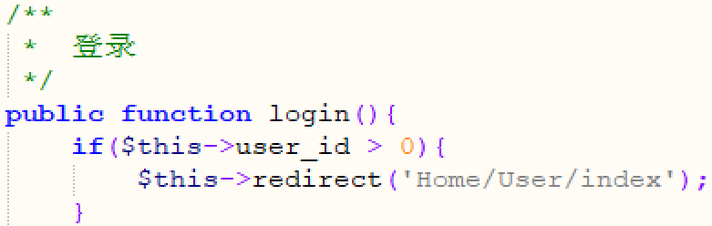
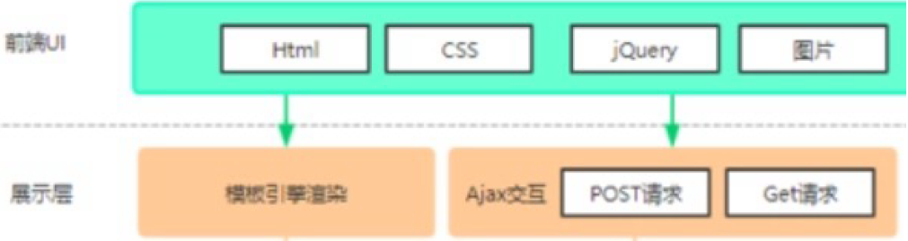
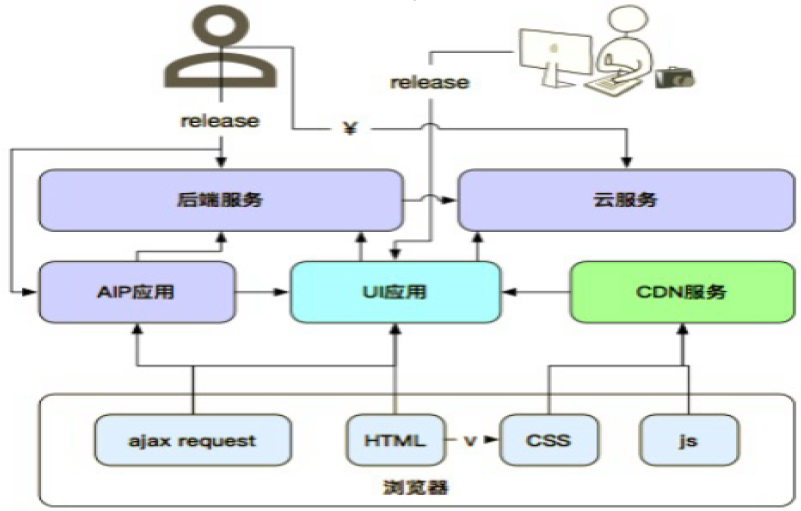
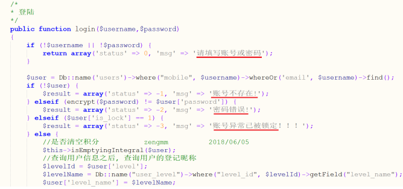
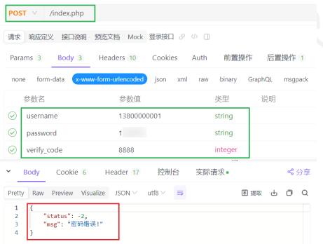

# 测试基础概念

## 软件测试概念

使用技术手段验证软件是否满足需求

## 为什么开发不能做测试

1. 思维定式: 自己写的代码有思维定式, 很难发现问题 
2. 精力有限: 开发若既做开发，又做测试，他的有效时间很难又来专一的解决问题，自然软件的质量就不能得到保证。

## bug的由来

bug是一个英文单词，本意是臭虫、缺陷、损坏、犯贫、窃听器、小虫等意思。现在人们将在电脑系统或程序中，隐藏着的一些未被发现的缺陷或问题统称为bug（漏洞）。

“Bug”的创始人格蕾丝·赫柏（Grace Murray Hopper），是一位为美国海军工作的电脑专家，1947年9月9日，赫柏对Harvard Mark II设置好17000个继电器进行编程后，技术人员正在进行整机运行时，它突然停止了工作。于是他们爬上去找原因，发现这台巨大的计算机内部一组继电器的触点之间有一只飞蛾，这显然是由于飞蛾受光和热的吸引，飞到了触点上，然后被高电压击死。所以在报告中，赫柏用胶条贴上飞蛾，并把“bug”来表示“一个在电脑程序里的错误”，“Bug”这个说法一直沿用到今天。

## 测试常用分类

### 阶段划分

1. 单元测试：针对程序源代码进行测试（单元：最小独立功能代码段）

    

2. 集成测试：针对模块与模块之间的接口进行测试, 又称接口测试。

    

3. 系统测试：针对系统整体功能+兼容+文档（说明、安装文档）

    

4. 验收测试
    - 内测：公司内部人员使用，发觉缺陷并修复。
    - 公测：让用户帮忙测试
    

### 代码可见度划分

- 白盒测试：针对程序源代码进行测试（阶段划分->单元测试）, 如无界面，直接对开发实现的登录功能的源代码进行测试

    

- 灰盒测试：针对接口测试（阶段划分->集成测试）, 如无界面，通过工具/代码实现登录功能测试

    

- 黑盒测试：主要针对功能（阶段划分->系统测试）, 如登录界面输入账号、密码、验证码，点击登录测试

    

### 其他分类

- 冒烟测试：对核心功能的验证作用, 保障提测内容具备可测性
- 回归测试: 指修改了旧代码后，重新进行测试以确认修改没有引入新的错误或导致其他代码产生错误。

## 软件测试基本流程

1. 需求分析

    - 前提：阅读1遍需求文档，记录不明确之处。
    - 参与人员：前端、后端、测试、产品
    - 目的：
        1. 确保各部门需求理解一致
        2. 各角色对需求进行查漏补缺
        3. 了解软件有些功能
    - 提示：需求分析阶段->软件还未实现（刚立项）

2. 测试计划

    - 说明：指导测试执行的文档（重要）
    - 测什么（目标、范围）
    - 谁来测（人员进度及安排）
    - 怎么测（测试工具、测试策略）
  
3. 编写测试用例（测什么 怎么测）

    - 说明：保证能准确验证软件测试点执行的文档。
        1. 分析需求
        2. 提取测试点
        3. 设计用例覆盖测试点

- 用例执行

    说明：实施测试

- 缺陷管理

    提交->验证->关闭

- 测试报告

  1. bug分析及统计
  2. 测试中遇到的问题
  3. 测试总结（本次测试中的优点和不足）

