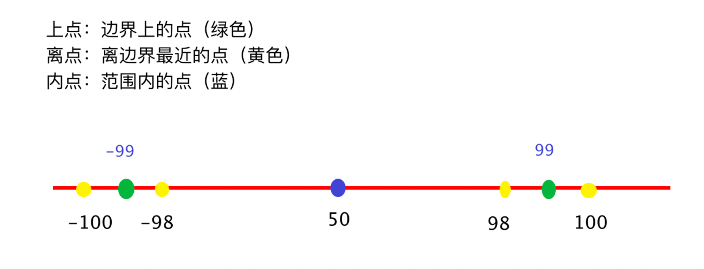

# 黑盒测试方法

## 最佳实践

### 考察问

❤️黑盒测试方法✨`()`

- `()`划分(取一个值代表一类)
    - 有效等价类
    - 无效等价类
- `()`分析
- `()`推测方法
- `()`法

### 考察点

黑盒测试方法✨`等价类, 边界值, 错误, 因果图`

- `等价类`划分(取一个值代表一类)
    - 有效等价类
    - 无效等价类
- `边界值`分析
- `错误`推测方法
- `因果图`法

### 定义

把所有可能的输入数据，即程序的输入域划分成若干部分（子集），然后从每一个子集中选取少数具有代表性的数据作为测试用例。

### 划分等价类

等价类是指某个输入域的子集合。在该子集合中，各个输入数据对于揭露程序中的错误都是等效的，并合理地假定：测试某等价类的代表值就等于对这一类其它值的测试，因此，可以把全部输入数据合理划分为若干等价类，在每一个等价类中取一个数据作为测试的输入条件就可以用少量代表性的测试数据取得较好的测试结果。等价类划分可有两种不同的情况：有效等价类和无效等价类。

- 有效等价类: 是指对于程序的规格说明来说是合理的、有意义的输入数据构成的集合。利用有效等价类可检验程序是否实现了规格说明中所规定的功能和性能。

- 无效等价类: 与有效等价类的定义恰巧相反。无效等价类指对程序的规格说明是不合理的或无意义的输入数据所构成的集合。对于具体的问题，无效等价类至少应有一个，也可能有多个。

设计测试用例时，要同时考虑这两种等价类。因为软件不仅要能接收合理的数据，也要能经受意外的考验，这样的测试才能确保软件具有更高的可靠性。

|分类|内容|
|----|----|
|说明|在所有测试数据中，具有某种共同特征的数据集合进行划分。|
|分类|有效等价类:满足需求的数据集合 无效等价类:不满足需求的数据集合|
|步骤|1.明确需求 2.确定有效和无效等价类 3.提取数据编写测试用例|

### 🌰要求:QQ号是6~10位自然数

|步骤|内容|
|----|----|
|明确需求|要求:6~10位自然数 长度：6-10位 类型：自然数|
|划分有效等价和无效等价|有效：8位自然数 无效：3位自然数、12位自然数；8位非自然数、为空|
|提取数据编写用例|有效数据：12345678 无效数据：123、123456789012；1234567A，为空|

## 边界值分析法

### 定义

边界值分析法就是对输入或输出的边界值进行测试的一种黑盒测试方法。通常边界值分析法是作为对等价类划分法的补充，这种情况下，其测试用例来自等价类的边界。

使用边界值分析方法设计测试用例，首先应确定边界情况。通常输入和输出等价类的边界，就是应着重测试的边界情况。应当选取正好等于，刚刚大于或刚刚小于边界的值作为测试数据，而不是选取等价类中的典型值或任意值作为测试数据。

### 与等价划分的区别

1. 边界值分析不是从某等价类中随便挑一个作为代表，而是使这个等价类的每个边界都要作为测试条件。
2. 边界值分析不仅考虑输入条件，还要考虑输出空间产生的测试情况。

### 🌰案例

|步骤|内容|
|----|----|
|1、明确需求|需求：通过边界值法验证QQ号码的合法性 要求：6-10位自然数|
|2、划分有效和无效等价（类型）|有效：自然数 无效：非自然数|
|3、确定边界范围|上点：6，10 离点：5，7，9，11 内点：8|

|用例编号|用例标题|项目/模块|优先级|前置条件|测试步骤|测试数据|预期结果|
|----|----|----|----|----|----|----|----|
|qq_001|不合法（8位非自然数）|qq|P1|打开qq验证程序|1、输入qq 2、点击验证按钮|1234567a|不合法|
|qq_002|合法（6位自然数）|qq|P0|打开qq验证程序|1、输入qq 2、点击验证按钮|123456|合法|
|qq_003|合法（10位自然数）|qq|P0|打开qq验证程序|1、输入qq 2、点击验证按钮|123456789|合法|
|qq_004|不合法（5位自然数）|qq|P1|打开qq验证程序|1、输入qq 2、点击验证按钮|12345|不合法|
|qq_005|合法（7位自然数）|qq|P0|打开qq验证程序|1、输入qq 2、点击验证按钮|1234567|合法|
|qq_006|合法（9位自然数）|qq|P0|打开qq验证程序|1、输入qq 2、点击验证按钮|123456789|合法|
|qq_007|不合法（11位自然数）|qq|P1|打开qq验证程序|1、输入qq 2、点击验证按钮|12345678901|不合法|
|qq_008|合法（8位自然数）|qq|P0|打开qq验证程序|1、输入qq 2、点击验证按钮|12345678|合法|

## 错误推测方法

### 定义

基于经验和直觉推测程序中所有可能存在的各种错误，从而有针对性的设计测试用例的方法。

### 🌰

- 例如，输入数据和输出数据为0的情况；输入表格为空格或输入表格只有一行。这些都是容易发生错误的情况。可选择这些情况下的例子作为测试用例。
- 再如，测试一个对线性表（比如数组）进行排序的程序，可推测列出以下几项需要特别测试的情况：
    - 输入的线性表为空表；
    - 表中只含有一个元素；
    - 输入表中所有元素已排好序；
    - 输入表已按逆序排好；
    - 输入表中部分或全部元素相同。

## 因果图法(判定表)

因果图不是一个独立的用例设计方法，专门用于当条件桩有哪些、动作桩有哪些、条件桩和动作桩之间的逻辑关系到底是怎样时适用，需要分析的时候才使用。如果逻辑清晰，不需要因果图来分析，就无需使用。

- 定义：是一种以表格形式表达多条件逻辑判断的工具。
- 组成：
    - 条件桩：列出问题中的所有条件，列出条件的次序无关紧要。
    - 动作桩：列出问题中可能采取的操作，操作的排列顺序没有约束。
    - 条件项：列出条件对应的取值，所有可能情况下的真假值。
    - 动作项：列出条件项的、各种取值情况下应该采取的动作结果。

    

- 规则：
    - 判定表中贯穿条件项和动作项的一列就是一条规则。
    - 假设有n个条件，每个条件的取值有两个(0,1)，全组合有2的n次方种规则。

步骤

1. 明确需求
2. 画出判定表
    1. 列出条件桩和动作桩
    2. 填写条件项，对条件进行全组合
    3. 根据条件项的组合确定动作项
    4. 简化、合并相似规则(有相同的动作)
3. 根据规则编写测试用例

🌰案例:

需求:

1. 如果金额大于500元，又未过期，则发出批准单和提货单；
2. 如果金额大于500元，但过期了，则不发批准单与提货单；
3. 如果金额小于等于500元，则不论是否过期都发出批准单和提货单；
4. 在过期的情况下不论金额大小还需要发出通知单。

判定表:

| 是否大于500 | 是 | 是 | 否 | 否 |
| --- | --- | --- | --- | --- |
| 是否过期 | 是 | 否 | 是 | 否 |
| 批准单 | × | √ | √ | √ |
| 提货单 | × | √ | √ | √ |
| 通知单 | √ | × | √ | × |

## 参考

- <https://www.cnblogs.com/kezz/p/18493089>
- <https://blog.csdn.net/Gabbana/article/details/108698502>
