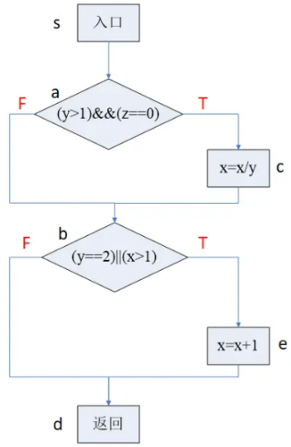
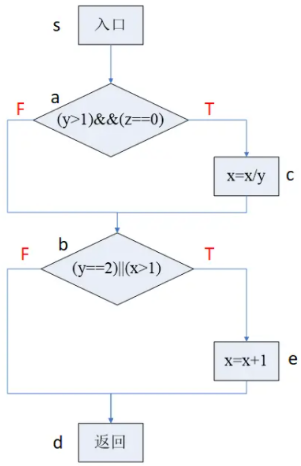
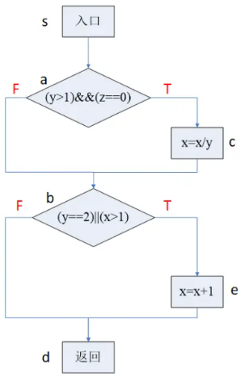
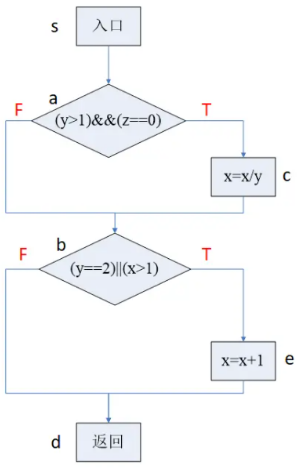
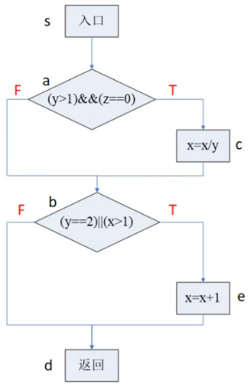

# 逻辑覆盖法

1. 定义
    逻辑覆盖是以程序内部的逻辑结构为基础来设计测试用例的测试技术，通过对程序内部的逻辑结构的遍历来实现程序的覆盖。它属于白盒测试中动态测试技术之一。

2. 6种逻辑覆盖方法
    从覆盖源程序语句的详尽程度分析，逻辑覆盖包括以下6种覆盖标准：
    - 语句覆盖（SC）；
    - 判定覆盖（DC）；
    - 条件覆盖（CC）；
    - 判定 - 条件覆盖（CDC）；
    - 条件组合覆盖（MCC）；
    - 路径覆盖。


## 语句覆盖（SC）

语句覆盖（Statement Coverage）的含义就是设计足够的测试用例，使得被测程序中每条语句至少执行一次。又称行覆盖、段覆盖、基本块覆盖，它是最常见的覆盖方式。

🌰如下java语言程序语句和对应的程序流程图：

```java
public class Test{
    public void Test1(int x,int y,int z){
        if(y>1 && z==0){
            x=(int)(x/y);
        }
        if(y==2 || x>1){
            x=x+1;
        }
    }
}
```


使用语句覆盖来为该程序设计测试用例。

为了使每条语句都能够至少执行一次，我们可以构造以下测试用例：

- 输入：x=4, y=2, z=0
- 执行路径为：sacbed

语句覆盖虽然可以测试执行语句是否被执行到，但却无法测试程序中存在的逻辑错误。因此，语句覆盖是一种弱覆盖。

例如，如果上述程序中的第一个逻辑判断符号“&&”误写了“||”，使用测试用例同样可以覆盖 sacbed 路径上的全部执行语句，但却无法发现错误。同样，如果第二个逻辑判断符号“||”误写了“&&”，使用同样的测试用例也可以执行 sacbed 路径上的全部执行语句，但却无法发现上述逻辑错误。

语句覆盖的目的：

- 语句覆盖的目的是测试程序中的代码是否被执行，它只测试代码中的执行语句，这里的执行语句不包括头文件、注释、空行等。
- 语句覆盖在多分支的程序中，只能覆盖某一条路径，使得该路径中的每一个语句至少被执行一次，但不会考虑各种分支组合情况。

## 判定覆盖(DC)

判定覆盖（Decision Coverage）又称为分支覆盖，其原则是设计足够的测试用例，使得程序中每个判定语句的取真和取假分支至少被执行一次。

除了双值的判定语句外，还有多值判定语句，如case语句，因此判定覆盖更一般的含义是：使得每一个判定获得每一种可能的结果至少一次。

🌰如下java语言程序语句和对应的程序流程图：

```java
public class Test{
    public void Test2(int x,int y,int z){
        if(y>1 && z==0){
            x=(int)(x/y);
        }
        if(y==2 || x>1){
            x=x+1;
        }
    }
}
```



以上述代码为例，构造以下测试用例即可实现判定覆盖标准：

- 输入：①x=1,y=3,z=0，执行路径为 sacbd（判断的结果分别为T，F）
- 输入：②x=3,y=1,z=1，执行路径为 sabed（判断的结果分别为F，T）

上述两组测试用例不仅满足了判定覆盖，而且满足了语句覆盖，从这一点可以看出`判定覆盖比语句覆盖更强一些`。所以只要满足了判定覆盖就一定满足语句覆盖，反之则不然。

判定覆盖仍然具有和语句覆盖一样无法发现逻辑判断符号“&&”误写了“||”的逻辑错误。
判定覆盖仅仅判断判定语句执行的最终结果而忽略每个条件的取值，所以也属于弱覆盖。


## 条件覆盖(CC)


条件覆盖（Condition Coverage）指的是设计足够的测试用例，使判定语句中的每个逻辑条件取真值与取假值至少出现一次。

例如，对于判定语句 if(a>1 OR c<0) 中存在 a>1、c<0 两个逻辑条件，设计条件覆盖测试用例时，要保证a>1、c<0的“真”、“假”值至少出现一次。

🌰如下java语言程序语句和对应的程序流程图：

```java
public class Test{
    public void Test3(int x,int y,int z){
        if(y>1 && z==0){
            x=(int)(x/y);
        }
        if(y==2 || x>1){
            x=x+1;
        }
    }
}
```



要使程序中每个判断的每个条件都至少取真值、假值一次，我们可以构造以下测试用例：

- 输入：①x=1,y=2,z=0，执行路径为 sacbed（条件的结果分别为TTTF）
- 输入：②x=2,y=1,z=1，执行路径为 sabed（条件的结果分别为FFFT）

从条件覆盖的测试用例可知，使用2个测试用例就达到了使每个逻辑条件取真值与取假值都至少出现了一次，但从测试用例的执行路径来看，条件分支覆盖的状态下仍旧不能满足判定覆盖，即没有覆盖bd这条路径。


🔒
关于白盒测试，下列说法正确的是( )。

- A.条件覆盖不一定包含判定覆盖，判定覆盖也不一定包含条件覆盖
- B.语句覆盖比判定覆盖强
- C.条件覆盖比判定覆盖强
- D.条件组合覆盖保证程序中所有可能的路径都至少遍历一次

答案: A


## 判定-条件覆盖(CDC)

要求设计足够的测试用例，使得判定语句中所有条件的可能取值至少出现一次，同时，所有判定语句的可能结果也至少出现一次。

例如，对于判定语句 if(a>1 AND c<1)，该判定语句有 a>1、c<1 两个条件，则在设计测试用例时，要保证 a>1、c<1 两个条件取“真”、“假”值至少一次，同时，判定语句 if(a>1 AND c<1) 取“真”、“假”也至少出现一次。

🌰如下java语言程序语句和对应的程序流程图：

```java
public class Test{
    public void Test3(int x,int y,int z){
        if(y>1 && z==0){
            x=(int)(x/y);
        }
        if(y==2 || x>1){
            x=x+1;
        }
    }
}
```




为满足判定 - 条件覆盖原则，我们可以构造以下测试用例：

- 输入：①x=4,y=2,z=0，覆盖路径：sacbed（判断的结果分别为TT，条件的结果分别为：TTTT）
- 输入：②x=1,y=1,z=1，覆盖路径：sabd（判断的结果分别为FF，条件的结果分别为：FFFF）

判定 - 条件覆盖满足了判定覆盖准则和条件覆盖准则，弥补了二者的不足。但是判定-条件覆盖不一定比条件覆盖的逻辑更强。

判定 - 条件覆盖的缺点：没有考虑条件的组合情况。


## 条件组合覆盖（MCC）

条件组合（Multiple Condition Coverage）指的是设计足够的测试用例，使得每个判定中条件的各种可能组合都至少执行一次。满足了判定覆盖、条件覆盖、判定 - 条件覆盖准则。

🌰如下java语言程序语句和对应的程序流程图：

```java
public class Test{
    public void Test4(int x,int y,int z){
        if(y>1 && z==0){
            x=(int)(x/y);
        }
        if(y==2 || x>1){
            x=x+1;
        }
    }
}
```




为满足条件组合覆盖原则，我们可以构造以下测试用例：

- 输入：①x=4,y=2,z=0，覆盖路径：sacbed（条件的结果分别为：TTTT）
- 输入：②x=1,y=2,z=1，覆盖路径：sabed（条件的结果分别为：TFTF）
- 输入：③x=2,y=1,z=0，覆盖路径：sabed（条件的结果分别为：FTFT）
- 输入：④x=1,y=1,z=1，覆盖路径：sabd（条件的结果分别为：FFFF）

由于这4个条件每个条件都有取“真”、“假”两个值，因此所有条件结果的组合有(2^4)=16种。但是，当一个程序中判定语句较多时，其条件取值的组合数目也较多。需要设计的测试用例也会增加，这样反而会使测试效率降低。

## 路径覆盖

路径覆盖指的是设计足够的测试用例，使得程序中的每一条可能组合的路径都至少执行一次。

🌰如下java语言程序语句和对应的程序流程图：

```java
public class Test{
    public void Test5(int x,int y,int z){
        if(y>1 && z==0){
            x=(int)(x/y);
        }
        if(y==2 || x>1){
            x=x+1;
        }
    }
}
```



为满足路径覆盖原则，我们可以构造以下测试用例：

- 输入：①x=4,y=2,z=0，覆盖路径：sacbed（判定的结果分别为：TT）
- 输入：②x=1,y=2,z=1，覆盖路径：sabed（判定的结果分别为：FT）
- 输入：③x=1,y=3,z=0，覆盖路径：sacbd（判定的结果分别为：TF）
- 输入：④x=1,y=1,z=1，覆盖路径：sabd（判定的结果分别为：FF）


## 参考

- https://blog.csdn.net/qq_42944594/article/details/121907540


