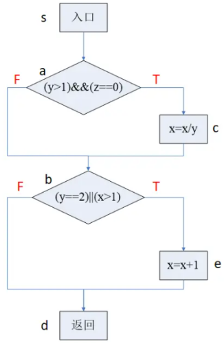
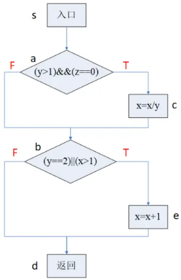
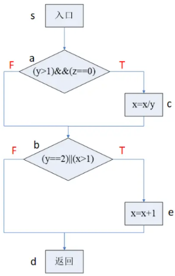
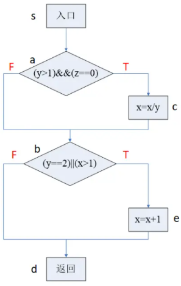
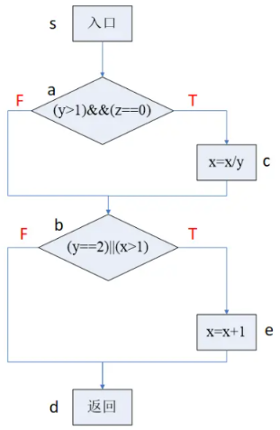
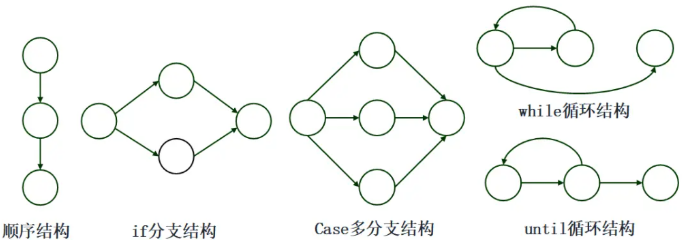
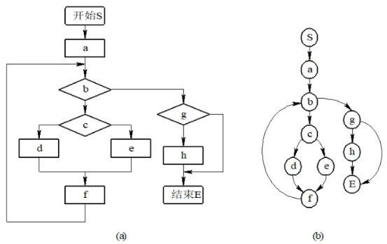
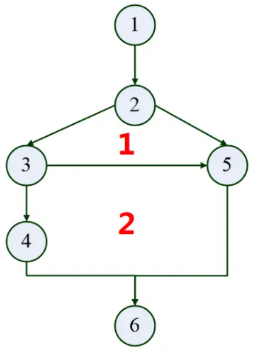
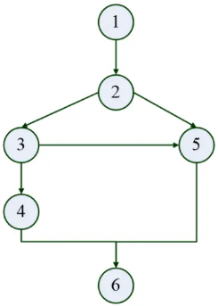
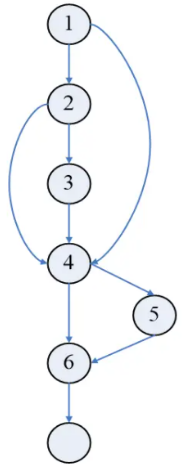

# 动态白盒测试

## 逻辑覆盖法

1. 定义
    逻辑覆盖是以程序内部的逻辑结构为基础来设计测试用例的测试技术，通过对程序内部的逻辑结构的遍历来实现程序的覆盖。它属于白盒测试中动态测试技术之一。

2. 6种逻辑覆盖方法
    从覆盖源程序语句的详尽程度分析，逻辑覆盖包括以下6种覆盖标准：
    - 语句覆盖（SC）；
    - 判定覆盖（DC）；
    - 条件覆盖（CC）；
    - 判定 - 条件覆盖（CDC）；
    - 条件组合覆盖（MCC）；
    - 路径覆盖。


### 语句覆盖（SC）

语句覆盖（Statement Coverage）的含义就是设计足够的测试用例，使得被测程序中每条语句至少执行一次。又称行覆盖、段覆盖、基本块覆盖，它是最常见的覆盖方式。

🌰如下java语言程序语句和对应的程序流程图：

```java
public class Test{
    public void Test1(int x,int y,int z){
        if(y>1 && z==0){
            x=(int)(x/y);
        }
        if(y==2 || x>1){
            x=x+1;
        }
    }
}
```


使用语句覆盖来为该程序设计测试用例。

为了使每条语句都能够至少执行一次，我们可以构造以下测试用例：

- 输入：x=4, y=2, z=0
- 执行路径为：sacbed

语句覆盖虽然可以测试执行语句是否被执行到，但却无法测试程序中存在的逻辑错误。因此，语句覆盖是一种弱覆盖。

例如，如果上述程序中的第一个逻辑判断符号“&&”误写了“||”，使用测试用例同样可以覆盖 sacbed 路径上的全部执行语句，但却无法发现错误。同样，如果第二个逻辑判断符号“||”误写了“&&”，使用同样的测试用例也可以执行 sacbed 路径上的全部执行语句，但却无法发现上述逻辑错误。

语句覆盖的目的：

- 语句覆盖的目的是测试程序中的代码是否被执行，它只测试代码中的执行语句，这里的执行语句不包括头文件、注释、空行等。
- 语句覆盖在多分支的程序中，只能覆盖某一条路径，使得该路径中的每一个语句至少被执行一次，但不会考虑各种分支组合情况。

### 判定覆盖(DC)

判定覆盖（Decision Coverage）又称为分支覆盖，其原则是设计足够的测试用例，使得程序中每个判定语句的取真和取假分支至少被执行一次。

除了双值的判定语句外，还有多值判定语句，如case语句，因此判定覆盖更一般的含义是：使得每一个判定获得每一种可能的结果至少一次。

🌰如下java语言程序语句和对应的程序流程图：

```java
public class Test{
    public void Test2(int x,int y,int z){
        if(y>1 && z==0){
            x=(int)(x/y);
        }
        if(y==2 || x>1){
            x=x+1;
        }
    }
}
```



以上述代码为例，构造以下测试用例即可实现判定覆盖标准：

- 输入：①x=1,y=3,z=0，执行路径为 sacbd（判断的结果分别为T，F）
- 输入：②x=3,y=1,z=1，执行路径为 sabed（判断的结果分别为F，T）

上述两组测试用例不仅满足了判定覆盖，而且满足了语句覆盖，从这一点可以看出`判定覆盖比语句覆盖更强一些`。所以只要满足了判定覆盖就一定满足语句覆盖，反之则不然。

判定覆盖仍然具有和语句覆盖一样无法发现逻辑判断符号“&&”误写了“||”的逻辑错误。
判定覆盖仅仅判断判定语句执行的最终结果而忽略每个条件的取值，所以也属于弱覆盖。


### 条件覆盖(CC)


条件覆盖（Condition Coverage）指的是设计足够的测试用例，使判定语句中的每个逻辑条件取真值与取假值至少出现一次。

例如，对于判定语句 if(a>1 OR c<0) 中存在 a>1、c<0 两个逻辑条件，设计条件覆盖测试用例时，要保证a>1、c<0的“真”、“假”值至少出现一次。

🌰如下java语言程序语句和对应的程序流程图：

```java
public class Test{
    public void Test3(int x,int y,int z){
        if(y>1 && z==0){
            x=(int)(x/y);
        }
        if(y==2 || x>1){
            x=x+1;
        }
    }
}
```



要使程序中每个判断的每个条件都至少取真值、假值一次，我们可以构造以下测试用例：

- 输入：①x=1,y=2,z=0，执行路径为 sacbed（条件的结果分别为TTTF）
- 输入：②x=2,y=1,z=1，执行路径为 sabed（条件的结果分别为FFFT）

从条件覆盖的测试用例可知，使用2个测试用例就达到了使每个逻辑条件取真值与取假值都至少出现了一次，但从测试用例的执行路径来看，条件分支覆盖的状态下仍旧不能满足判定覆盖，即没有覆盖bd这条路径。


🔒
关于白盒测试，下列说法正确的是( )。

- A.条件覆盖不一定包含判定覆盖，判定覆盖也不一定包含条件覆盖
- B.语句覆盖比判定覆盖强
- C.条件覆盖比判定覆盖强
- D.条件组合覆盖保证程序中所有可能的路径都至少遍历一次

答案: A


### 判定-条件覆盖(CDC)

要求设计足够的测试用例，使得判定语句中所有条件的可能取值至少出现一次，同时，所有判定语句的可能结果也至少出现一次。

例如，对于判定语句 if(a>1 AND c<1)，该判定语句有 a>1、c<1 两个条件，则在设计测试用例时，要保证 a>1、c<1 两个条件取“真”、“假”值至少一次，同时，判定语句 if(a>1 AND c<1) 取“真”、“假”也至少出现一次。

🌰如下java语言程序语句和对应的程序流程图：

```java
public class Test{
    public void Test3(int x,int y,int z){
        if(y>1 && z==0){
            x=(int)(x/y);
        }
        if(y==2 || x>1){
            x=x+1;
        }
    }
}
```




为满足判定 - 条件覆盖原则，我们可以构造以下测试用例：

- 输入：①x=4,y=2,z=0，覆盖路径：sacbed（判断的结果分别为TT，条件的结果分别为：TTTT）
- 输入：②x=1,y=1,z=1，覆盖路径：sabd（判断的结果分别为FF，条件的结果分别为：FFFF）

判定 - 条件覆盖满足了判定覆盖准则和条件覆盖准则，弥补了二者的不足。但是判定-条件覆盖不一定比条件覆盖的逻辑更强。

判定 - 条件覆盖的缺点：没有考虑条件的组合情况。


### 条件组合覆盖（MCC）

条件组合（Multiple Condition Coverage）指的是设计足够的测试用例，使得每个判定中条件的各种可能组合都至少执行一次。满足了判定覆盖、条件覆盖、判定 - 条件覆盖准则。

🌰如下java语言程序语句和对应的程序流程图：

```java
public class Test{
    public void Test4(int x,int y,int z){
        if(y>1 && z==0){
            x=(int)(x/y);
        }
        if(y==2 || x>1){
            x=x+1;
        }
    }
}
```




为满足条件组合覆盖原则，我们可以构造以下测试用例：

- 输入：①x=4,y=2,z=0，覆盖路径：sacbed（条件的结果分别为：TTTT）
- 输入：②x=1,y=2,z=1，覆盖路径：sabed（条件的结果分别为：TFTF）
- 输入：③x=2,y=1,z=0，覆盖路径：sabed（条件的结果分别为：FTFT）
- 输入：④x=1,y=1,z=1，覆盖路径：sabd（条件的结果分别为：FFFF）

由于这4个条件每个条件都有取“真”、“假”两个值，因此所有条件结果的组合有(2^4)=16种。但是，当一个程序中判定语句较多时，其条件取值的组合数目也较多。需要设计的测试用例也会增加，这样反而会使测试效率降低。

### 路径覆盖

路径覆盖指的是设计足够的测试用例，使得程序中的每一条可能组合的路径都至少执行一次。

🌰如下java语言程序语句和对应的程序流程图：

```java
public class Test{
    public void Test5(int x,int y,int z){
        if(y>1 && z==0){
            x=(int)(x/y);
        }
        if(y==2 || x>1){
            x=x+1;
        }
    }
}
```



为满足路径覆盖原则，我们可以构造以下测试用例：

- 输入：①x=4,y=2,z=0，覆盖路径：sacbed（判定的结果分别为：TT）
- 输入：②x=1,y=2,z=1，覆盖路径：sabed（判定的结果分别为：FT）
- 输入：③x=1,y=3,z=0，覆盖路径：sacbd（判定的结果分别为：TF）
- 输入：④x=1,y=1,z=1，覆盖路径：sabd（判定的结果分别为：FF）


## 基本路径测试法


### 独立路径

从控制流图来看，一条独立路径是至少包含一条在其他独立路径中从未有过的边的路径。

### 程序控制流图

程序控制流图的定义: 控制流图是描述程序控制流的一种图示方式。（有向图）

控制流图的两种图形符号

- 图中的每一个圆圈称为流图的结点，表示一个或多个无分支的语句或源程序语句。
- 流图中的箭头称为边或连接，表示控制流线。


程序控制流图的5种基本结构




程序控制流图的描述

- 程序控制流图实际上可以看作是一种简化了的程序流程图。
- 在控制流图中，只关注程序的流程，不关心各个处理框的细节。
- 因此，原来程序流程图中的各个处理框（包括语句框、判断框、输入/输出框等）都被简化为结点，一般用圆圈表示，而原来程序流程图中的带有箭头的控制流变成了控制流图中的有向边。

下图是典型的程序流程图转换为相对应的流图。对（a）图所示的程序流程图进行简化，得到（b）图所示的流图。




### 软件复杂度

- 软件复杂度是指理解和处理软件的难易程度。
- 程序复杂度是软件度量的重要组成部分。
- 度量方法：McCabe 度量法（环路度量）

McCabe 复杂性度量方式有如下三种：

$$
V(G)=\begin{cases}
区域数 \\
边数 - 结点数 + 2 \\
判定结点数 + 1
\end{cases}
$$

#### 通过控制流图的区域个数来计算

公式：$ V(G) = 区域数 $

程序的环路复杂性为控制流图的区域数（即封闭的区域数 + 1）。

在下图中可以看到，有 1 和 2 两个封闭区域，因此，环路复杂度 $ V(G) = 2 + 1 = 3 $。（2 个封闭的区域 + 1 个开放区域）



#### 通过控制流图的边数和结点数来计算

公式：$V(G) = e - n + 2$
其中，$e$ 即 edge，表示图中边的数目；$n$ 即 node，表示结点个数。
下图中 $V(G) = e - n + 2 = 7 条边 - 6 个结点 + 2 = 3$。
因此，环路复杂度 $V(G) = 3$。




#### 通过控制流图中的判定结点个数来计算

公式：$V(G) = P + 1$
其中，$P$ 表示判定结点的数目。所谓判定节点数，即有多个分支的节点，比如下图中的节点 2，它可以走 3 或者 5，这个时候它就需要做判断了。所以，2 是一个判定节点。同样地，下面的节点 3 也像节点 2 一样分析。
因此，图中 $V(G) = 2 个判定结点 + 1 = 3$，所以环路复杂度为 3。


讲到这里，我们来给环路复杂性做个小结。事实上，程序的环路复杂性给出了程序基本路径集中的独立路径条数，这是确保可执行语句至少执行一次所必需的测试用例数目的上界。

通过对以上三个例子的了解，相信大家对环路复杂度的三种求解方式有了一个新的认识。有了上面一系列内容的铺垫，我们来开始讲解基本路径测试法。


### 基本路径测试法

路径测试就是从一个程序的入口开始，执行所经历的各个语句的完整过程。从广义的角度讲，任何有关路径分析的测试都可以被称为路径测试。

完成路径测试的理想情况就是做到路径覆盖，但对于复杂性较大的程序要做到所有的路径覆盖（测试所有可执行路径）是不可能的。

在不能做到所有路径覆盖的情况下，如果某一程序的每一个独立路径都被执行到，那么就可以认为程序中的每个语句都已经检验过了，即达到了语句覆盖。这种测试方法就是通常所说的基路径测试法。

基本路径测试法是在程序控制流图的基础上，通过分析控制构造的环路复杂性，导出基本可执行路径的集合，从而设计测试用例的方法。设计出的测试用例要保证在测试中程序的每个可执行语句至少执行一次。


#### 基本路径测试法的4个步骤

基本路径测试法包括以下4个步骤：
- 以详细设计或源代码作为基础，绘制程序的控制流图。
- 计算得到的控制流图G的环路复杂性V（G）。
- 确定独立路径的集合。通过程序控制流图导出基本路径集，列出程序的独立路径。所谓独立路径，是指至少包含一条新边的路径，也就是包含一些前面的路径未包含的语句，当所有的语句都包含了，基路径集就够了。（线性无关路径）
- 设计测试用例，确保基本路径集中每条路径的执行。


🌰例子阐述1

依据以下代码，用基本路径测试法，设计该程序的测试用例。
```java
1 if(a>8 && b>10)  //1,2
2  m=m+1;       //3
3 if(a==10 || c>5) //4,5
4  m=m+5;       //6
```

1. 绘制程序控制流图，如下图所示。

    

2. 计算环路复杂度

    $V(G)=4$（3个封闭区域+1个开放区域）

3. 确定线性无关路径：

    - 路径1：1、4、6
    - 路径2：1、4、5、6
    - 路径3：1、2、4、5、6
    - 路径4：1、2、3、4、5、6

4. 设计测试用例

    |编号|输入数据|预期输出|覆盖路径|
    |---|----|---|---|
    |1|$a=2,b=3,c=4$|$m=0$|1、4、6|
    |2|$a=2,b=3,c=8$|$m=5$|1、4、5、6|
    |3|$a=10,b=6,c=8$|$m=5$|1、2、4、5、6|
    |4|$a=10,b=15,c=8$|$m=6$|1、2、3、4、5、6|

## 参考
- https://blog.csdn.net/qq_42944594/article/details/121907540
- https://blog.csdn.net/qq_42944594/article/details/121907540


