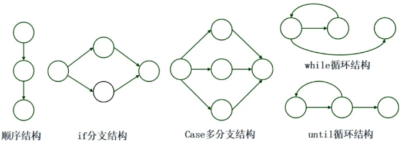
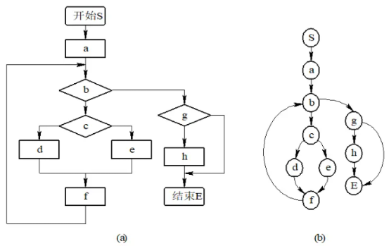
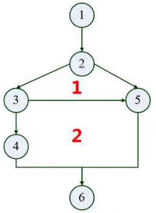
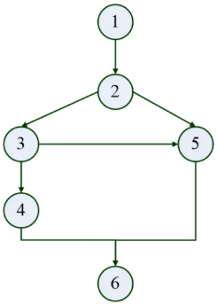
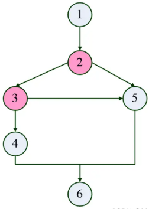
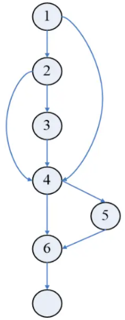

# 基本路径测试法


## 独立路径

从控制流图来看，一条独立路径是至少包含一条在其他独立路径中从未有过的边的路径。

## 程序控制流图

程序控制流图的定义: 控制流图是描述程序控制流的一种图示方式。（有向图）

控制流图的两种图形符号

- 图中的每一个圆圈称为流图的结点，表示一个或多个无分支的语句或源程序语句。
- 流图中的箭头称为边或连接，表示控制流线。


程序控制流图的5种基本结构




程序控制流图的描述

- 程序控制流图实际上可以看作是一种简化了的程序流程图。
- 在控制流图中，只关注程序的流程，不关心各个处理框的细节。
- 因此，原来程序流程图中的各个处理框（包括语句框、判断框、输入/输出框等）都被简化为结点，一般用圆圈表示，而原来程序流程图中的带有箭头的控制流变成了控制流图中的有向边。

下图是典型的程序流程图转换为相对应的流图。对（a）图所示的程序流程图进行简化，得到（b）图所示的流图。




## 软件复杂度

- 软件复杂度是指理解和处理软件的难易程度。
- 程序复杂度是软件度量的重要组成部分。
- 度量方法：McCabe 度量法（环路度量）

McCabe 复杂性度量方式有如下三种：

$$
V(G)=\begin{cases}
区域数 \\
边数 - 结点数 + 2 \\
判定结点数 + 1
\end{cases}
$$

### 通过控制流图的区域个数来计算

公式：$ V(G) = 区域数 $

程序的环路复杂性为控制流图的区域数（即封闭的区域数 + 1）。

在下图中可以看到，有 1 和 2 两个封闭区域，因此，环路复杂度 $ V(G) = 2 + 1 = 3 $。（2 个封闭的区域 + 1 个开放区域）



### 通过控制流图的边数和结点数来计算

公式：$V(G) = e - n + 2$
其中，$e$ 即 edge，表示图中边的数目；$n$ 即 node，表示结点个数。
下图中 $V(G) = e - n + 2 = 7 条边 - 6 个结点 + 2 = 3$。
因此，环路复杂度 $V(G) = 3$。




### 通过控制流图中的判定结点个数来计算

公式：$V(G) = P + 1$
其中，$P$ 表示判定结点的数目。所谓判定节点数，即有多个分支的节点，比如下图中的节点 2，它可以走 3 或者 5，这个时候它就需要做判断了。所以，2 是一个判定节点。同样地，下面的节点 3 也像节点 2 一样分析。
因此，图中 $V(G) = 2 个判定结点 + 1 = 3$，所以环路复杂度为 3。



讲到这里，我们来给环路复杂性做个小结。事实上，程序的环路复杂性给出了程序基本路径集中的独立路径条数，这是确保可执行语句至少执行一次所必需的测试用例数目的上界。

通过对以上三个例子的了解，相信大家对环路复杂度的三种求解方式有了一个新的认识。有了上面一系列内容的铺垫，我们来开始讲解基本路径测试法。


## 基本路径测试法

路径测试就是从一个程序的入口开始，执行所经历的各个语句的完整过程。从广义的角度讲，任何有关路径分析的测试都可以被称为路径测试。

完成路径测试的理想情况就是做到路径覆盖，但对于复杂性较大的程序要做到所有的路径覆盖（测试所有可执行路径）是不可能的。

在不能做到所有路径覆盖的情况下，如果某一程序的每一个独立路径都被执行到，那么就可以认为程序中的每个语句都已经检验过了，即达到了语句覆盖。这种测试方法就是通常所说的基路径测试法。

基本路径测试法是在程序控制流图的基础上，通过分析控制构造的环路复杂性，导出基本可执行路径的集合，从而设计测试用例的方法。设计出的测试用例要保证在测试中程序的每个可执行语句至少执行一次。


### 基本路径测试法的4个步骤

基本路径测试法包括以下4个步骤：
- 以详细设计或源代码作为基础，绘制程序的控制流图。
- 计算得到的控制流图G的环路复杂性V（G）。
- 确定独立路径的集合。通过程序控制流图导出基本路径集，列出程序的独立路径。所谓独立路径，是指至少包含一条新边的路径，也就是包含一些前面的路径未包含的语句，当所有的语句都包含了，基路径集就够了。（线性无关路径）
- 设计测试用例，确保基本路径集中每条路径的执行。


🌰例子阐述1

依据以下代码，用基本路径测试法，设计该程序的测试用例。
```java
1 if(a>8 && b>10)  //1,2
2  m=m+1;       //3
3 if(a==10 || c>5) //4,5
4  m=m+5;       //6
```

1. 绘制程序控制流图，如下图所示。

    

2. 计算环路复杂度

    $V(G)=4$（3个封闭区域+1个开放区域）

3. 确定线性无关路径：

    - 路径1：1、4、6
    - 路径2：1、4、5、6
    - 路径3：1、2、4、5、6
    - 路径4：1、2、3、4、5、6

4. 设计测试用例

    |编号|输入数据|预期输出|覆盖路径|
    |---|----|---|---|
    |1|$a=2,b=3,c=4$|$m=0$|1、4、6|
    |2|$a=2,b=3,c=8$|$m=5$|1、4、5、6|
    |3|$a=10,b=6,c=8$|$m=5$|1、2、4、5、6|
    |4|$a=10,b=15,c=8$|$m=6$|1、2、3、4、5、6|

## 参考

- https://blog.csdn.net/qq_42944594/article/details/121907540
