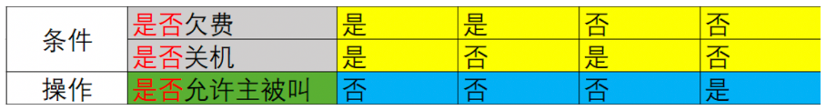
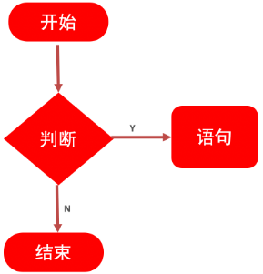
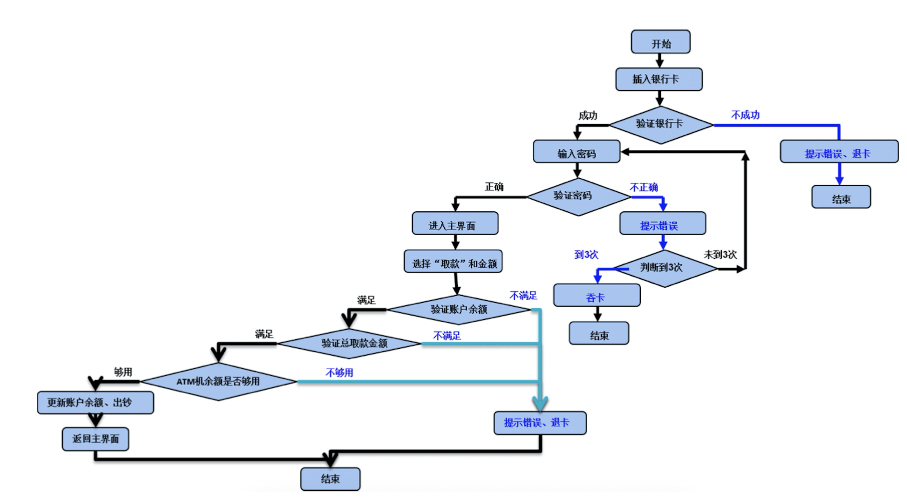

## 测试用例

用例：`用`户使用的案`例`

🌰根据以下测试点编写用例, QQ登录（4条）

- 账号为空
- 账号未注册
- 密码为空
- 密码错误

用例模板:

|用例编号|用例标题|项目/模块|优先级|前置条件|测试步骤|测试数据|预期结果|
|----|----|----|----|----|----|----|----|
|QQ_login_001|登录失败（账号为空）|登录|p1|1、打开登录界面 2、网络正常|1、输入账号 2、输入密码 3、点击登录按钮|1、账号：空 2、密码：123455|登录失败，提示：账号不可为空|
|QQ_login_002|登录失败（账号未注册）|登录|p1|1、打开登录界面 2、网络正常 3、账号未注册|1、输入账号 2、输入密码 3、点击登录按钮|1、账号：未注册账号 2、密码：123455|登录失败，提示：账号不存在。|
|QQ_login_003|登录失败（密码为空）|登录|p1|1、打开登录界面 2、网络正常 3、账号已注册|1、输入账号 2、输入密码 3、点击登录按钮|1、账号：已注册账号 2、密码：空|登录失败，提示：密码不可为空。|
|QQ_login_004|登录失败（密码错误）|登录|p1|1、打开登录界面 2、网络正常 3、账号已注册|1、输入账号 2、输入密码 3、点击登录按钮|1、账号：已注册账号 2、密码：错误密码|登录失败，提示：密码不正确。|

字段说明:

- 用例编号：项目_模块_编号
- 用例标题：预期结果（测试点）
- 模块/项目：所属项目或模块
- 前置条件：要执行此条用例，有哪些前置操作
- 优先级：表示用例的重要程度或者影响力P0～p4（P0最高）
- 测试步骤：描述操作步骤
- 测试数据：操作的数据，没有的话可以为空
- 预期结果：期望达到的结果

## 用例设计方法

1. 能对穷举场景设计测试点
2. 能对限定边界规则设计测试点
3. 能对多条件依赖关系进行设计测试点
4. 能对于项目业务进行设计测试点

### 能对穷举场景设计测试点

|分类|内容|
|----|----|
|说明|在所有测试数据中，具有某种共同特征的数据集合进行划分。|
|分类|有效等价类:满足需求的数据集合 无效等价类:不满足需求的数据集合|
|步骤|1.明确需求 2.确定有效和无效等价类 3.提取数据编写测试用例|

🌰要求:QQ号是6~10位自然数

|步骤|内容|
|----|----|
|1、明确需求|要求:6~10位自然数 长度：6-10位 类型：自然数|
|2、划分有效等价和无效等价|有效：8位自然数 无效：3位自然数、12位自然数；8位非自然数、为空|
|2、提取数据编写用例|有效数据：12345678 无效数据：123、123456789012；1234567A，为空|

### 解决边界限制问题

使用边界值解决边界位数限制问题。

步骤: 

1. 明确需求
2. 确定有效和无效等价
3. 确定边界范围
4. 提取数据编写用例

🌰案例:

|步骤|内容|
|----|----|
|1、明确需求|需求：通过边界值法验证QQ号码的合法性 要求：6-10位自然数|
|2、划分有效和无效等价（类型）|有效：自然数 无效：非自然数|
|3、确定边界范围|上点：6，10 离点：5，7，9，11 内点：8|

|用例编号|用例标题|项目/模块|优先级|前置条件|测试步骤|测试数据|预期结果|
|----|----|----|----|----|----|----|----|
|qq_001|不合法（8位非自然数）|qq|P1|打开qq验证程序|1、输入qq 2、点击验证按钮|1234567a|不合法|
|qq_002|合法（6位自然数）|qq|P0|打开qq验证程序|1、输入qq 2、点击验证按钮|123456|合法|
|qq_003|合法（10位自然数）|qq|P0|打开qq验证程序|1、输入qq 2、点击验证按钮|123456789|合法|
|qq_004|不合法（5位自然数）|qq|P1|打开qq验证程序|1、输入qq 2、点击验证按钮|12345|不合法|
|qq_005|合法（7位自然数）|qq|P0|打开qq验证程序|1、输入qq 2、点击验证按钮|1234567|合法|
|qq_006|合法（9位自然数）|qq|P0|打开qq验证程序|1、输入qq 2、点击验证按钮|123456789|合法|
|qq_007|不合法（11位自然数）|qq|P1|打开qq验证程序|1、输入qq 2、点击验证按钮|12345678901|不合法|
|qq_008|合法（8位自然数）|qq|P0|打开qq验证程序|1、输入qq 2、点击验证按钮|12345678|合法|

### 解决多条件有依赖关系测试

使用判定表

- 定义：是一种以表格形式表达多条件逻辑判断的工具。
- 组成：
    - 条件桩：列出问题中的所有条件，列出条件的次序无关紧要。
    - 动作桩：列出问题中可能采取的操作，操作的排列顺序没有约束。
    - 条件项：列出条件对应的取值，所有可能情况下的真假值。
    - 动作项：列出条件项的、各种取值情况下应该采取的动作结果。

    

- 规则：
    - 判定表中贯穿条件项和动作项的一列就是一条规则。
    - 假设有n个条件，每个条件的取值有两个(0,1)，全组合有2的n次方种规则。

步骤

1. 明确需求
2. 画出判定表
    1. 列出条件桩和动作桩 
    2. 填写条件项，对条件进行全组合 
    3. 根据条件项的组合确定动作项 
    4. 简化、合并相似规则(有相同的动作)
3. 根据规则编写测试用例

🌰案例:

需求: 

1. 如果金额大于500元，又未过期，则发出批准单和提货单；
2. 如果金额大于500元，但过期了，则不发批准单与提货单；
3. 如果金额小于等于500元，则不论是否过期都发出批准单和提货单；
4. 在过期的情况下不论金额大小还需要发出通知单。

判定表:
| 是否大于500 | 是 | 是 | 否 | 否 |
| --- | --- | --- | --- | --- |
| 是否过期 | 是 | 否 | 是 | 否 |
| 批准单 | × | √ | √ | √ |
| 提货单 | × | √ | √ | √ |
| 通知单 | √ | × | √ | × |

### 业务测试覆盖

业务用例是根据流程图来梳理的

🌰案例: atm流程图

1. 开始->验证银行不成功->结束
2. 开始->验证银行卡成功->密码错误3次->结束
3. 开始->验证银行卡成功->密码验证成功->账户余额不足->结束
4. 开始->验证银行卡成功->密码验证成功->账户余额验证成功->取款金额不正确->结束
5. 开始->验证银行卡成功->密码验证成功->账户余额验证成功->取款金额正确->ATM机余额不足->结束
6. 开始->验证银行卡成功->密码验证成功->账户余额验证成功->取款金额正确->ATM机余额充足->取款成功->结束

用例

|用例编号|用例标题|项目/模块|优先级|前置条件|测试步骤|测试数据|预期结果|
|----|----|----|----|----|----|----|----|
|ATM_001|取款失败（非银行卡）|ATM|P1|打开ATM验证程序|1、插入卡|卡：会员卡|取款失败，提示非银行卡、退卡|
|ATM_002|取款失败（密码错误3次）|ATM|P1|打开ATM验证程序|1、插入卡 2、输入密码|卡：银行卡 密码：错误密码3次|取款失败，提示密码错误达3次，吞卡|
|ATM_003|取款失败（账户余额不足）|ATM|P1|1、打开ATM验证程序 2、卡余额为0|1、插入卡 2、输入密码|卡：银行卡 密码：正确密码|取款失败，提示余额不足，退卡|
|ATM_004|取款失败（取款金额不正确）|ATM|P1|1、打开ATM验证程序 2、卡余额为10000|1、插入卡 2、输入密码 3、输入取款金额|卡：银行卡 密码：正确密码 取款金额：1|取款失败，提示不是正确金额，只能取100或100的倍数|
|ATM_005|取款失败（ATM余额不足）|ATM|P1|1、打开ATM验证程序 2、卡余额为10000 3、ATM余额为0|1、插入卡 2、输入密码 3、输入取款金额|卡：银行卡 密码：正确密码 取款金额：1000|取款失败，提示故障！|
|ATM_006|取款成功（取款业务）|ATM|P0|1、打开ATM验证程序 2、卡余额为10000 3、ATM余额为20000|1、插入卡 2、输入密码 3、输入取款金额|卡：银行卡 密码：正确密码 取款金额：1000|取款成功，打印凭证、退卡。|
