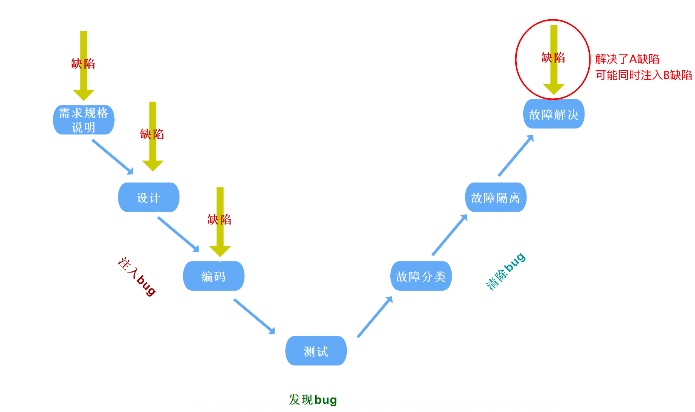
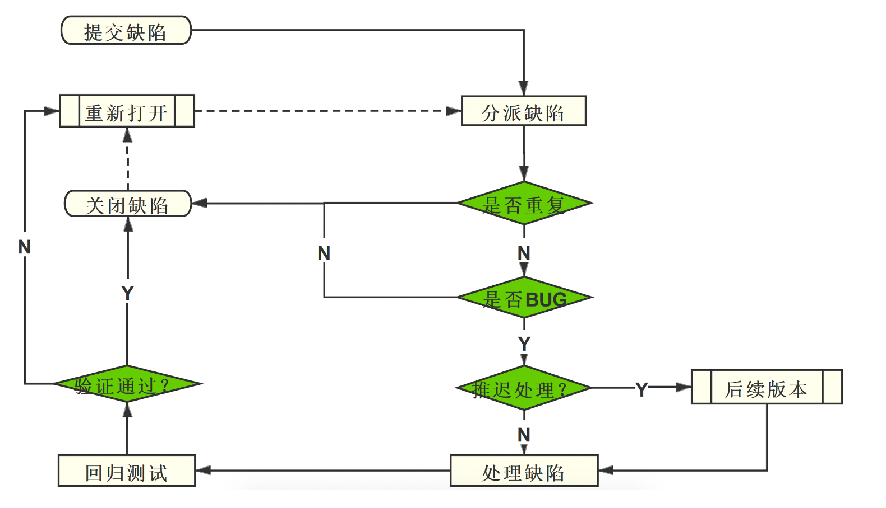

## 缺陷

软件中存在的各种问题，都为缺陷，简称bug；

|类别|内容|
|----|----|
|缺陷报告编号|缺陷的唯一性标志|
|严重程度|严重（S1）：主功能 一般（S2）：次要功能 微小（S3）：易用性、界面 建议（S4）：建议性问题|
|缺陷优先级|Priority 0：24小时之内解决 Priority 1：发布前必须修复 Priority 2：可以在下一个版本中修复|
|Bug类型|代码错误、兼容性问题、设计缺陷、性能问题|
|缺陷状态|New：新建 Open：打开 Closed：关闭 Postponed：延期|

缺陷衡量标准：

1. 软件未实现需求(规格)说明书中明确要求的功能 -> 少功能
2. 软件实现的功能超出需求(规格)说明书指明的范围 -> 多功能
3. 软件出现了需求(规格)说明书中指明不应该出现的错误 -> 功能错误
4. 软件未实现需求(规格)说明书中虽未明确指明但应该实现的要求(违反法律法规, 不符合行业规范) -> 隐性功能缺失/错误
5. 软件难以理解，不易使用，运行缓慢，用户体验不好 -> 不易使用

工作流程

1. 设计用例->执行用例（执行测试）->缺陷（提交、验证、关闭）
2. 缺陷定义：任何问题（Bug）
3. 缺陷标准：多功能、少功能、错误、缺少隐性功能、易用性
4. 描述缺陷重点：缺陷标题、前置条件、复现步骤、预期结果、实际结果、附件备注
5. 提交缺陷信息：指派人、缺陷等级、修复优先级、类型、状态（统计缺陷）

### 缺陷跟踪流程

