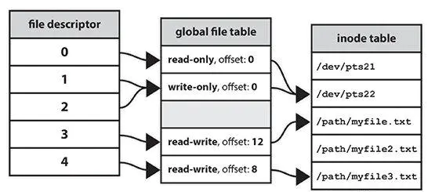
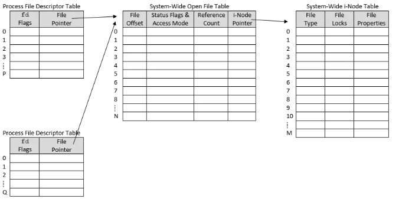

# FileDescriptor


文件描述符是一个非负整数，通常在C编程语言中表示为int类型(保留负值以表示“无值”或错误条件)。
在Linux上，进程中打开的一组文件描述符可以在路径/proc/pid/fd/下访问，其中PID是进程标识符。
在类似Unix的系统中，文件描述符可以引用在文件系统中命名的任何Unix文件类型。除了常规文件之外，它还包括目录、Blockand字符设备(也称为“特殊文件”)、Unix域套接字和命名管道。文件描述符还可以引用文件系统中通常不存在的其他对象，例如匿名管道和网络套接字。





## 系统级底层读写
下面程序中`fd`就是打开文件的文件描述符，`read()`执行系统调用将文件描述符作为参数传入进去。由内核执行后续的操作。
```c
#include <stdio.h>
#include <fcntl.h>

int main()
{
    char c;
    int fd = open("d:\\1.txt", O_RDONLY, 0);
    read(fd, &c, 1);

    printf("c = %c\n", c);
    exit(0);
}
// c = 1
```


## 用户级高级读写
没有看到文件描述符相关的信息，而是通过FILE类型的指针来进行操作。文件描述符是一个低级别的"句柄"，用于标识内核级、Linux和其他类Unix系统中打开的文件(或套接字或其他什么)。C语言对文件描述符进行了包装，提出了文件指针的概念。

文件指针是C标准库级结构，用于表示文件。FILE包装了文件描述符，并添加缓冲和其他功能，以使I/O更容易。

```c
#include <stdio.h>
#include <fcntl.h>

int main()
{
    int num;
    FILE *fptr;
    fptr = fopen("d:\\1.txt", "w");

    if(fptr == NULL) {
        printf("Error!");
        exit(1);
    }

    fprintf(fptr, "%d", 1213);
    fclose(fptr);

    return 0;
}

```
