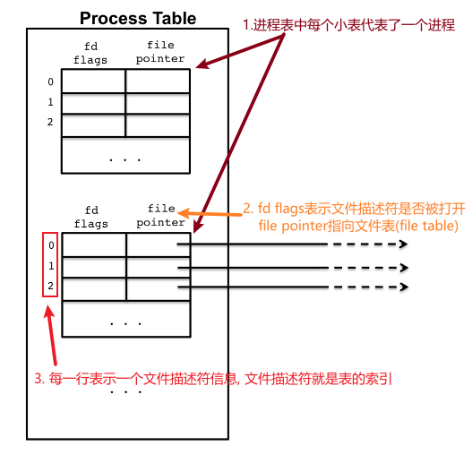
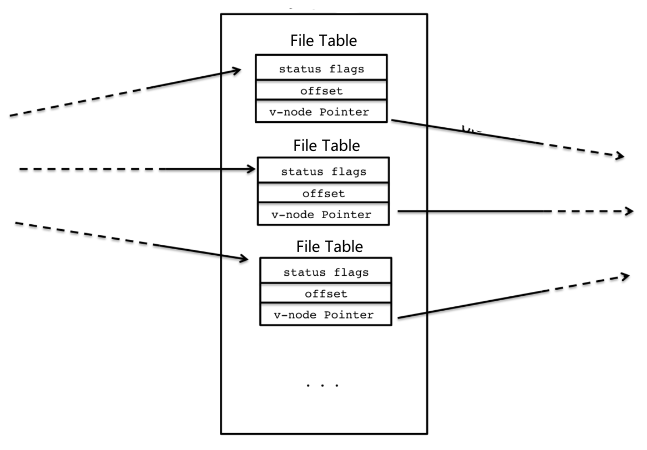
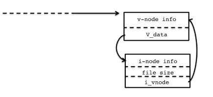
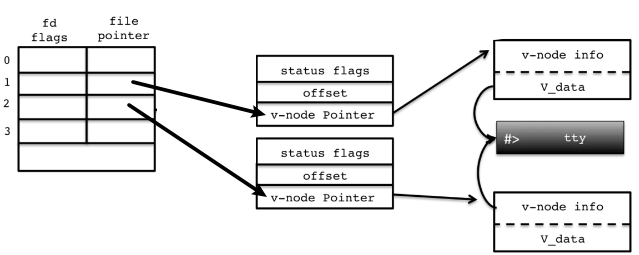
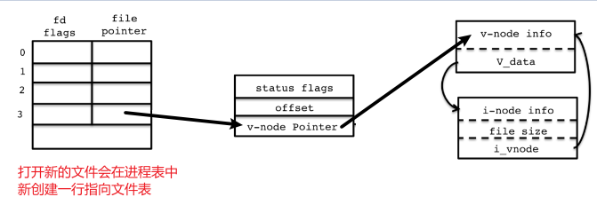
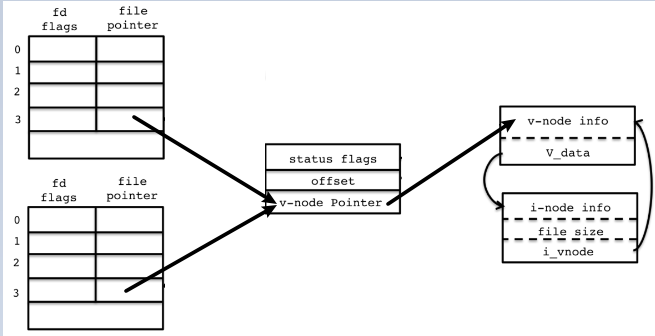
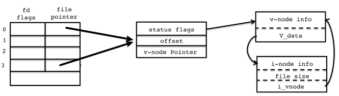
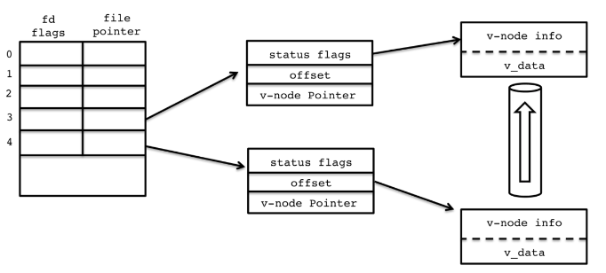

# FileSystem

内核维护了三个表:进程表(process table), 文件表(file table), v-node/i-node信息表(node table).

## 进程表
1. 内核维护了所有的进程, 每个进程都有一个进程表.
2. 进程表有两列:
    1. `fd flags`(file descriptor flags): 表示文件是否被打开
    2. `file pointer`: 指针, 指向文件表
3. 进程表中的每一行表示一个文件描述符(descriptor), 所有进程都默认具有0,1,2三个文件描述符. 文件描述符是进程表的索引(index)
4. 当fork创建子进程时,进程表,这就是为何父子进程可以共享一个打开的文件

而在Linux 系统中，有默认文件描述符
0 标准输入 STDIN_FILENO
1 标准输出 STDOUT_FILENO
2 标准错误输出 STDERR_FILENO

## 文件表
1. 每当打开一个文件时, 系统就会在全局创建一个文件表, 这个表被所有进程共享. 例如: 同一个文件被不同进程打开时, 可能具有相同的文件描述符(比如3), 但是指向的文件表不同.
2. 每个文件表包含了:
    1. status flags: 文件的读写状态
    2. offset: 偏移量, 已经读写了多少字符, 下一次从何处读写. 例如: 以读方式打开文件, 偏移量是0. 读10个字节后, 偏移量变为10.
    3. v-node pointer: 是v-node(虚拟节点)和索引节点(i-node)的引用. 包含了文件的类型, 是terminal device 比如stdin, 或是硬盘上的文件.

## v-node/i-node
1. v-node: 不同的文件系统对磁盘的编码不同, v-node虚拟了一个通用的访问方式
2. i-node: 文件的具体信息, 比如文件的大小
3. v-node和i-node互相指向

## 标准文件描述符
该文件描述符由getty创建, 标准的文件描述符不是磁盘上的文件，而是与另一个设备，终端设备相关联的文件。这意味着v-node条目是指终端设备i-node，它存储使用户能够从终端读写的底层访问功能。
下图表示的是标准输出(1)和错误输出(2)文件描述符

## 打开新文件
当我们用`open()`打开一个新文件时，会生成一个新的文件描述符. 如果此文件存在于磁盘上，则文件表条目将引用一个v-node，该节点引用可以从磁盘或存储该文件的特定设备读取/写入数据的i-node信息。

## 父子进程共享文件
当进程`fork`时, 整个进程表会被赋值, 包括打开的文件描述符. 但是不会新创建文件表, 所以父子是共享偏移量, 二者再读取时会相互影响.

## 复制文件描述符
当使用`dup2()`将一个文件描述符复制到另一个文件描述符上。
这意味着文件描述符表中的两个条目引用相同的文件表条目。结果，对文件描述符中的任何一个的读取和写入相同。

## 管道
管道更像标准的文件描述符，因为它们不引用文件系统中的文件，而是用于在管道的写读端之间输送数据的内核数据结构。对pipe()的调用将创建两个文件描述符，即管道两端的读和写文件描述符。这些文件描述符中的每一个都将在文件表中包含条目，但是v-node条目通过内核缓冲区链接。

参考:
https://www.jianshu.com/p/1041ad2f5d6b
https://blog.csdn.net/claroja/article/details/103574530
https://www.usna.edu/Users/cs/aviv/classes/ic221/s16/lec/21/lec.html
