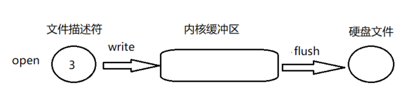
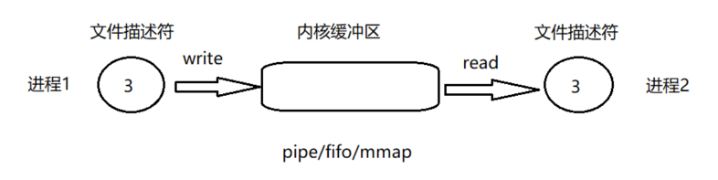
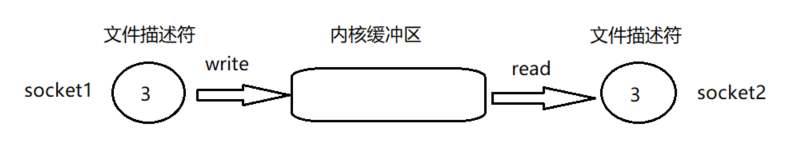

# 用户级IO

用户级IO对系统级IO的API进行高级的封装.


## 内核缓冲区:流
流是`open`,`socket`,`pipe`等操作的内核对象,内核缓冲区就是这样的流
read:从流中读数据
write:向流中写入数据

假设有一个管道,进程A为管道的写入方,B为管道的读出方
1.内核缓冲区空
B作为读出方,阻塞

2.内核缓冲区非空
当A写入数据,内核缓冲区给B发信号,唤醒B,B就可以读了

3.内核缓冲区满
假设B未开启,A一直往内核缓冲区写,写满后A.内核缓冲区发信号给A,A阻塞
B读数据,内核缓冲区变为非空状态,内核缓冲区向A发送信号,A继续写

## 缓冲类型
- 全缓冲
缓冲区满时才会嗲用时间的文件IO(除了终端设备的文件流,其他基本都是全缓冲)
- 行缓冲
遇到换行符\n才会调用文件IO.(终端设备就是行缓冲,如标准输入和标准输出,但是如果标准输入和输出重定向到某个文件时,就是全缓冲)
- 无缓冲
直接调用文件IO(标准错误就是无缓冲)


## open
1.`open`函数返回文件描述符,
2.`write`写入缓冲区
3.`flush`将缓冲区内容写入硬盘文件
4.当内核缓冲区满后,自动调用`flush`,写入硬盘文件


## pipe/fifo/mmap
1.进程1使用`pipe/fifo/mmap`创建描述符,写入(如果写满会阻塞)
2.进程2使用相同的方法创建描述符,读取(如果空会堵塞)
3.区别于`open`,`flush`相当于进程2的`read`,因为写入磁盘是被动的

## socket
1.`socket1`使用`pipe/fifo/mmap`创建描述符,写入(如果写满会阻塞)
2.`socket2`使用相同的方法创建描述符,读取(如果空会堵塞)


## 多文件描述符操作

### 忙轮询
将所有的流从头到尾询问一遍,如果有数据,就可以处理,但是如果都没数据就会浪费cpu


### 无差别轮询 select/poll
1.没有I/O产生,程序阻塞在select/poll处,有一个或多个I/O时间,从阻塞中醒来,轮询一遍所有的流
2.使用select我们有O(n)无差别轮询复杂度,当监听的流变多时,效率差
3.select最大文件描述符1024,poll没有最大限制

### 回调 epoll
1.没有最大文件描述限制
2.不是轮询方式,有活跃可用的文件描述符调用callback函数,跟踪连接数无关,复杂度O(1)


## C语言
声明FILE结构体类型的信息包含在头文件“stdio.h”中，一般设置一个指向FILE类型变量的指针变量，然后通过它来引用这些FILE类型变量。通过文件指针就可对它所指的文件进行各种操作。


基本上每种语言都是这样,文本文件可以显示给我们看,而二进制文件是每种语言所特有的,比如python的pickle,java的objectwrite

有三个特殊的文件指针由系统默认打开，用户无需定义即可直接使用:
stdin： 标准输入，默认为当前终端（键盘），我们使用的scanf、getchar函数默认从此终端获得数据。
stdout：标准输出，默认为当前终端（屏幕），我们使用的printf、puts函数默认输出信息到此终端。
stderr：标准出错，默认为当前终端（屏幕），我们使用的perror函数默认输出信息到此终端。

C语言中，EOF表示文件结束符(end of file)。在while循环中以EOF作为文件结束标志，这种以EOF作为文件结束标志的文件，必须是文本文件。在文本文件中，数据都是以字符的ASCII代码值的形式存放。我们知道，ASCII代码值的范围是0~127，不可能出现-1，因此可以用EOF作为文件结束标志。

当把数据以二进制形式存放到文件中时，就会有-1值的出现，因此不能采用EOF作为二进制文件的结束标志。为解决这一个问题，ANSI C提供一个feof函数，用来判断文件是否结束。feof函数既可用以判断二进制文件又可用以判断文本文件。


### 打开和关闭文件

#### fopen
```c
FILE * fopen ( const char * filename, const char * mode );
```

参数|描述
--|--
filename|C字符串,文件名
mode|

mode|描述
--|--
"r"|read: Open file for input operations. The file must exist.
"w"|write: 创建新文件,如果已存在,则覆盖
"a"|append: 追加,如果文件不存在,则创建.光标在末尾,忽略`fseek, fsetpos, rewind`
"r+"|read/update: Open a file for update (both for input and output). The file must exist.
"w+"|write/update: 创建新文件,如果已存在,则覆盖
"a+"|append/update: Open a file for update (both for input and output) with all output operations writing data at the end of the file. Repositioning operations (fseek, fsetpos, rewind) affects the next input operations, but output operations move the position back to the end of file. The file is created if it does not exist.

1. mode:使用`b`来处理二进制文件,如"rb","wb","ab","r+b","w+b"
2. mode:C2011中加了'x',来确认文件是否存在,而不是直接覆盖文件
3. mode:"+",文件stream在写后的读操作,会先调用flushed(`fflush)或repositioned((fseek, fsetpos, rewind)
4. mode:"+",读后的写操作,需要先调用`fseek, fsetpos, rewind`

注意: 为什么会有`b`模式?
实际上，fopen()的 b 标志不但可以打开二进制文件，还可以打开文本文件，同样，不带 b 标志也可以打开文本文件。既然这样，为什么还要区分两种打开方式呢？
因为这两种方式在读写`文本`文件时的操作是不一样的。
之所以 C 语言要区分“文本文件”和“二进制文件”这两个概念，是因为每个操作系统存储换行符的方式不一样。类 UNIX 系统（包括 Linux、BSD、现代 macOS 等）用 LF "\n" 表示换行，DOS 和 Windows 系统使用 CRLF "\r\n" 表示换行，Classic Mac OS 使用 CR "\r" 表示换行。这个要是错了，在一些程序中，可能会解析成错误的结果。具体的:
1、使用二进制方式进行读文本文件时，会原封不动的读出全部的内容，写文件的时候，会把内存缓冲区的内容原封不动的写到文件中。
2、使用文本方式进行读文本文件时，会将回车换行符号CRLF(0x0D OxOA)全部转换成单个的换行符号LF(OxOA)，写文件的时候，会将换行符号LF( OxOA)全部转换成回车换行符号CRLF(0x0D OxOA)
```c
FILE* fp = fopen("1.txt", "wt");//以文本方式写文件
if (fp)
	{
		for (int i = 0;i < 10;i++)
		{
			fprintf(fp,"%s%s\n","12","34");//行尾加回车符:\n
		}
		fclose(fp);
		fp = NULL;
	}
```
使用编辑器, 显示换行符, 可以看到在写文件时，`\n (LF)`转换成了 `\r\n (CR LF)`。
所以c语言中的二进制`b`和文本`t`模式, 仅是换行符的区别. 其他语言则不然, 比如在`python`中, 二进制`b`是和c语言一样的, 但是`t`模式下, `python`还增加了`encoding`参数, 用来编解码GBK, utf等.

```c
#pragma warning(disable:4996)

#include<stdio.h>
#include<stdlib.h>

int main()
{
	FILE * pFile;
	pFile = fopen("test.txt", "w");
	fputs("fopen example", pFile);
	fclose(pFile);
	return 0;
}

```


#### fclose
1. 关闭文件,在之前刷新缓冲区

参数|描述
--|--
stream| FILE object

返回|描述
--|--
成功|返回0
失败|EOF(-1)


#### freopen
1. 重定向已经打开的流
```c
FILE *freopen(const char *filename, const char *mode, FILE *stream)
```

参数|描述
--|--
filename|C字符串,要打开的文件名
mode|C字符串
stream|FILE指针,要被重新打开的流

```c
#pragma warning(disable:4996)

#include<stdio.h>
#include<stdlib.h>

int main()
{
	FILE *fp;
	fp = freopen("test.txt", "w", stdout);
	printf("%s\n","将标准输出的流重定向到文件"); //printf本应该打印在控制台,现在写入了文件
	fclose(fp);
}
```

### 操作文件内容

#### fread
`size_t fread ( void * ptr, size_t size, size_t count, FILE * stream )` Read block of data from stream
1. fread()──从fp所指向文件的当前位置开始，一次读入size个字节，重复count次，并将读入的数据存放到从buffer开始的内存中； 
2. 读写的是数据块,既`size_t size`
参数|描述
--|--
ptr|block of memory with a size of at least (size*count) bytes,converted to a void*
size|Size, in bytes, of each element to be read.
count|Number of elements, each one with a size of size bytes.
stream|Pointer to a FILE object 

返回|描述
--|--
成功| 返回count


```c
#pragma warning(disable:4996)

#include<stdio.h>
#include<stdlib.h>

int main()
{
	FILE *fp = fopen("test.txt", "r");
	char arr[5] = { 0,0,0,0,0 }; //一定要初始化数组,不然会很'烫'(声明数组时,内存空间可能被其他程序修改过)
	fread(arr, 2, 2, fp);
	printf("%s\n",arr);
	fclose(fp);
	system("pause");
	return(0);
}
```

### fwrite
和fread对应


## int 类型读写

```c
#pragma warning(disable:4996)

#include <stdio.h>
#include <stdlib.h>
int main()
{
	FILE * pFile = fopen("test.txt", "wb+");

	int wbuffer[] = { 1 };
	fwrite(wbuffer, sizeof(int), 1, pFile);

	rewind(pFile);// 此时文件position已经在1字节后
	int rbuffer[] = { 0 };
	fread(rbuffer, sizeof(int), 1, pFile);

	printf("%d\n", rbuffer[0]);
	system("pause");
	fclose(pFile);
	return 0;
}
```


### 结构体读写
```c
#pragma warning(disable:4996)

#include <stdio.h>
#include <stdlib.h>
#include <string.h>
typedef struct {
	int age;
	char name[10];
}person;


int main()
{
	FILE * pFile = fopen("test.txt", "wb+");
	
	person wper;
	wper.age = 10;
	strcpy(wper.name, "wang");// 字符串数组
	fwrite(&wper, sizeof(person), 1, pFile);
	
	rewind(pFile);// 此时文件position已经在1字节后
	
	person rper;
	fread(&rper, sizeof(person), 1, pFile);
	printf("%d %s\n", rper.age, rper.name);
	system("pause");
}

```

#### fseek
方法|描述
--|--
fgetpos|Get current position in stream (function )
fsetpos|Set position indicator of stream (function )
ftell|Get current position in stream (function )
fseek|Reposition stream position indicator (function )
rewind|Set position of stream to the beginning (function )


ftell() 和 fseek() 用长整型表示文件内的偏移 (位置)
fgetpos() 和 fsetpos() 函数使用 了一个特殊的类型定义 fpos_t 来表示偏移量


### buffer
ANSI C标准采用“缓冲文件系统”处理数据文件。所谓缓冲文件系统是指系统自动地在内存区为程序中每一个正在使用的文件开辟一个文件缓冲区从内存向磁盘输出数据必须先送到内存中的缓冲区，装满缓冲区后才一起送到磁盘去。
如果从磁盘向计算机读入数据，则一次从磁盘文件将一批数据输入到内存缓冲区(充满缓冲区)，然后再从缓冲区逐个地将数据送到程序数据区(给程序变量) 。
#### setbuf
`void setbuf ( FILE * stream, char * buffer );`  Set stream buffer
1. 设置文件描述符的缓冲区大小
2. stream buffer是一个 block of data,在i/o操作和 physical file(文件) 之间
3. output buffers,写出:数据会放在buffer区,直到填满,然后会flushed(发送给 物理文件并清空buffer区)
4. input buffers,也是如此
5. Stream buffers can be explicitly flushed by calling `fflush`, `fclose` and `freopen`或者程序terminates normally(正常终止)会自动调用`fllush`
6. 所有打开的文件都默认带有`buffer`
7.  stdin and stdout are fully buffered by default  if they are known to not refer to an interactive . Otherwise, they may either be line buffered or unbuffered by default
8.  通过setvbuf 改变缓冲方式

参数|描述
--|--
stream| FILE object
buffer|存放buffer的数组


```c
#pragma warning(disable:4996)

#include<stdio.h>
#include<stdlib.h>

int main()
{
	char buf[BUFSIZ];
	printf("缓冲区大小是%d字节\n", BUFSIZ);
	setbuf(stdout, buf);
	puts("hello world");  //屏幕此时没有输出,因为存在buf数组里
	system("pause");
	fflush(stdout);  //屏幕输出
	system("pause");
	return(0);
}
```


#### setvbuf
`int setvbuf ( FILE * stream, char * buffer, int mode, size_t size );`Change stream buffering
1. 设置缓冲方式(Full buffering,Line buffering,No buffering)


参数|描述
--|--
stream|Pointer to a FILE object
buffer|User allocated buffer. Shall be at least size bytes long.如果空,会自动设置默认buffer(BUFSIZ)
mode|三种
size|Buffer size, in bytes.

mode|描述
--|--
_IOFBF|Full buffering,写出:buffer区间满,刷新,读入:buffer空,刷新
_IOLBF|Line buffering,写出:buffer区满或碰到换行符,刷新,读入:buffer空,或换行符,刷新
_IONBF|No buffering,没有缓冲区,buffer and size参数被忽略

返回|描述
--|--
成功|返回0
失败|非0


```c
#pragma warning(disable:4996)

#include<stdio.h>
#include<stdlib.h>

int main()
{
	setvbuf(stdout, NULL, _IONBF, 512);
	puts("hello world"); //直接输出到屏幕,不需要刷新缓冲区
	system("pause");
	fflush(stdout);
	system("pause");
	return(0);
}
```


#### fflush
`int fflush ( FILE * stream );` Flush stream
功能：更新缓冲区，让缓冲区的数据立马写到文件中。
参数：
stream：文件指针
返回值：
成功：0
失败：-1


### scan&printf

#### scanf
1. scanf()第一个参数是一个都带有格式的控制串
2. .第二个参数是地址(address).
3. 从键盘输入一切数据(数字、字母，还是空格、回车、Tab)都会放入缓冲区(队列),按回车后读取缓冲区内容
4. 对 %d 而言，空格、回车、Tab 键都是区分数据与数据的分隔符,如果碰到不会取用,而是跳过知道取到十进制整数”为止.
5. %d 遇到字母，那么它不会跳过也不会取用，而是直接从缓冲区跳出,所以下面的程序会打印变量i的未初始化的值
6. %c，那么任何数据都会被当作一个字符，不管是数字还是空格、回车、Tab 键它都会取回。
7. 在读入数字时,scanf()跳过空白字符(空格,换行符和跳格符),但在读入字符时,不会跳过空白字符.
```c
#pragma warning(disable:4996)

#include<stdio.h>
#include<stdlib.h>

int main()
{
	int i;
	scanf("%d", &i);  //&i 表示变量 i 的地址，&是取地址符
	printf("i = %d\n", i);
	system("pause");
}
```


#### printf


## python
### 打开和关闭文件
#### open

1. 二进制读写
使用`open()`函数, 二进制字节对象,不会执行编码,解码和换行符转换操作.
1. 硬盘二进制写入
```python
f = open("file.jpg","wb")   # 硬盘中, 写入字节
```
2. 硬盘二进制读取
```python
f = open("myfile.jpg", "rb")  # 硬盘中, 读取字节
```


2. 文本读写
```python
f = open('hello.txt', 'w')

f.write("Hello Python!\n")

## f.flush()  # 如果不冲洗,则硬盘没有内容`hello Python`还保存在内存的缓冲区,调用后才写入磁盘
## f.close()  # close方法先调用flush()方法,再写入
```

#### close

`f.close()`  # close方法先调用flush()方法,再写入

### 操作文件内容

#### read

#### write

### BytesIO

省略了保存到硬盘的步骤, 相当于在内存中虚拟了硬盘的存储空间
1. 内存二进制写入
```python

## 保存字符串的二进制
binaryObject = '王'.encode('utf-8')  # 将字符转换为二进制对象
bytes_io = BytesIO(binaryObject)  # 将二进制


## 保存matplotlib二进制图片
buf = BytesIO()  #另一种写入BytesIO的方法
plt.savefig(buf,format='png') # 保存图片二进制
```

2. 内存二进制读取
`BytesIO对象`和`open()`函数返回的`file对象`有相同的`read`和`write`函数
```python
## 字符串二进制读取
from io import BytesIO # 和StringIO类似
bytes_io = BytesIO('王'.encode('utf-8'))
bytes_io.getvalue().decode('utf-8')


## 图片二进制读取
from PIL import Image
from io import BytesIO
i = Image.open(BytesIO(binaryImgObject))
```

### 应用
```python
from jinja2 import Template,FileSystemLoader,Environment
env = Environment(loader=FileSystemLoader("./"))
template = env.get_template("./test.html")

import matplotlib.pyplot as plt
x = [1,2,3]
y = [1,2,3]
plt.plot(x,y)
from io import BytesIO
buf = BytesIO()  #另一种写入BytesIO的方法
plt.savefig(buf,format='png') #另一种写入BytesIO的方法
import base64
data = base64.b64encode(buf.getvalue()).decode()
data = "data:image/png;base64," + data
temp_render = template.render(name=data)
print(temp_render)

```

```html
<!DOCTYPE html>
<html lang="en">
<head>
    <meta charset="UTF-8">
    <meta name="viewport" content="width=device-width, initial-scale=1.0">
    <title>Document</title>
</head>
<body>
    
    
</body>
</html>
```

### StringIO

内存读写

```python
from io import StringIO
string_io = StringIO("hello\nworld")
string_io.readline()  # 获得行
string_io.getvalue() # 获得存储的值

from io import StringIO
string_io = StringIO()
string_io.write("hello")
string_io.getvalue()
string_io.seek(0)  # 回到起始位置,每次写入指针都会后移动
string_io.readline()
```


## 应用
Text I/O 对象
StringIO可以当成open打开文件返回的对象来使用
```python
f = open("myfile.txt", "r", encoding="utf-8")
f = io.StringIO("some initial text data")
```

```python
import io
f = io.StringIO("id,name\n1,brian\n2,amanda\n3,zoey\n")
df = pd.read_csv(f) # pandas takes a file path or a file-like object
```


参考:
http://www.gnu.org/software/libc/manual/html_node/I_002fO-on-Streams.html#I_002fO-on-Streams
http://www.cplusplus.com/reference/cstdio/
http://www.gnu.org/software/libc/manual/html_node/I_002fO-on-Streams.html#I_002fO-on-Streams
http://blog.sina.com.cn/s/blog_ade902fe0101l4yd.html
http://www.cplusplus.com/reference/cstdio/
http://www.gnu.org/software/libc/manual/html_node/I_002fO-on-Streams.html#I_002fO-on-Streams
http://www.gnu.org/software/libc/manual/html_node/I_002fO-on-Streams.html#I_002fO-on-Streams
http://c.biancheng.net/view/159.html
https://docs.python.org/3/library/functions.html#open
https://www.cnblogs.com/maociping/p/5132583.html
https://www.cnblogs.com/gregoryli/p/7899010.html
https://stackoverflow.com/questions/7996479/what-is-stringio-in-python-used-for-in-reality
