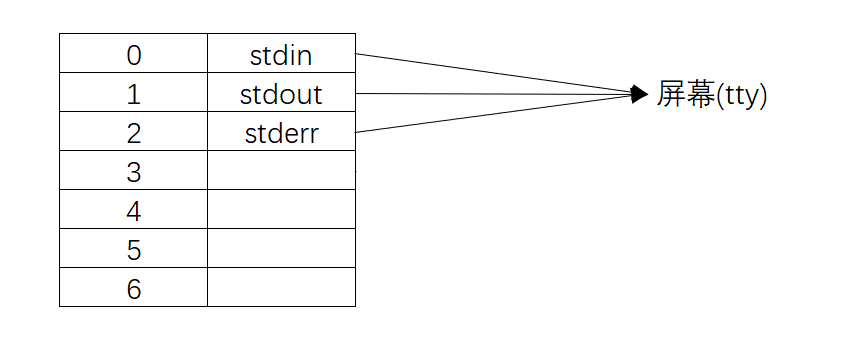
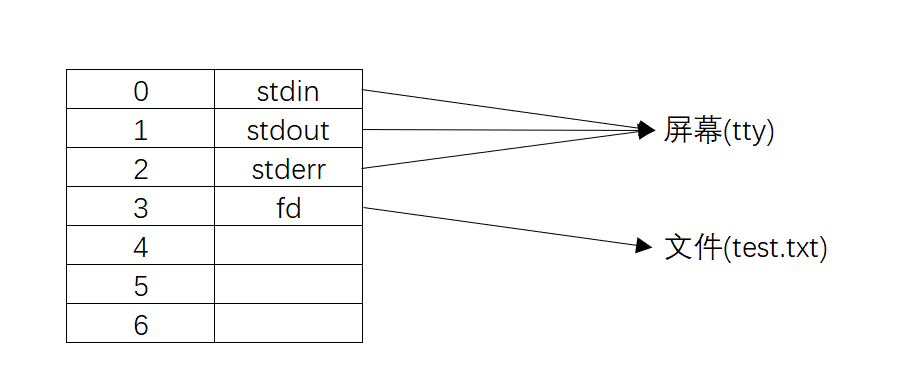
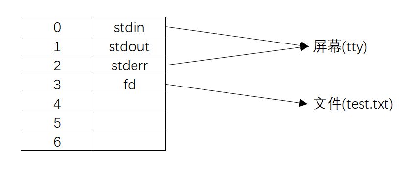
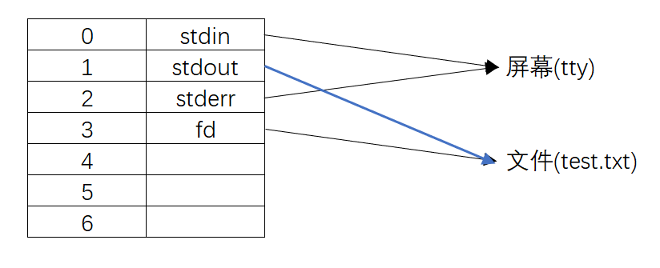

# 系统级IO

## 基础概念
1. 系统级IO是相较于用户级IO的概念, 系统级IO更底层.
2. Linux中会将所有的设备都当做文件来处理,每个文件对应一个文件描述符(file descriptor).所有的I/O操作都会调用文件描述符.比如
	1. 文件描述符0对应的是标准输入,就是我们的键盘.
	2. 文件描述符1对应的是标准输出,就是我们的console.
3. 系统为每一个进程维护了一个文件描述符表,表默认是0~1023. 如果新打开一个文件描述符(包含socket),是从最小的文件描述符开始占用. 文件描述符总共有1024个(0stdin,1stdout,2stderr),可以关掉(0,1,2)文件描述符


## c

### 打开和关闭文件描述符

#### open
打开文件, 返回文件的描述符.
`open()`来自`fcntl.h`,系统级;`fopen()`来自`stdlib.h`,用户级.`fopen()`最终会调用`open()`.

```c
int open(const char *path, int oflag, ... /*mode_t mode*/ );
int fd = open("path/to/file", O_RDONLY);
int fd = open("test.txt", O_WRONLY | O_TRUNC | O_CREAT, 0664);
```
1. 参数
参数|描述
--|--
pathname|
flags|必选项O_RDONLY,O_WRONLY,O_RDWR&可选项O_APPEND-O_CREAT-O_EXCL-O_NONBLOCK
mode|权限位(mode & ~umask)

`oflag`参数详解:
flag|描述
--|--
O_RDONLY |open for reading only
O_WRONLY |open for writing only
O_RDWR| open for reading and writing
O_APPEND |append on each write
O_CREAT |create file if it does not exist
O_TRUNC |truncate size to 0

`mode`参数详解:
mode|描述
--|--
S_IRUSR 00400 |owner has read permission
S_IWUSR 00200| owner has write permission
S_IXUSR 00100 |owner has execute permission
S_IRGRP 00040 |group has read permission
S_IWGRP 00020 |group has write permission
S_IXGRP 00010 |group has execute permission
S_IROTH 00004 |others have read permission
S_IWOTH 00002| others have write permission
S_IXOTH 00001| others have execute permission

2. 返回值:
最小可用的文件描述符,失败返回-1,设置errnum


#### close
关闭文件描述符, 成功返回0,失败返回-1,可以设置errnum.
stdin,stdout,stderr的文件描述符分别是0,1,2.
```c
int close (int filedes)

#pragma warning(disable:4996)
#include <fcntl.h>
#include <stdio.h>

int main()
{
	int fd = open("test.txt", O_WRONLY);
	printf("%d\n", fd); //一般为3,其余的被stdin,stdout和stderr占用
	close(fd);
	system("pause");
}
```

#### create
1. `int creat (const char *filename, mode_t mode)`
2. `create()` 等价于`open (filename, O_WRONLY | O_CREAT | O_TRUNC, mode)`


### 操作文件内容

#### read
`ssize_t read(int fd,void*buf,size_t count)`
参数|描述
--|--
fd|默认为一般为3,0,1,2是stdin,stdout,stderr
buf|要读入的数据
count|读入的字节数,读后位置后移

#### write
`ssize_t write(int fd,const void*buf,size_t count);`
参数|描述
--|--
fd|默认为一般为3,0,1,2是stdin,stdout,stderr
buf|要写出的数据
count|是每次写出的字节数
3.返回
成功:返回写出的字节数
失败:返回-1


### dup
重定向文件描述符
```c
#ifndef _UNISTD_H
#define _UNISTD_H
#include <io.h>
#include <process.h>
#endif /* _UNISTD_H */
//#include <unistd.h>
#include <fcntl.h>
#include <stdio.h>


int main()
{
	int fd;
	fd = open("./test.txt", O_WRONLY | O_TRUNC | O_CREAT);
	close(1); //关闭文件描述符1,既stdout
	dup2(fd, 1); //将文件描述符1,对应的位置输出指向换成fd对应的位置输出指向
	printf("Hello World!\n"); //把请按任意键继续都打印进去了
	system("pause");
}

```

1. 初始化进程,默认0,1,2,对应stdin,stdout,stderr,都输出到屏幕

2. `fd=open(...)`,新打开一个文件描述符,指向文件

3. `close(1)`,将文件描述符1对应的指向删除,此时对1做任何操作都无效

4. `dup2(fd, 1);`,将fd的指向复制给1,所以此时对1的输出都写入到文件里

5. `printf`默认的输出文件描述符是1,所以输出任何东西都会定向到文件里


### fseek
方法|描述
--|--
fgetpos|Get current position in stream (function )
fsetpos|Set position indicator of stream (function )
ftell|Get current position in stream (function )
fseek|Reposition stream position indicator (function )
rewind|Set position of stream to the beginning (function )


ftell() 和 fseek() 用长整型表示文件内的偏移 (位置)
fgetpos() 和 fsetpos() 函数使用 了一个特殊的类型定义 fpos_t 来表示偏移量


## python
读写文件是最常见的IO操作。Python内置了读写文件的函数，用法和C是兼容的。


### 打开和关闭文件描述符
#### os.open()
`os.open(file, flags[, mode])`

参数:
- filename  - 要打开的文件名。
- mode  - 这个工作方式与chmod()方法相似。
- flags - 以下常量是标志的选项。它们可以使用按位OR运算符组合。有一些在所有平台上都不可用。
	- os.O_RDONLY - 仅供读取使用
	- os.O_WRONLY - 仅供写入
	- os.O_RDWR - 开放阅读和写作
	- os.O_NONBLOCK - 不要阻止打开
	- os.O_APPEND - 附加在每次写入
	- os.O_CREAT - 如果不存在，则创建文件
	- os.O_TRUNC - 将大小截短为0
	- os.O_EXCL - 如果创建和文件存在错误
	- os.O_SHLOCK - 原子地获取一个共享锁
	- os.O_EXLOCK - 原子地获取排他锁
	- os.O_DIRECT - 消除或减少缓存效果
	- os.O_FSYNC - 同步写入
	- os.O_NOFOLLOW - 不要遵循符号链接

返回值:
此方法返回新打开的文件的文件描述符。

```python
import os, sys
## Open a file
fd = os.open( "foo.txt", os.O_RDWR|os.O_CREAT )
## Write one string
line = "this is test" 
## string needs to be converted byte object
b = str.encode(line)
os.write(fd, b)
## Close opened file
os.close( fd)
```

### 操作文件内容

#### os.read()
`os.read(fd,n)`
参数
- fd - 这是文件的文件描述符。n - 这些是文件描述符fd的n个字节
- n - 这些是文件描述符fd的n个字节。
返回值
此方法返回一个包含读取字节的字符串。
```python
import os, sys

## Open a file
fd = os.open("foo.txt",os.O_RDWR)

## Reading text
ret = os.read(fd,12)
print (ret.decode())

## Close opened file
os.close(fd)
```

#### os.write()
`os.write(fd, str)`

参数
- fd - 这是文件描述符。
- str - 这是要写的字符串。
返回值
此方法返回实际写入的字节数。

```python
import os, sys

## Open a file
fd = os.open( "f1.txt", os.O_RDWR|os.O_CREAT )

## Write one string
line = "this is test" 

## string needs to be converted byte object
b = str.encode(line)
ret = os.write(fd, b)

## ret consists of number of bytes written to f1.txt
print ("the number of bytes written: ", ret)

## Close opened file
os.close( fd)
```


#### lseek
`os.lseek(fd, pos, how)`

参数

fd  - 这是文件描述符，需要处理。
pos  - 这是相对于给定参数文件的位置。os.SEEK_SET或0设置相对于文件开头的位置，os.SEEK_CUR或1用来设置它相对于当前位置; os.SEEK_END或2用来设置它相对于文件的结尾。
how  - 这是文件中的参考点。os.SEEK_SET或0表示文件的开头，os.SEEK_CUR或1表示当前位置，os.SEEK_END或2表示文件的结尾。

定义的pos常数
- os.SEEK_SET = 0
- os.SEEK_CUR = 1
- os.SEEK_END = 2
返回值
此方法不返回任何值。

```python
import os, sys

## Open a file
fd = os.open( "foo.txt", os.O_RDWR|os.O_CREAT )

## Write one string
line = "This is test"
b = line.encode()
os.write(fd, b)

## Now you can use fsync() method.
## Infact here you would not be able to see its effect.
os.fsync(fd)

## Now read this file from the beginning
os.lseek(fd, 0, 0)
line = os.read(fd, 100)
print ("Read String is : ", line.decode())

## Close opened file
os.close( fd )
```


### dup
`os.dup2(fd, fd2)`

参数
fd − 这是用于重复的文件描述符。fd2 − 这是重复的文件描述符。
返回值
此方法返回文件描述符的副本。


```python
import os
fd = os.open( "foo.txt", os.O_RDWR|os.O_CREAT )
os.write(fd, b"This is test")
fd2 = 1000
os.dup2(fd, fd2)  # 关闭fd2的文件描述符指向的文件,并将fd2文件描述符指向fd文件描述符指向的文件
os.lseek(fd2, 0, 0)
str = os.read(fd2, 100)
os.close(fd2)

import os
fd = os.open( "foo.txt", os.O_RDWR|os.O_CREAT )
os.dup2(fd,1)
print('hello')
```


## shell

### 文件描述符的数量设置
查看系统级别最大打开文件数`sysctl -a | grep fs.file-max` 197185
查看用户级别最大打开文件数`ulimit -n` 1024
也就是说系统为了不让某个进程占用全部文件描述符,设置了用户级别限制,所以可以通过更改用户级别限制来优化服务器
临时修改文件描述符上限:ulimit -SHn 65535
永久修改可以配置/etc/security/limits.conf文件

`shell`中可以使用exec命令来改变文件描述符对应的文件(设备) `exec 1 > test`


参考:
https://blog.csdn.net/claroja/article/details/103580327
http://www.gnu.org/software/libc/manual/html_node/Opening-and-Closing-Files.html#Opening-and-Closing-Files
http://www.gnu.org/software/libc/manual/
http://blog.sina.com.cn/s/blog_ade902fe0101l4yd.html
http://www.cplusplus.com/reference/cstdio/
http://www.gnu.org/software/libc/manual/html_node/I_002fO-on-Streams.html#I_002fO-on-Streams
https://www.yiibai.com/python/os_file_methods.html
