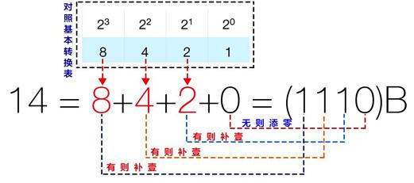
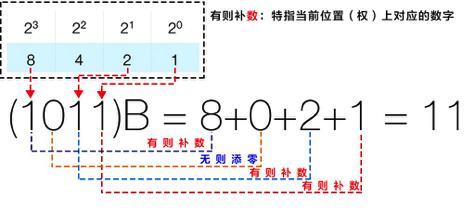
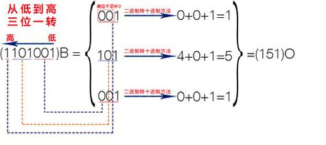
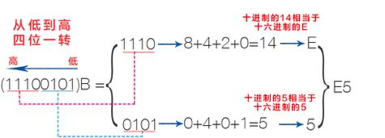
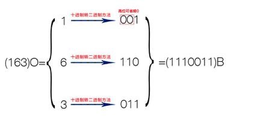
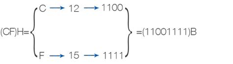

# 进制转换


## 最佳实践



## 进制的概念

进制是一种数值表示方式，它规定了数的基数（或称为底数）和位数（或称为位权）

- 基数:

    - 二进制(Binary, B)：基数为2，只包含0和1两个数字。
    - 八进制(Octal, O)：基数为8，包含0-7这8个数字。
    - 十进制(Decimal, D)：基数为10，包含0-9这10个数字。
    - 十六进制(Hexadecimal, H)：基数为16，包含0-9和A-F这16个数字。

    🌰(1111)B = (17)O = 15 = (F)H

- 位数:

    位权是指在某种进位计数制中，数位所代表的大小，即处在某一位上的1所表示的数值的大小。例如，在十进制中，个位的位数为1，十位的位数为10，百位的位数为100。

    🌰$10^2$, 其中10是基数, 2是位数。


|二进制|八进制|十进制|十六进制|
|------|------|------|--------|
|0|0|0|0|
|1|1|1|1|
|10|2|2|2|
|11|3|3|3|
|100|4|4|4|
|101|5|5|5|
|110|6|6|6|
|111|7|7|7|
|1000|10|8|8|
|1001|11|9|9|
|1010|12|10|A|
|1011|13|11|B|
|1100|14|12|C|
|1101|15|13|D|
|1110|16|14|E|
|1111|17|15|F|


## 进制转换的分类

在进制转换中，我们通常会遇到以下几种情况：


- 十进制与二进制, 八进制, 十六进制的转换
- 二进制, 八进制, 十六进制之间的转换


## 十进制与其他进制之间的转换


### 其他进制转十进制


1. 从二进制到十进制的转换

    将每一位上的数与其对应的权重相乘然后将结果相加即可。例如：

    - 二进制数：1101
    - 权重：$2^3$，$2^2$，$2^1$，$2^0$
    - 计算过程：$1×2^3 + 1×2^2 + 0×2^1 + 1×2^0 = 8 + 4 + 0 + 1 = 13$
    - 所以二进制数 1101 等于十进制的 13。

2. 从八进制到十进制的转换, 同二进制, 仅基数改变
3. 从十六进制到十进制的转换, 同二进制, 仅基数改变


### 十进制转其他进制

1. 从十进制到二进制的转换需要用到除法和取余数的方法。具体步骤如下：

    1. 将十进制数除以2；
    2. 记录下商和余数；
    3. 如果商不为0则继续用商除以2重复步骤2；
    4. 当商为0时停止计算；
    5. 将所有的余数倒序排列就得到了二进制的形式。例如将十进制的25转换为二进制：

    $25 ÷ 2 = 12\cdots1$
    $12 ÷ 2 = 6\cdots0$
    $6 ÷ 2 = 3\cdots0$
    $3 ÷ 2 = 1\cdots1$
    $1 ÷ 2 = 0\cdots1$

    所以十进制的25等于二进制的11001。

2. 从十进制到八进制, 同二进制, 仅基数改变
3. 从十进制到十六进制, 同二进制, 仅基数改变


### 1024和$2^{10}$以内的十进制与二进制快速转换


首先, 熟记2的次方的结果

| 序号n | 10 | 9 | 8 | 7 | 6 | 5 | 4 | 3 | 2 | 1 | 0 |
|-------|----|----|----|----|----|----|----|----|----|----|----|
| $2$的$n$次方 | $2^{10}$ | $2^9$ | $2^8$ | $2^7$ | $2^6$ | $2^5$ | $2^4$ | $2^3$ | $2^2$ | $2^1$ | $2^0$ |
| $2$的$n$次方结果 | 1024 | 512 | 256 | 128 | 64 | 32 | 16 | 8 | 4 | 2 | 1 |


🌰将十进制14转换为二进制.

1. 14后面是8, 既$2^3$, 14-8=6, 所以第4位($2^3$对应的), 填入1
2. 6后面是4, 既$2^2$, 6-4=2, 所以第3位($2^2$对应的), 填入1
3. 2后面是2, 既$2^1$, 2-2=0, 所以第2位($2^1$对应的), 填入1
4. 0前面有1, 既$2^0$, 所以第1位($2^0$对应的), 填入0
5. 最终的结果是1110




🌰将二进制1011转换为十进制




## 二进制, 八进制, 十六进制的转换


### 从低进制到高进制的转换

1. 二进制转八进制

    从低位到高位, 每3位分为1组, 每组进行十进制转换, 然后拼贴

    

2. 二进制转十六进制

    从低位到高位, 每4位分为1组, 每组进行十进制转换, 然后拼贴

    

3. 从八进制到十六镜子, 同二到八, 2个为1组

✨总结：2进制于8进制的转换要以2进制与10进制的转换为基础，注意每个三位当成一个单独的二进制。

### 从高净值到低进制的转换


1. 八进制转二进制

    从低位到高位, 每1位1组, 1组4格无值填0, 每组进行十进制转换, 然后拼贴

    


2. 十六进制转二进制

    从低位到高位, 每1位1组, 1组4格无值填0, 每组进行十进制转换, 然后拼贴

    

3. 从十六进制到八进制, 没2位1组


## 计算机的单位

计量单位

- 1G = 1024M = $2^{10}$M
- 1M = 1024K = $2^{10}$M
- 1K = 1024 = $2^{10}$


字节与比特
- 1bit就是指1个比特位, 可以存2个值
- 1Byte就是指8个比特位, 可以存256个字


## 八卦中的进制


| 八卦名 | 自然 | 二进制 | 十进制 |
| ---- | ---- | ---- | ---- |
| 乾 | 天 | 111 | 7 |
| 兑 | 泽 | 110 | 6 |
| 离 | 火 | 101 | 5 |
| 震 | 雷 | 100 | 4 |
| 巽 | 风 | 011 | 3 |
| 坎 | 水 | 010 | 2 |
| 艮 | 山 | 001 | 1 |
| 坤 | 地 | 000 | 0 |


## python中的进制


二进制转十进制
```python
int('00000010', 2)   # 2
int('00000011', 2)   # 3
int('00010001', 2)   # 17
int('11111111', 2)   # 255
```

十进制转二进制
```python
bin(2)   # '0b10'
bin(3)   # '0b11'
bin(17)   # '0b10001'
bin(255)   # '0b11111111'
```


## 参考

- https://www.juhe.cn/news/index/id/9227