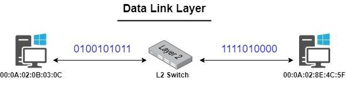

# osi

## OSI7层协议介绍

开放系统互联(Open Systems Interconnection, OSI)七层模型是国际标准化组织（ISO）制定的网络通信模型，共包含7层:

1. 物理层（Physical Layer）
    1. 功能：物理层负责在物理介质上传输原始的比特流，即0和1。包括了针脚、电压、线缆规范、集线器、中继器、网卡、主机介面卡等。
    2. 典型设备：网线、集线器、网络接口卡（NIC）、光纤等。
    3. 协议和标准：以太网（Ethernet）、RS-232、SONET等。

    

2. 数据链路层（Data Link Layer）
    1. 功能：针对位于相同网路(LAN)的两个装置, 数据链路层利用媒体存取控制（Media Access Control，MAC）位址来进行数据帧(Data Frame)的传递 。
    2. 典型设备：交换机、网桥。
    3. 协议和标准：以太网（Ethernet）、点对点协议（PPP）、高清电视接口（HDLC）等。

    

3. 网络层（Network Layer）
    1. 功能：网络层针对位于不同网路(WAN)的两个装置。它处理逻辑地址,如网路协定（Internet Protocol，IP）和路由选择，确保数据包(Packet)可以跨越多个网络传输。
    2. 典型设备：路由器。
    3. 协议和标准：互联网协议（IP）、互联网控制消息协议（ICMP）、地址解析协议（ARP）等。

    

4. 传输层（Transport Layer）
    1. 功能：传输层的主要用途是，协助OSI前三层与OSI后三层进行沟通。它提供流量控制、错误检测和纠正，以及数据分段和重组。MAC address 和IP address﹞都是用于主机和主机之间的沟通，因此我们还需要一个端口(Port)来建立通讯，而传输层这边所提供很多不同的协议，就是进行端口与端口之间的沟通。
    2. 典型设备：防火墙（部分传输层功能）。
    3. 协议和标准：传输控制协议（TCP）、用户数据报协议（UDP）、流控制传输协议（SCTP）等。

    

5. 会话层（Session Layer）
    1. 功能：主要负责建立网络连线，等到资料传输结束时，再将连线中断。它处理会话恢复、同步和对话控制，确保长时间运行的会话能够顺利进行。会议层会透过检查点机制来同步资料传输。例如，若正在传输100 MB 档案，会议层可以每5 MB 设定一个检查点。若在传输52 MB 后中断连线或毁损，工作阶段可从上一个检查点继续进行，亦即只剩下50 MB 的资料需要传输。若没有检查点，整个传输就必须再次从头开始。
    2. 典型应用：会话管理、远程过程调用（RPC）。
    3. 协议和标准：远程过程调用（RPC）、会话初始协议（SIP）等。

    

6. 表示层（Presentation Layer）
    1. 功能：表示层负责数据的加密、解密和压缩。
    2. 典型应用：数据加密、解密，数据格式转换（如ASCII到EBCDIC）。
    3. 协议和标准：SSL/TLS、JPEG、MPEG、GIF等。

    

7. 应用层（Application Layer）
    1. 功能：应用层主要用途是，透过通讯协定和资料操作，将资讯整合起来，提供给使用者进行操作。
    2. 典型应用：网页浏览器、电子邮件客户端、文件传输协议（FTP）客户端等。
    3. 协议和标准：超文本传输协议（HTTP）、文件传输协议（FTP）、简单邮件传输协议（SMTP）、域名系统（DNS）等。

    

## 各层所用到的协议

为了把全世界的所有不同类型的计算机都连接起来，创建了互联⽹协议簇（Internet Protocol Suite）,因为最重要的两个协议是TCP和IP协议，所以，⼤家把互联⽹的协议简称TCP/IP协议

## 数据在在各层的表现形式

1. 发送数据

    

1. 接收数据

    

✨注意数据在会话层才添加HTTP头, 但是HTTP其实是在应用层

## 参考
1. https://blog.csdn.net/2301_76577168/article/details/140408905
2. https://vocus.cc/article/618c7853fd8978000108c4d5
3. https://www.telecomhall.net/t/osi-7-layers-model/6383/8
4. https://vocus.cc/article/618c7853fd8978000108c4d5