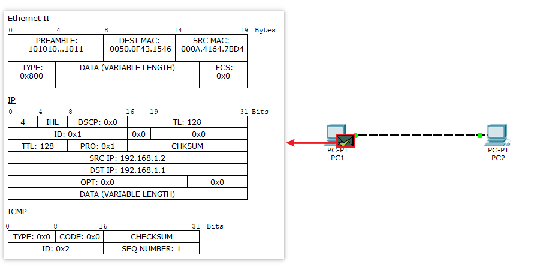
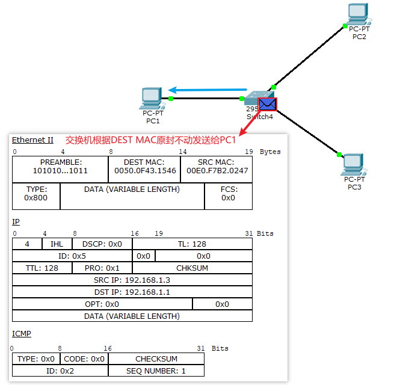

# switch


## 交换机概念

交换机(switch)记录每个网卡(network interface card, NIC)的MAC地址, 根据MAC地址来发送信息

## MAC地址(链路层)

每一个网卡唯一标识, 六个字节表示, 前三个字节用来确定厂商, 后三个字节是序号.

1. 如果PC不知⽬标IP所对应的的MAC， 那么可以看出， pc会先发送arp⼴播， 得到对⽅的MAC然后， 在进⾏数据的传送
2. 当switch第⼀次收到arp⼴播数据， 会把arp⼴播数据包转发给所有端⼝（除来源端⼝） ； 如果以后还有pc询问此IP的MAC， 那么只是向⽬标的端⼝进⾏转发数据

为什么要MAC地址(链路层)?

因为有很多subnet, 不同子网下不同电脑可能有相同的IP, 所以仅仅凭借网络层(IP地址)还不能唯一确定一台电脑

相关的协议:

1. ARP:根据IP找MAC
2. RARP:根据MAC找IP


## 两个网卡直连

### 创建网络

创建如下网络:


### 模拟通话

1. `PC1`输入`ping 192.168.1.2`, 会创建两个包ARP和ICMP.

    由于通讯的前提是知道对方的MAC地址, 所以`ping`命令发送的`ICMP`包会暂停发送, 因为不知道`192.168.1.2`MAC
    所以会创建发送ARP包获取指定IP的MAC地址, 这里`DEST MAC`是`F...F`表示发送同网段下所有主机.

    

2. `PC2`收到ARP包后首先记录主机`PC1`的MAC, 然后发送ARP包返回

    ```sh
    arp -a
    ## Internet Address      Physical Address      Type
    ## 192.168.1.1           0050.0f43.1546        dynamic
    ```

    

3. `PC1`收到返回的ARP包后, 首先记录`PC2`的MAC地址, 然后将`PC2`的MAC地址添加到`ICMP`包上, 并将`ICMP`包发送给`PC2`

    ```sh
    arp -a
    ## Internet Address      Physical Address      Type
    ## 192.168.1.2           000a.4164.7bd4        dynamic
    ```

    


4. `PC2`收到`ICMP`包后, 返回`ICMP`包给`PC1`

    

5. `PC1`收到`ICMP`包后, 此次通信结束

    


## 通过switch组网

switch的作用

1. 转发过滤： 当⼀个数据帧的⽬的地址在MAC地址表中有映射时， 它被转发到连接⽬的节点的端⼝⽽不是所有端⼝（如该数据帧为⼴播帧`F...F`则转发⾄所有端⼝）

2. 学习功能： 以太⽹交换机了解每⼀端⼝相连设备的MAC地址， 并将地址同相应的端⼝映射起来存放在交换机缓存中的MAC地址表中

### 配置网络

创建三个电脑和一个交换机:


1. 操作`PC1`在控制台输入`ping 193.168.1.3`, `PC1`会创建两个包:
    - ARP包, 用来获取目标主机的MAC地址, 因为此时`PC1`不知道`193.168.1.3`的MAC地址
    - ICMP包, ping命令发送的包, 因为不知道`PC3`的MAC所以没有链路层的协议数据, 不能发送

    首先, 会发送`ARP`包, 来获取`192.168.1.3`的MAC地址. 将ARP包发给`swtich1`, 

    

1. `switch1`收到`PC1`的ARP包后, 首先记录下`PC1`的信息, 然后查看`TARGET MAC`是`F...F`, 广播地址, 所以会将包原封不动转换给同网段的所有主机(`PC2`和`PC3`)

    ```sh
    show mac address-table 
    ##           Mac Address Table
    ## -------------------------------------------
    ## 
    ## Vlan    Mac Address       Type        Ports
    ## ----    -----------       --------    -----
    ## 
    ##    1    0050.0f43.1546    DYNAMIC     Fa0/1
    ```

    

2. 同一个subnet下的`PC2`和`PC3`收到`switch1`的ARP包

    `PC2`收到包, 查看目的IP是`192.168.1.3`, 和自己不匹配就丢弃
    `PC3`收到包, 查看和自己匹配, 于是更改包的内容, 收记录下发来包的`PC1`的地址, 并反向发送ARP包:

    ```sh
    arp -a
    ## Internet Address      Physical Address      Type
    ## 192.168.1.1           0050.0f43.1546        dynamic
    ```

    

3. `switch1`收到包后, 先记录发来包的`PC3`的MAC地址, 然后通过IP和MAC判断, 将APR包只发给`PC1`

    ```sh
    show mac address-table 
    ##           Mac Address Table
    ## -------------------------------------------
    ## 
    ## Vlan    Mac Address       Type        Ports
    ## ----    -----------       --------    -----
    ## 
    ##    1    0050.0f43.1546    DYNAMIC     Fa0/1
    ##    1    00e0.f7b2.0247    DYNAMIC     Fa0/3
    ```

    

4. `PC1`拿到包之后, 记录`PC3`的MAC地址, 在ICMP(ping)包中写入`PC3`的MAC地址, 补全链路层的内容, 发送给`switch1`.

    ```sh
    PC>arp -a
    Internet Address      Physical Address      Type
    192.168.1.3           00e0.f7b2.0247        dynamic
    ```

    


6. `PC1`通过MAC地址发送ICMP包

    
    
    


## 通过集线器组⽹

hub（集线器） 能够完成多个电脑的链接, 每个数据包的发送都是以⼴播的形式进⾏的， 容易堵塞⽹络


