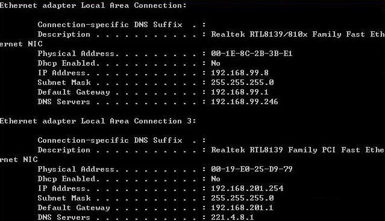
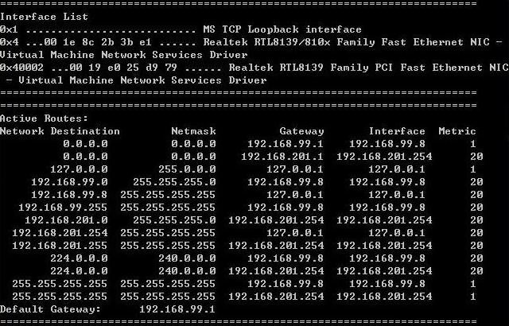
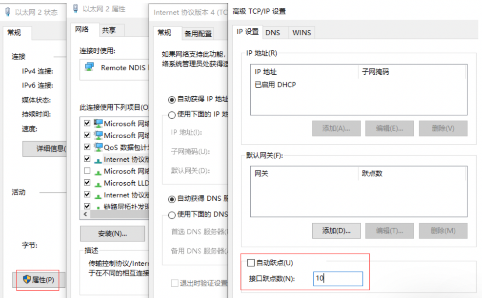

# route_windows

## 最佳实践

某公司有两个网络：

1. 一个是办公网络 
    1. 网段为: 192.168.99.0/24 
    2. 网关为： 192.168.99.1 
2. 一个是用来访问 internet 的商务网络 
    1. 网段为: 192.168.201.0/24 
    2. 网关为：192.168.201.1 

现在有一台电脑使用两块网卡:

1. 一块连接公司办公网络，IP地址为: 192.168.99.8
2. 一块连接商务网络，IP地址为: 192.168.201.254

现在需要这台电脑既能访问办公网络，也能访问商务网络。

1. 使用`ipconfig /all`命令来查看该电脑的网卡设置情况，如下图： 

    

2. 用`route print`命令来查看该电脑的路由表信息，该路由表跟上面介绍的路由表是一样的，只是增加了几条网卡 

    

3. 使用`ping`命令来测试网络连接情况，如下图： 
    1. `ping`内网是通的
    2. `ping`外网不通

    也就是说现在该电脑只能访问办公网络，但是无法访问商务网络。 

4. 由上面的路由表可以看到，系统有两条缺省路由，分别是内网`192.168.99.0`网段和外网`192.168.201.0`网段, 且`99`网段的`metric`优先级最高, 所以所有外网的请求, 都会发给内网的网关, 因此不能访问外网. 要解决这个问题，我们就需要修改路由表。 

    1. 删除默认路由: `route delete 0.0.0.0`
    2. 添加外网的网段和路由: `route add -p 0.0.0.0 mask 0.0.0.0 192.168.201.1`
    3. 添加内网的网段和路由: `route add -p 192.168.99.0 mask 255.255.255.0 192.168.99.1`

    ✨直接修改外网的metric, 让非局域网内的目标地址包都丢给外网网卡. 这样可以保留内网的路由规则, 以后不访问外网, 直接把外网的驱动删掉就行. 暂未找到使用命令行直接修改的方法.

    1. 
    2. 添加内网的网段和路由: `route add -p 192.168.99.0 mask 255.255.255.0 192.168.99.1`

5. 再用`route print`来查看路由表信息，现在我们可以看到`Persistent Routes` 

## 基础

路由器的工作是协调一个网络与另一个网络之间的通信。因此，一台路由器包含多个网卡，每一个网卡连接到不同的网段。当用户把一个数据包发送到本机以外的一个不同的网段时，这个数据包将被发送到路由器。路由器将决定这个数据包应该转发给哪一个网段。如果这台路由器连接两个网段或者十几个网段也没有关系。决策的过程都是一样的，而且决策都是根据路由表做出的。 

## 查看路由信息

1. 查看网卡信息: `ipconfig /all`

2. 命令查看路由表信息: `route print`

    1. Interface List(网卡列表)
        1. Loopback interface(127.0.0.1)
        2. Ethernet NIC以太网卡
    2. Actiue Routes(激活的路由规则)

        1. 列名
            1. Network destination: 网络目的地址。列出了路由器连接的所有的网段。
            2. Netmask: 网络掩码列提供这个网段的子网掩码。让路由器确定目的网络的地址类。
            3. Gateway：网关, 当本局域网(LAN)无法到达目的IP时, 则将包转给该网关的IP. 如果在本局域网内, 则显示本主机名或者显示online(在链路上)
            4. Interface：接口, 标识哪一个网卡连接到了目的网络。这里用IP代表网卡, 而不是直接使用物理网卡。
            5. Metric：度量, 度量(跳数)越低，优先级越高。 
        2. 行
            1. 缺省路由(0.0.0.0): 当一个数据包的目的网段不在你的路由记录中, 则发送给改规则下的网关`待补充`, `0.0.0.0`表示所有的目的网段.
            2. 本地环路(127.0.0.0): 环路目的的网段, 直接发给网关`127.0.0.1`, 不经过网络, 在本机传输.
            3. 直连网段的路由(`待补充`): 所在局域网直连网段, 直接发送, 或者说网关就是自己.
            4. 本局域网主机路由(`待补充`): 当目的IP是自己局域网IP时, 当成环路控制.
            5. 本局域网广播路由(`待补充`): 当系统接收到一个发给直连网段的本地广播数据包时，系统会将该数据包从`待补充` 这个接口以广播的形式发送出去。
            6. 本局域网组播路由(`待补充`): 当系统接收到一个发给直连网段的本地组播数据包时，系统会将该数据包从`待补充` 这个接口以组播的形式发送出去。
            7. 绝对广播路由(`待补充`): 在系统接收到一个绝对广播数据包时，系统会将该数据包通过`待补充`这个接口发送出去。 
            8. 默认网关(Default Gateway): 如果规则未设置网关, 则使用这个网关

## route命令

`ROUTE [-f] [-p] [command [destination] [MASK netmask] [gateway] [METRIC metric] [IF interface]`

参数解释:

1. `-f`: 清除路由表

    清除所有不是主路由（子网掩码为 255.255.255.255 的路由）、环回网络路由（目标为 127.0.0.0，子网掩码为 255.255.255.0 的路由）或多播路由（目标为 224.0.0.0，子网掩码为 240.0.0.0 的路由）的条目的路由表。如果它与命令之一（例如 add、change 或 delete）结合使用，表会在运行命令之前清除

2. `-p`: 参数用于永久保留某条路由（即在系统重启时不会丢失路由）

    与add命令共同使用时，指定路由被添加到注册表并在启动TCP/IP协议的时候初始化IP路由表。默认情况下，启动TCP/IP协议时不会储存添加的路由。与print命令一起使用时，则显示永久路由列表。所有其他的命令都忽略此参数。永久路由储存在注册表中的位置是HKEY_LOCAL_MACHINE\SYSTEM\CurrentControlSet\Services\Tcpip\Parameters\PersistentRoutes。 

3. `Command`
    1. `PRINT`: 打印路由表
        1. 显示完整路由表: `route print`
        2. 显示以`10.`开始的路由: `route print 10.*`
    2. `ADD`: 添加路由规则
        1. 添加默认目标地址的网关: `route add 0.0.0.0 mask 0.0.0.0 192.168.12.1`
        2. 添加指定目标地址的网关: `route add 10.41.0.0 mask 255.255.0.0 10.27.0.1`
        3. 添加指定目标地址的网关并设置优先级: `route add 10.41.0.0 mask 255.255.0.0 10.27.0.1 metric 7`
        4. 添加指定目标地址的网关并设置优先级和索引: `route add 10.41.0.0 mask 255.255.0.0 10.27.0.1 metric 7 if 0x3`
    3. `DELETE`: 删除路由规则
        1. 删除 IP 路由表中以 10. 开始的所有路由规则: `route delete 10.*`
        2. 删除目标为 10.41.0.0，子网掩码为 255.255.0.0 的路由规则: `route delete 10.41.0.0 mask 255.255.0.0`
    4. `CHANGE`: 更改路由规则, 根据目标地址找到规则, 更改属性
        1. 更改目标为 10.41.0.0，子网掩码为 255.255.0.0 的路由地址为10.27.0.25: `route change 10.41.0.0 mask 255.255.0.0 10.27.0.25`
4. `Destination`: 所要到达的目的网段或地址
5. `MASK`: 目的网段的子网掩码, 
    1. 如果不加说明，默认是255.255.255.255, 既单机IP
    2. 如果是全部出口, 使用0.0.0.0
6. `gateway`: 发送该目的网段所使用的网关
7. `metric`: 优先级, 既有相同目的网络, 优先使用该值最小的规则. 为路由指定所需跳点数的整数值（范围是 1～9999），它用来在路由表里的多个路由中选择与转发包中的目标地址最为匹配的路由。所选的路由具有最少的跳点数。跳点数能够反映跳点的数量、路径的速度、路径可靠性、路径输送量以及管理属性。
8. `if interface`: 指定目标可以到达的接口的接口索引。使用route print命令可以显示接口及其对应接口索引的列表。对于接口索引可以使用十进制或十六进制的值。对于十六进制值，要在十六进制数的前面加上0x。忽略if参数时，接口由网关地址确定。 

## 参考

1. https://blog.csdn.net/tao546377318/article/details/52485627
2. https://topic.alibabacloud.com/tc/a/windows-route-table-command-arrangement_1_15_32421732.html
3. https://www.cnblogs.com/ygunoil/p/18329720