# router

一台路由器(router):

1. 有两个网卡(Network Interface Card, NIC)
2. 一个NIC对应一个IP和一个MAC, 分别处于两个的subnet中
3. 两个NIC是直连的, 这样两个subnet可以通过这台router来交换信息.


## 一个router两个switch

### 配置网络

配置如下网络:

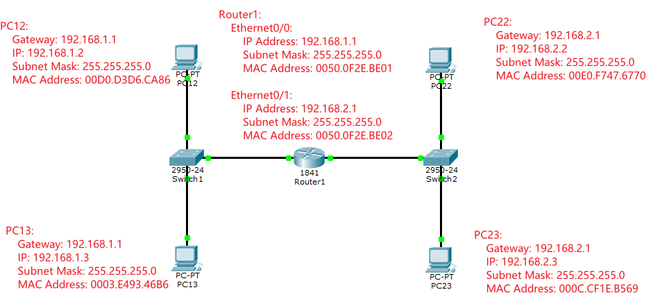

### 路由器的通信流程

#### 路由初始化

在`Router1`上查看`show ip route`, 可以看到路由两端的网段已经链接起来了:

1. 所有从`192.168.1.0/24`网段发送给网卡`FastEthernet0/0 192.168.1.1`的非`192.168.1.0/24`网段的消息都会复制给网卡`FastEthernet0/1 192.168.2.1`
2. 所有从`192.168.2.0/24`网段发送给网卡`FastEthernet0/1 192.168.2.1`的非`192.168.2.0/24`网段得消息都会复制给网卡`FastEthernet0/0 192.168.1.1`

```sh
show ip route
## Codes: C - connected, S - static, I - IGRP, R - RIP, M - mobile, B - BGP
##        D - EIGRP, EX - EIGRP external, O - OSPF, IA - OSPF inter area
##        N1 - OSPF NSSA external type 1, N2 - OSPF NSSA external type 2
##        E1 - OSPF external type 1, E2 - OSPF external type 2, E - EGP
##        i - IS-IS, L1 - IS-IS level-1, L2 - IS-IS level-2, ia - IS-IS inter area
##        * - candidate default, U - per-user static route, o - ODR
##        P - periodic downloaded static route
## 
## Gateway of last resort is not set
## 
## C    192.168.1.0/24 is directly connected, FastEthernet0/0
## C    192.168.2.0/24 is directly connected, FastEthernet0/1
```

通过`show ip arp`命令, 可以看到`Router1`内部已经建立了`ARP`表, 它的两个网卡是可以相互通信的.

```sh
show ip arp
## Protocol  Address          Age (min)  Hardware Addr   Type   Interface
## Internet  192.168.1.1             -   0050.0F2E.BE01  ARPA   FastEthernet0/0
## Internet  192.168.2.1             -   0050.0F2E.BE02  ARPA   FastEthernet0/1
```


#### 模拟通信过程

1. 在`PC12`上执行`ping 192.168.2.2`命令, 因为subnet不同, 所以ARP包会发给`PC12`配置的网关`192.168.1.1`.

    


2. `switch1`拿到ARP包,首先记下`PC12`的MAC地址, 然后判断`DEST MAC`是`F...F`, 所以会发给该subnet下, 所有NIC.

    ```sh
    show mac address-table 
    ##           Mac Address Table
    ## -------------------------------------------
    ## 
    ## Vlan    Mac Address       Type        Ports
    ## ----    -----------       --------    -----
    ## 
    ##    1    00d0.d3d6.ca86    DYNAMIC     Fa0/1
    ## ```
    ```

    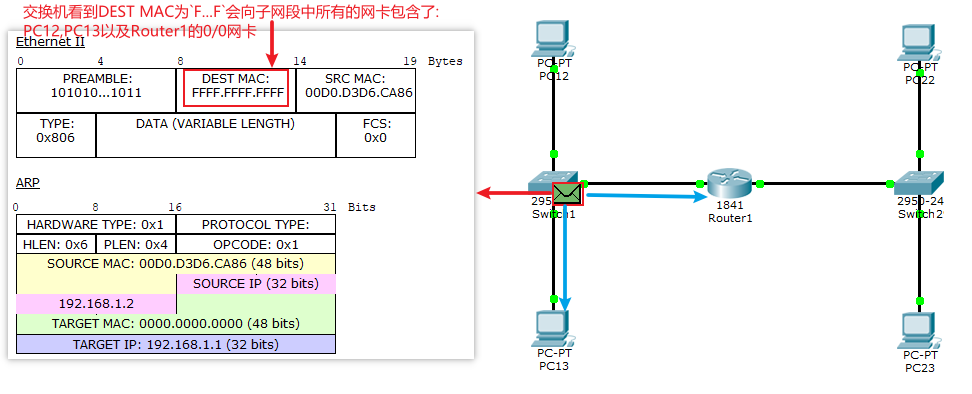

3. `Router1`拿到ARP包后, 首先记录`PC12`的ARP信息, 然后反向发送给`switch1`, 告诉其`Router1 0/0`的MAC

    ```sh
    show ip arp
    ## Protocol  Address          Age (min)  Hardware Addr   Type   Interface
    ## Internet  192.168.1.1             -   0050.0F2E.BE01  ARPA   FastEthernet0/0
    ## Internet  192.168.1.2             0   00D0.D3D6.CA86  ARPA   FastEthernet0/0
    ## Internet  192.168.2.1             -   0050.0F2E.BE02  ARPA   FastEthernet0/1
    ```

    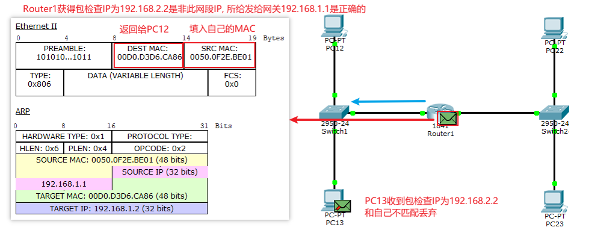


4. `Switch1`拿到ARP包后, 首先记录`Router1 0/0`显卡的MAC信息, 然后发送给`PC12`

    ```sh
    show mac address-table 
    ##           Mac Address Table
    ## -------------------------------------------
    ## 
    ## Vlan    Mac Address       Type        Ports
    ## ----    -----------       --------    -----
    ## 
    ##    1    0050.0f2e.be01    DYNAMIC     Fa0/3
    ##    1    00d0.d3d6.ca86    DYNAMIC     Fa0/1

    ```

    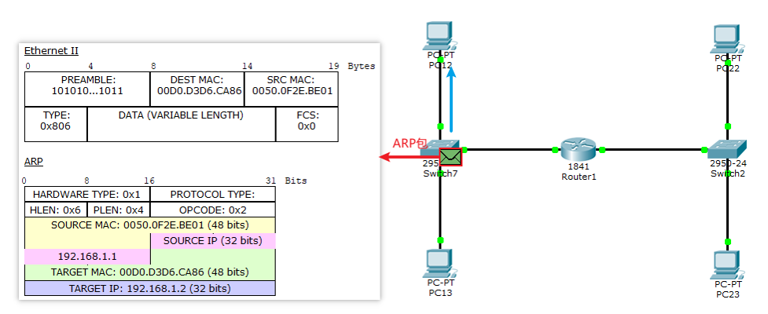


5. `PC1`拿到ARP包后,首先记录`Router1`的地址, 然后 将`Router1` MAC地址补充完成, 开始发送`ICMP`包, 到`Router1`

    ```sh
    arp -a
    ## Internet Address      Physical Address      Type
    ## 192.168.1.1           0050.0f2e.be01        dynamic

    ```

    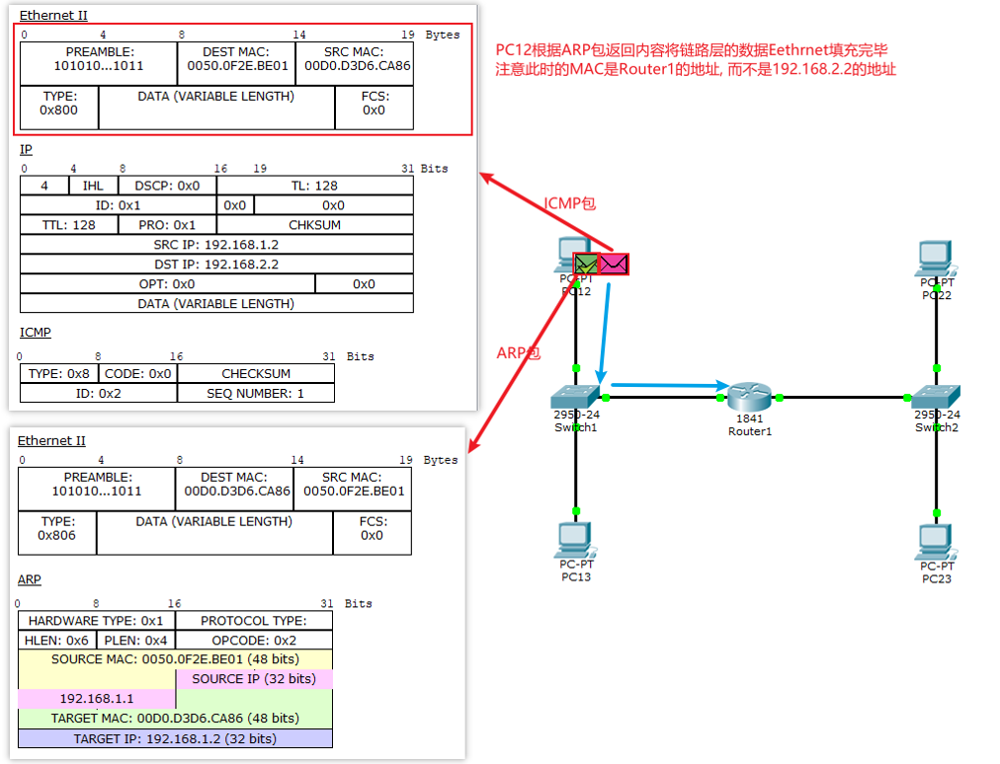

6. `Router1`拿到`ICMP`包后, 发现目的IP是`192.168.2.2`, 而目前`0/1`网卡并不知道其MAC地址, 所以将ICMP包丢弃, 然后`0/1`创建ARP包, 开始查询`192.168.2.2`的MAC地址. 过程和在`192.168.1.0`网段相同.

    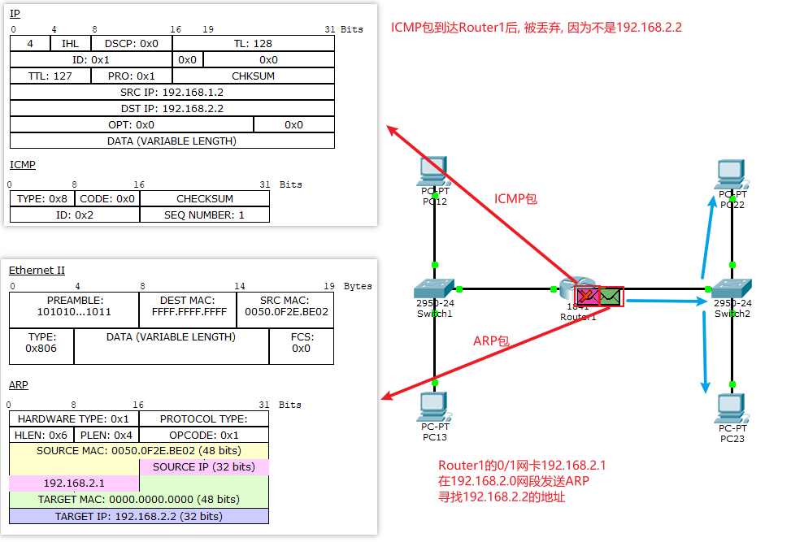
    

7. 当ARP包返回到`Router1`之后, `Router1`记录`PC22`的MAC地址

    ```sh
    show ip arp
    ## Protocol  Address          Age (min)  Hardware Addr   Type   Interface
    ## Internet  192.168.1.1             -   0050.0F2E.BE01  ARPA   FastEthernet0/0
    ## Internet  192.168.1.2             0   00D0.D3D6.CA86  ARPA   FastEthernet0/0
    ## Internet  192.168.2.1             -   0050.0F2E.BE02  ARPA   FastEthernet0/1
    ## Internet  192.168.2.2             0   00E0.F747.6770  ARPA   FastEthernet0/1
    ```

    可以看到, 此时两个网段的MAC地址链路已经建立:
    192.168.1.2(00D0.D3D6.CA86) 可以查到 192.168.1.1(0050.0F2E.BE01)
    192.168.1.1(0050.0F2E.BE01) 可以查到192.168.2.1(0050.0F2E.BE02)
    192.168.2.1(0050.0F2E.BE02) 可以查到192.168.2.2(00E0.F747.6770)

    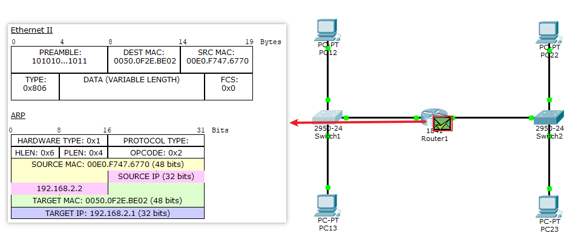


8. `PC12`开始发送ICMP包, 首先是根据MAC地址发送给`Router1` `0/0`网卡

    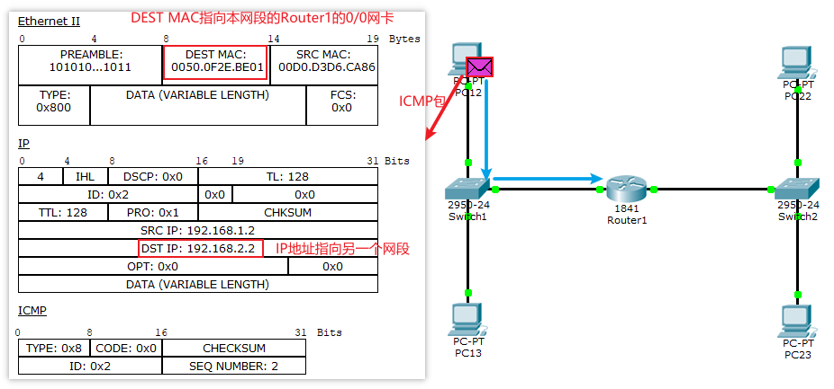

9. `Router 1 0/0`(192.168.1.1)将数据发送给`Router1 0/1`(192.168.2.1)网卡

    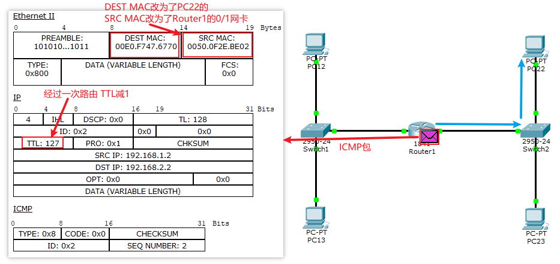

10. `PC22`收到ICMP包, 并返回
    
    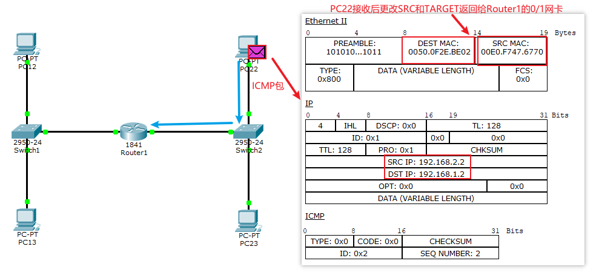
    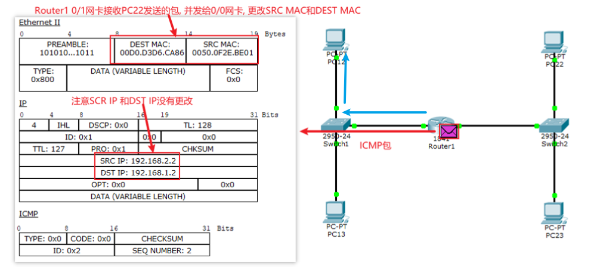
    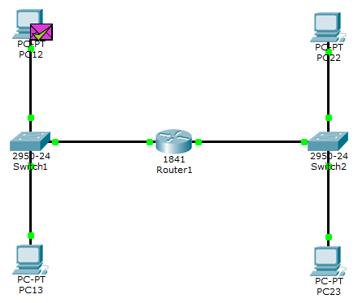


## 两台Router三台Switch

### 配置网络

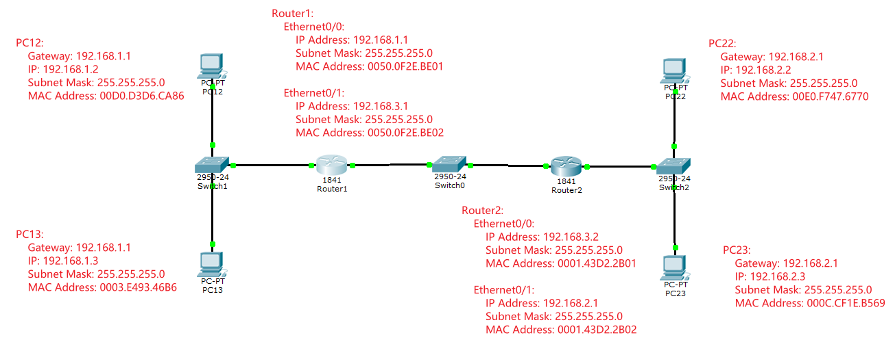


### 一台Router与两台Router的区别

一台Router与两台Router的区别:

1. 一个路由器连接两个子网, 路由器的两个网卡会自动传递信息
2. 两个路由器连接三个子网, 则需要配置路由规则.


🔒举例:

首先在`Router1`中配置, 将所有`192.168.1.0`网段中请求`192.168.2.0`的包都转发给`192.168.3.0`网段中的`Router2`的`0/0`网卡`192.168.3.2`.具体的:

1. 假设`PC12`ping`PC22`, 此时`PC12`发送了`ICMP`包, 根据路由`192.168.1.1`到`Router1`的`0/0`网卡
2. `0/0`网卡, 将此`ICMP`包发送给`0/1`网卡`192.168.3.1`, 
3. 根据子网掩码, 发现此包的目的地并不在`192.168.3.0`网段中, 所以会丢弃. 这时就需要我们告诉`Router1`, 将所有请求`192.168.2.0`网段的包, 都发给`Router2`的`0/0`网卡`192.168.3.2`, 让其继续寻找.
4. `Router2`的`0/0`网卡`192.168.3.2`将`ICMP`包复制给`0/1`网卡`192.168.2.1`, 这样就可以找到`192.168.2.2`了.


配置方法如下:

1. 在`Router1`中输入: `ip route 192.168.2.0 255.255.255.0 192.168.3.2`
    1. 第一个参数: `192.168.2.0`表示要请求的那个网段进行转发
    2. 第二个参数: `255.255.255.0`是子网掩码, 和第一个参数与运算, 确定网段,所以第一个参数也可以是一个具体ip, 比如`192.168.2.2`
    3. 第三个参数: `192.168.3.2`是要转发的目的地

2. 注意这里我们只配置`Router1`, 此时只能从`PC12`访问`PC22`, 而不能从`PC22`访问`PC12`. 所以我们要继续配置`Router2`.

    在`Router2`中输入: `ip route 192.168.1.0 255.255.255.0 192.168.3.1`

