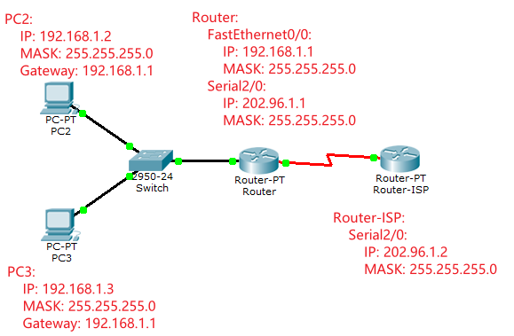
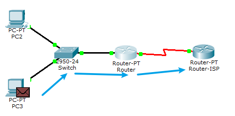
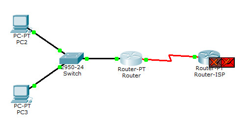

# nat

我们家用的所谓的路由器, 不只具有Router的功能, 还具有dhcp, switch 以及nat功能.
NAT(Network Address Translation)允许一个私有sub net网段(LAN口)以一个公用IP地址(WAN口)出现在Internet上.

## 模拟

配置如下网络:
PC2:
    IP: 192.168.1.2
    MASK: 255.255.255.0
    Gateway: 192.168.1.1
PC3:
    IP: 192.168.1.3
    MASK: 255.255.255.0
    Gateway: 192.168.1.1
Router:
    FastEthernet0/0:
        IP: 192.168.1.1
        MASK: 255.255.255.0
    Serial2/0:
        IP: 202.96.1.1
        MASK: 255.255.255.0
Router-ISP:
    Serial2/0:
        IP: 202.96.1.2
        MASK: 255.255.255.0




相关命令:
配置`Router1`, R1模拟公司出口路由器，配置默认路由指向ISP（运营商），就是无论什么不知道的目的IP，都往默认路由指向的下一条地址扔。
```
en
conf t
ip add 202.96.1.1 255.255.255.0
no shut
int fa0/0
ip add 192.168.1.1 255.255.255.0
no shut
ip route 0.0.0.0 0.0.0.0 202.96.1.2  # 配置下一跳
```

配置`Router2`
```sh
en
conf t
host ISP  # 设置别名方便
int s2/0
ip add 202.96.1.2 255.255.255.0
no shut
```


### 模拟ping

1. 在`PC2`中输入`ping 202.96.1.3`, 尝试访问`Router-ISP`.

`Router-ISP`成功接收到了包, 但是无法返回, 因为`Router-ISP`不在`192.168.1.0`网段中.

在[network_router](/network_router/)一文中, 我们知道可以配置`Router-ISP`的转发规则, 比如将所有访问`192.168.1.0`的包全部转发给`Router`的`202.96.1.1`网卡.
但是在实际中, ISP供应商不可能为我们配置, 所以只能自己来通过`Router`来配置. 所使用的的方式就是NAT

## NAT

### 静态NAT
静态NAT，相当于每个私网地址，都要给它转换为一个单独的公网地址。
进入`Router`
```sh
conf t
ip nat inside source static 192.168.1.3 202.96.1.3
int s2/0
ip nat outside # 设置为出接口
int fa0/0
ip nat inside  # 设置为入接口    
```
此时`PC3`就可以`ping`通`Router-ISP`了, `Router-ISP`在回复`ping`时, 相当于是发给了`202.96.1.3`

### 动态路由
上面的NAT，非常耗费公网IP地址，因为每个私网地址都要消耗一个公网地址，而公网地址有限，而且需要付费租用，因此，可以动过动态NAT，来建立一个地址池，按需分配。
```sh
## NAT为公网IP地址池的名字，然后规定开始到结束的地址。
ip nat pool NAT 202.96.1.3 202.96.1.100 netmask 255.255.255.0
## 匹配ACL与地址池
ip nat inside source list 1 pool NAT
## 将死亡地址划入对应的ACL，实现了私网地址段与公网地址池的匹配
access-list 1 permit 192.168.1.0 0.0.0.255
## 设置出口
int s2/0
ip nat outside
## 设置入口
int fa0/0
ip nat inside     
```
此时，如果，公网地址202.96.1.3~202.96.1.100的地址，会被192.168.1.0/24这个私网地址段的终端共用，有访问外网需求的时候，自动会轮询分配着公网IP使用。

### PAT
上述动态NAT方案，对于有一大堆笔记本等办公终端要访问外网的企业，还是太亏了。100个公网地址，轮着使用，也就是相当于同一时间访问外网，只能有100个人在线，肯定无法满足要求。因此，有没有更省IP地址的方案呢，答案是有的，就是PAT。
PAT采用1个公网地址，然后后面自动增加端口号，来匹配到私网IP，实现多人通过同一个公网IP来上网。

例如PC0可能使用202.96.1.3:20001，而PC1使用202.96.1.3:20002，端口号有65535个，那么1个公网IP就可以给6万多个人同时使用了。

而且配置命令上，与动态NAT是一致的，只需要增加一个overload单词就可以了。
```sh
ip nat pool NAT 202.96.1.3 202.96.1.100 netmask 255.255.255.0 overload
```


## 参考

1. https://zhuanlan.zhihu.com/p/104891736
2. https://blog.csdn.net/m0_37681914/article/details/72860274
3. https://www.cnblogs.com/wbxjiayou/p/5150753.html
