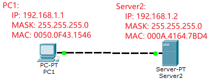
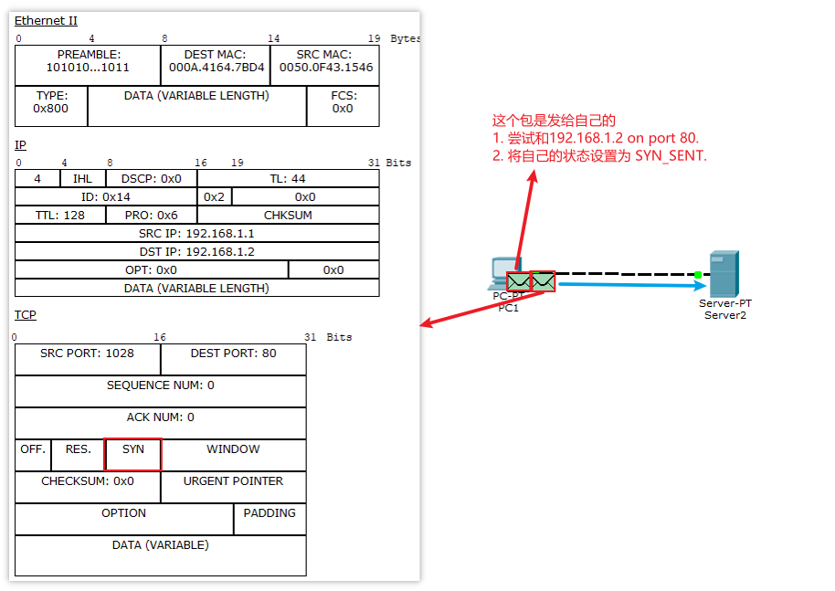
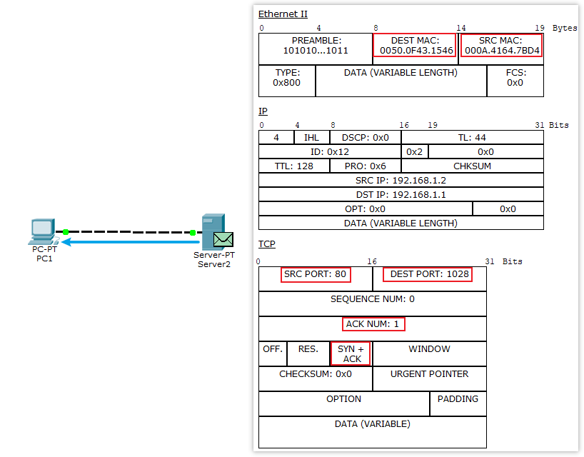
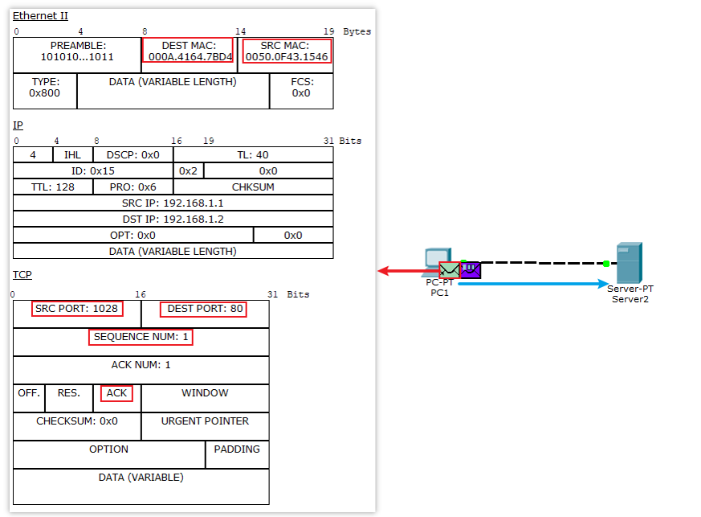
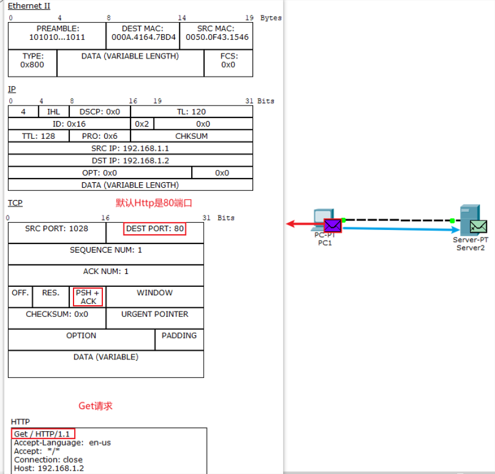
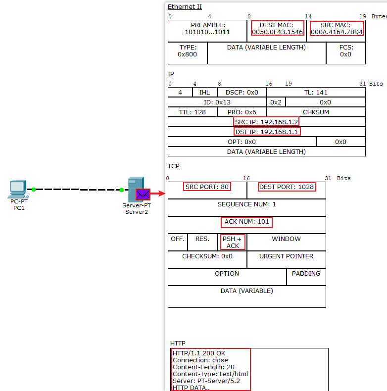
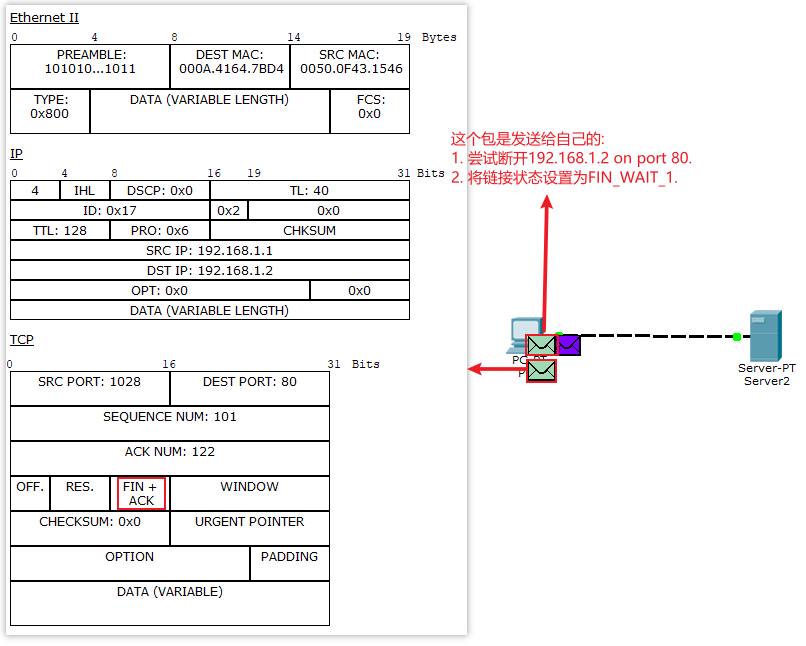
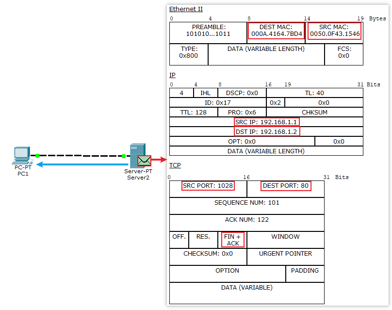
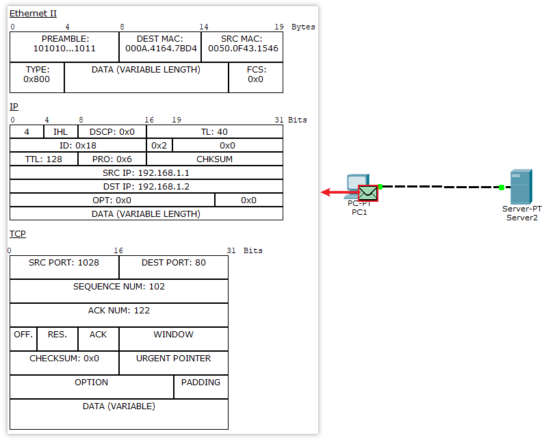
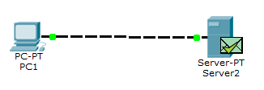

# tcp-http

HTTP是四层网络协议的顶层, 三层用的是TCP协议.

TCP通信的一些概念:
SYN(synchronous)建立联机
ACK(acknowledgement)确认
PSH(push)传输
FIN(finish)结束

## 创建网络
创建如下网络:
PC1:
    IP: 192.168.1.1
    MASK: 255.255.255.0
    MAC: 0050.0F43.1546
Server2:
    IP: 192.168.1.2
    MASK: 255.255.255.0
    MAC: 000A.4164.7BD4

## 模拟网络请求
在`Server2`中开启HTTP和HTTPs服务, 在`PC1`浏览器输入`192.168.1.2`

1. `PC1`创建`SYN`的TCP包, 发送给`Server2`,请求创建链接. 这是第一次握手.

2. `Server2`包收到`SYN`的TCP包之后, 返回`SYN+ACK`的TCP包, 确认`PC1`的请求, 并发送创建链接请求.第二次握手.

3. `PC1`收到`Server2`发送来的`SYN+ACK`的TCP包之后, 返回`ACK`的TCP包, 确认`Server2`的请求. 第三次握手.
另外创建`HTTP`包, 等待返回的`ACK`的TCP包被`Server2`接受后发送.

4. `PC1`将HTTP包发送给`Server2`, 这里发送的是`Get`请求, 这里开始传送数据, 每个数据帧有四层网络协议.

5. `Server2`收到HTTP请求包之后, 进行返回. 
TCP每次携带的数据是一定的, 如果大于此数据量, 则会分多份TCP分别发送, 每次发送`PC1`都是返回`ACK`包TCP进行确认.

6. `PC1`收到返回结果, 发送`FIN+ACK`的TCP包给`Server2`, 确认收到的数据没问题, 并请求结束连接.第一次挥手.

7. `Server2`收到`PC1`的结束请求, 发送`FIN+ACK`的TCP包给`Server2`, 确认`PC1`的结束请求, 并发送断开连接的请求. 第二次和第三次挥手.
注意所谓四次挥手, 其实就是将这一步分为第二次和第三次挥手, `Server2`可能先发送`ACK`的确认TCP, 再发送`FIN`的结束TCP. 而这里是合并了.

8. `PC1`收到`Server2`结束请求后, 发送`ACK`的TCP包给`Server2`, 确认`Server2`的结束请求.

9. `Server2`收到确认的TCP包后, 结束.

