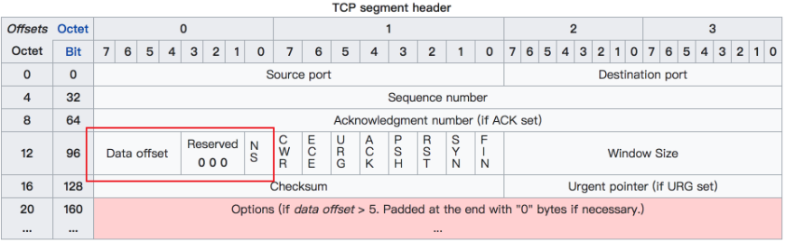

# tcpdump

类似于windows下面的wireshark软件.

## syntax

tcpdump [option] [proto] [direction] [type]
- option: 可选参数
- proto: 根据协议类型过滤, 如`tcp, udp, icmp, ip, ip6, arp, rarp,ether,wlan, fddi, tr, decnet`
- direction: 根据流向过滤, 如`src, dst`, 还可以加入逻辑判断`src or dst`
- type: 根据类型过滤, 如`host, net, port, portrange`

## 输出结果格式

`17:15:12.539971 IP VM-4-11-centos.ssh > 112.80.133.148.10303: Flags [P.], seq 15160:15236, ack 77, win 3932, length 76`

第一列: 时间,格式为 时:分:秒:毫秒
第二列: 协议类型, IP
第三列: 发送方的IP和PORT
第四列: 箭头`>` 数据流向
第五列: 接收方的IP和PORT
第六列: 冒号`:`
第七列: 数据包的内容, 包括Flags 标识符，seq 号，ack 号，win 窗口，数据长度 length，其中 [P.] 表示 PUSH 标志位为 1

### Flags标识符
如果遇到`TCP`报文, `Flags`有如下几种:
- [S] : SYN（开始连接）
- [P] : PSH（推送数据）
- [F] : FIN （结束连接）
- [R] : RST（重置连接）
- [.] : 没有 Flag （意思是除上面四种类型外的其他情况，有可能是 ACK 也有可能是 URG）


## 常用过滤规则
### type与direction参数
1. host主机地址过滤
```sh
tcpdump host 192.168.10.100  # 抓取主机为192.168.10.100的包
tcpdump src 192.168.10.100  # 抓取源自192.168.10.100的包
tcpdump dst 192.168.10.200  # 抓取目的是192.168.10.200的包
```

2. net网段过滤
```sh
tcpdump net 192.168.10.0/24
tcpdump src net 192.168
tcpdump dst net 192.168
```
3. 端口过滤
```sh
tcpdump port 8088
tcpdump src port 8088  # 指定来源端口
tcpdump dst port 8088  # 指定目的端口
tcpdump port 80 or port 8088  # 同时指定两个端口
tcpdump portrange 8000-8080  # 指定端口范围
tcpdump src portrange 8000-8080
tcpdump dst portrange 8000-8080
```

常见协议的默认端口，直接使用协议名, 比如 http == 80，https == 443 等
```sh
tcpdump tcp port http  # 指定80端口
```

### proto协议过滤
常见的网络协议有：tcp, udp, icmp, http, ip,ipv6 等
```sh
tcpdump icmp  # 查看icmp(ping)包
```

查看tcp协议包
```sh
tcpdump tcp  # 包含ipv4和ipv6
tcpdump ip proto 6  # 查看ipv4包, `6`表示tcp在ip报文中的编号
tcpdump ip6 proto 6  # 查看ipv6包
```

### option参数
#### 不解析域名配置
- `-n`：不把ip转化成域名，直接显示 ip，避免执行 DNS lookups 的过程，速度会快很多
- `-nn`：不把协议和端口号转化成名字，速度也会快很多。
- `-N`：不打印出host 的域名部分。比如,，如果设置了此选现，tcpdump 将会打印'nic' 而不是 'nic.ddn.mil'.
#### 读写解析结果
```sh
tcpdump icmp -w icmp.pcap  # 保存
tcpdump icmp -r all.pcap  # 读取
```

#### 控制内容详细程度
- `-v`：产生详细的输出. 比如包的TTL，id标识，数据包长度，以及IP包的一些选项。同时它还会打开一些附加的包完整性检测，比如对IP或ICMP包头部的校验和。
- `-vv`：产生比-v更详细的输出. 比如NFS回应包中的附加域将会被打印, SMB数据包也会被完全解码。（摘自网络，目前我还未使用过）
- `-vvv`：产生比-vv更详细的输出。比如 telent 时所使用的SB, SE 选项将会被打印, 如果telnet同时使用的是图形界面，其相应的图形选项将会以16进制的方式打印出来（摘自网络，目前我还未使用过）

#### 控制时间显示

- `-t`：在每行的输出中不输出时间
- `-tt`：在每行的输出中会输出时间戳
- `-ttt`：输出每两行打印的时间间隔(以毫秒为单位)
- `-tttt`：在每行打印的时间戳之前添加日期的打印（此种选项，输出的时间最直观）

### 数据包头部控制

- `-x`：以16进制的形式打印每个包的头部数据（但不包括数据链路层的头部）
- `-xx`：以16进制的形式打印每个包的头部数据（包括数据链路层的头部）
- `-X`：以16进制和 ASCII码形式打印出每个包的数据(但不包括连接层的头部)，这在分析一些新协议的数据包很方便。
- `-XX`：以16进制和 ASCII码形式打印出每个包的数据(包括连接层的头部)，这在分析一些新协议的数据包很方便。

### 过滤指定网卡数据包

`-i`：指定要过滤的网卡接口，如果要查看所有网卡，可以 -i any

### 过滤特定流向的数据包
`-Q`： 选择是入方向还是出方向的数据包，可选项有：in, out, inout，也可以使用 --direction=[direction] 这种写法

### 其他常用的一些参数#
- `-A`：以ASCII码方式显示每一个数据包(不显示链路层头部信息). 在抓取包含网页数据的数据包时, 可方便查看数据
- `-l`: 基于行的输出，便于你保存查看，或者交给其它工具分析
- `-q`: 简洁地打印输出。即打印很少的协议相关信息, 从而输出行都比较简短.
- `-c`: 捕获 count 个包 tcpdump 就退出
- `-s`: tcpdump 默认只会截取前 96 字节的内容，要想截取所有的报文内容，可以使用 -s number， number 就是你要截取的报文字节数，如果是 0 的话，表示截取报文全部内容。
- `-S`: 使用绝对序列号，而不是相对序列号
- `-C`：file-size，tcpdump 在把原始数据包直接保存到文件中之前, 检查此文件大小是否超过file-size. 如果超过了, 将关闭此文件,另创一个文件继续用于原始数据包的记录. 新创建的文件名与-w 选项指定的文件名一致, 但文件名后多了一个数字.该数字会从1开始随着新创建文件的增多而增加. file-size的单位是百万字节(nt: 这里指1,000,000个字节,并非1,048,576个字节, 后者是以1024字节为1k, 1024k字节为1M计算所得, 即1M=1024 ＊ 1024 ＝ 1,048,576)
- `-F`：使用file 文件作为过滤条件表达式的输入, 此时命令行上的输入将被忽略.


## 过滤规则组合

### 逻辑组合
- `and`：所有的条件都需要满足，也可以表示为 `&&`
- `or`：只要有一个条件满足就可以，也可以表示为 `||`
- `not`：取反，也可以使用 `!`

```sh
tcpdump src 10.5.2.3 and dst port 3389  # 来自10.5.2.3，发往任意主机的3389端口的包
tcpdump 'src 10.0.2.4 and (dst port 3389 or 22)'  # 括号在 shell 中是特殊符号，因为你需要使用引号将其包含
```

### 条件判断
而在单个过滤器里，常常会判断一条件是否成立，这时候，就要使用下面两个符号
- `=`：判断二者相等
- `==`：判断二者相等
- `!=`：判断二者不相等
tcpdump 还提供了一些关键字的接口来方便我们进行判断，比如:
- `if`：表示网卡接口名、
- `proc`：表示进程名
- `pid`：表示进程 id
- `svc`：表示 service class
- `dir`：表示方向，in 和 out
- `eproc`：表示 effective process name
- `epid`：表示 effective process ID

```sh
tcpdump "( if=en0 and proc =nc ) || (if != en0 and dir=in)"  # 程名为 nc 发出的流经 en0 网卡的数据包，或者不流经 en0 的入方向数据包
```


## 特殊过滤规则
### 通过tcpflags标志位过滤
`proto [ expr:size ]`
- proto：可以是熟知的协议之一（如ip，arp，tcp，udp，icmp，ipv6）
- expr：可以是数值，也可以是一个表达式，表示与指定的协议头开始处的字节偏移量。
- size：是可选的，表示从字节偏移量开始取的字节数量。

1、tcpflags 可以理解为是一个别名常量，相当于 13，它代表着与指定的协议头开头相关的字节偏移量，也就是标志位，所以 tcp[tcpflags] 等价于 tcp[13] 
2、tcp-fin, tcp-syn, tcp-rst, tcp-push, tcp-ack, tcp-urg 这些同样可以理解为别名常量，分别代表 1，2，4，8，16，32，64。
syn + ack 包
```sh
tcpdump -i eth0 'tcp[13] == 2 or tcp[13] == 16'
tcpdump -i eth0 'tcp[tcpflags] == tcp-syn or tcp[tcpflags] == tcp-ack'
```

### 通过包大小进行过滤
```sh
tcpdump less 32 
tcpdump greater 64 
tcpdump <= 128
```

### 过滤指定网关的数据
```sh
tcpdump gateway [host]

```

### 过滤广播和多播
```sh
tcpdump ether broadcast
tcpdump ether multicast
tcpdump ip broadcast
tcpdump ip multicast
tcpdump ip6 multicast
```

## 实战
### 抓取HTTP的POST请求
```sh
tcpdump -s 0 -A -vv 'tcp[((tcp[12:1] & 0xf0) >> 2):4]'  # 抓取 HTTP 的 POST 请求
```
解释:
- `tcp[n]`：表示 tcp 报文里 第 n 个字节
- `tcp[n:c]`: tcp[12:1] 表示从报文的第12个字节（因为有第0个字节，所以这里的12其实表示的是13）开始算起取一个字节，也就是 8 个bit。
- `&`：是位运算里的 and 操作符，比如 0011 & 0010 = 0010
- `>>`：是位运算里的右移操作，比如 0111 >> 2 = 0001
- `0xf0`：是 10 进制的 240 的 16 进制表示，但对于位操作来说，10进制和16进制都将毫无意义，我们需要的是二进制，将其转换成二进制后是：11110000，这个数有什么特点呢？前面个 4bit 全部是 1，后面4个bit全部是0




1. tcp[12:1] & 0xf0 其实并不直观，tcp 报文中的 第12 个字节是这样组成的 10110000，那么这个表达式就可以变成 10110110 && 11110000 = 10110000
2. tcp[12:1] & 0xf0) >> 2 这个表达式实际是 (tcp[12:1] & 0xf0) >> 4 ) << 2 的简写形式。

从上一步我们算出了 tcp[12:1] & 0xf0 的值其实是一个字节，也就是 8 个bit，但是你再回去看下上面的 tcp 报文首部结构图，表示数据偏移量的只有 4个bit，也就是说 上面得到的值 10110000，前面 4 位（1011）才是正确的偏移量，那么为了得到 1011，只需要将 10110000 右移4位即可，也就是 tcp[12:1] & 0xf0) >> 4，至此我们是不是已经得出了实际数据的正确位置呢，很遗憾还没有，前一篇文章里我们讲到 Data Offset 的单位是 4个字节，因为要将 1011 乘以 4才可以，除以4在位运算中相当于左移2位，也就是 <<2，与前面的 >>4 结合起来一起算的话，最终的运算可以简化为 >>2。
至此，我们终于得出了实际数据开始的位置是 tcp[12:1] & 0xf0) >> 2 （单位是字节）。
找到了数据的起点后，可别忘了我们的目的是从数据中打到 HTTP 请求的方法，是 GET 呢 还是 POST ，或者是其他的？
有了上面的经验，我们自然懂得使用 tcp[((tcp[12:1] & 0xf0) >> 2):4] 从数据开始的位置再取出四个字节，然后将结果与 GET （注意 GET最后还有个空格）的 16进制写法（也就是 0x47455420）进行比对

0x47   -->   71    -->  G
0x45   -->   69    -->  E
0x54   -->   84    -->  T
0x20   -->   32    -->  空格

### 其他常用
```sh
## 提取 HTTP 的 User-Agent
tcpdump -nn -A -s1500 -l | grep "User-Agent:"
## 通过 egrep 可以同时提取User-Agent 和主机名（或其他头文件）
tcpdump -nn -A -s1500 -l | egrep -i 'User-Agent:|Host:'
## 抓取 HTTP GET 请求包
tcpdump -vvAls0 | grep 'GET'
## 抓取 HTTP POST 请求包(不能保证抓取到 HTTP POST 有效数据流量，因为一个 POST 请求会被分割为多个 TCP 数据包。)
tcpdump -vvAls0 | grep 'POST'
## 找出一段时间内发包最多的 IP，或者从一堆报文中找出发包最多的 IP
## cut -f 1,2,3,4 -d '.' : 以 . 为分隔符，打印出每行的前四列。即 IP 地址。
## sort | uniq -c : 排序并计数
## sort -nr : 按照数值大小逆向排序
tcpdump -nnn -t -c 200 | cut -f 1,2,3,4 -d '.' | sort | uniq -c | sort -nr | head -n 20
## 抓取 DNS 请求和响应
tcpdump -i any -s0 port 53
## 切割 pcap 文件
tcpdump  -w /tmp/capture-%H.pcap -G 3600 -C 200
## 提取 HTTP POST 请求中的密码
tcpdump -s 0 -A -n -l | egrep -i "POST /|pwd=|passwd=|password=|Host:"
## 提取 HTTP 请求的 URL
tcpdump -s 0 -v -n -l | egrep -i "POST /|GET /|Host:"
## 抓取 HTTP 有效数据包 抓取 80 端口的 HTTP 有效数据包，排除 TCP 连接建立过程的数据包（SYN / FIN / ACK）
tcpdump 'tcp port 80 and (((ip[2:2] - ((ip[0]&0xf)<<2)) - ((tcp[12]&0xf0)>>2)) != 0)'


```


参考:
https://www.cnblogs.com/wongbingming/archive/2020/06/30/13212306.html