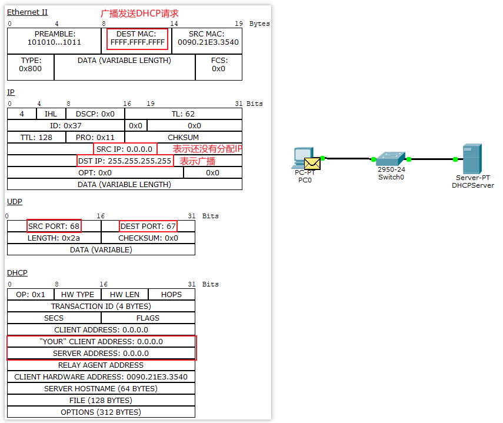
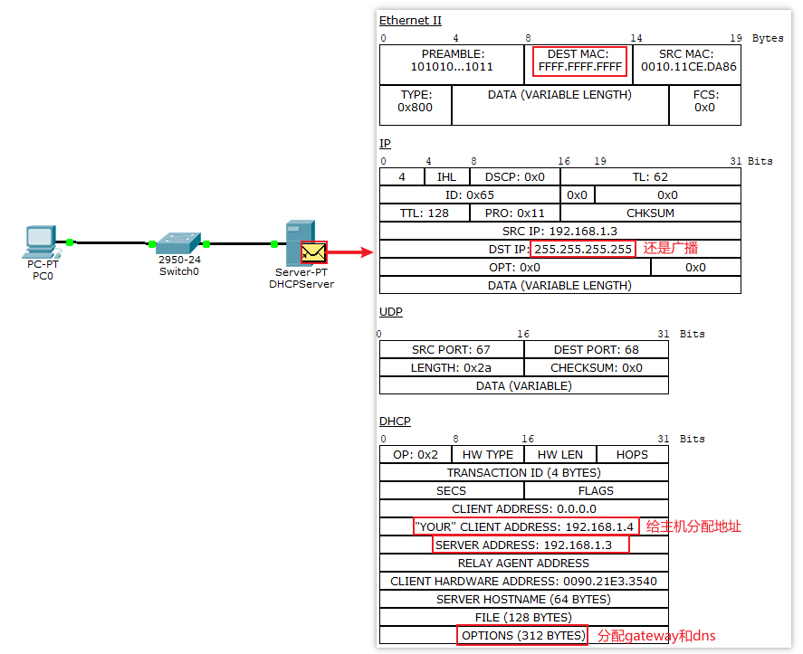
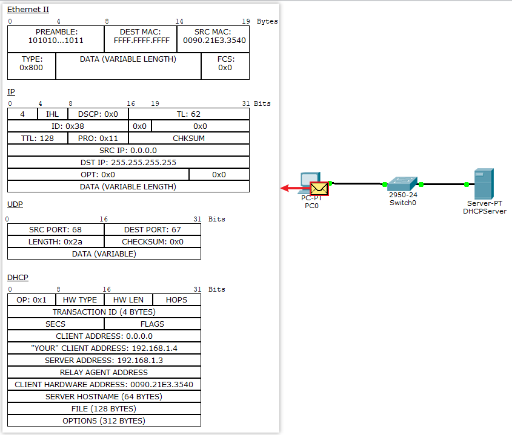
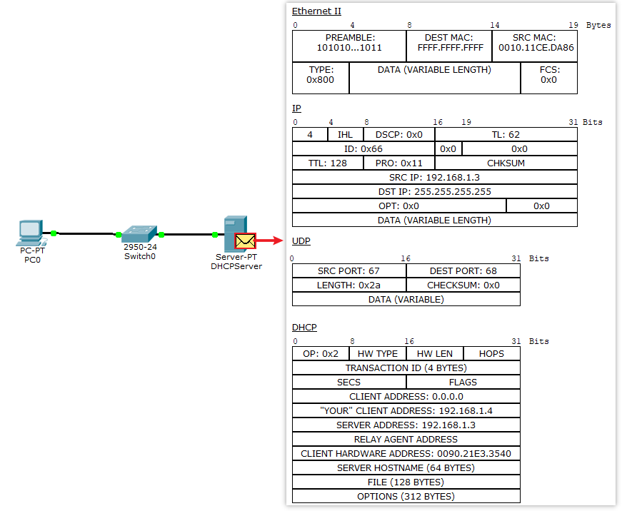

# dhcp

dhcp(Dynamic Host Configuration Protocol)在transport layer使用UDP, Server端使用67端口, Client端使用68端口. 可以给subnet 下的网卡自动配置:

1. IP address
2. subnet mask
3. gateway
4. DNS

## 协议传输过程

### 配置如下网络:
PC0:
    MAC Address: FE80::290:21FF:FEE3:3540
    IP: dhcp
    SubnetMask: dhcp
    DNS: dhcp

DHCPServer:
    MAC FE80::210:11FF:FECE:DA86
    IP: 192.168.1.3
    SubnetMask: 255.255.255.0
    DNS: 192.168.1.1

并在DHCPServer配置:
    PoolName: serverPool
    DefaultGateway: 192.168.1.1
    DNSServer: 192.168.1.2
    StartIPAddress: 192.168.1.4
    SubnetMask: 255.255.255.0

[](./dhcp/1.png)


## 模拟dhcp请求
### 命令输入
1. 在主机上输入`ipconfig /release`, 断开连接, IP地址变为`0.0.0.0`

```sh
ipconfig /release
## IP Address......................: 0.0.0.0
## Subnet Mask.....................: 0.0.0.0
## Default Gateway.................: 0.0.0.0
## DNS Server......................: 0.0.0.0
```
2. 在主机上输入`ipconfig /renew`, 请求为客户端分配IP, 可以看到总共有四个UDP包

2.1 发现阶段(DHCP Discover):

client端在局域网内以广播的方式发起一个DHCP Discover包，目的是在子网络中发现能够给client端提供IP地址的server端。
UDP 目标端口号为67    源IP 地址0.0.0.0    目的IP:255.255.255.255(广播地址)



### 提供阶段(DHCP Offer)
局域网中DHCP server接受到Discover包之后，通过发送DHCP offer包给client端应答，主要是告知client端可以提供IP地址，以及相应的IP地址租约信息和其他配置信息也会在其中.
UDP 目标68    源IP为DHCP服务器的IP   目的IP: Client端



### 请求阶段(DHCP Request)
client只会接受收到offer报文，然后client端就会以广播的方式发送一个DHCP request报文请求分配IP地址。
UDP 目标67    源IP为0.0.0.0   目的IP:255.255.255.255



### 确认阶段(DHCP ACK or DHCP NAK)
server端在收到DHCP request报文之后，会判断”option”字段的serverIP地址是否是自己的IP地址，如果符合分配IP地址的条件，就会给client发送一个DHCP ACK包，如果不满足就发挥发送一个DHCP NAK 包。


### 没有响应
注意：客户端执行DHCP-DISCOVER后，如果没有DHCP服务器响应客户端的请求，客户端会随机使用169.254.0.0/16网段中的一个IP地址配置到本机地址。

169.254.0.0/16是Windows的自动专有IP寻址范围，也就是在无法通过DHCP获取IP地址时，由系统自动分配的IP地址段。


参考:
https://blog.csdn.net/scanf_linux/article/details/89415965
https://blog.51cto.com/tonyguo/163475
https://www.sysnettechsolutions.com/en/configure-dhcp-in-cisco-packet-tracer/
https://blog.csdn.net/qq_39414668/article/details/80407746
