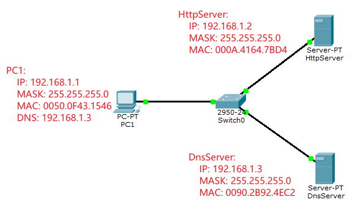
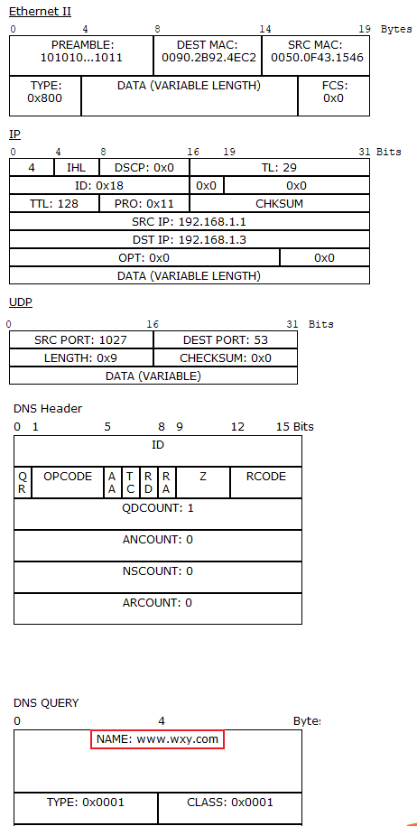
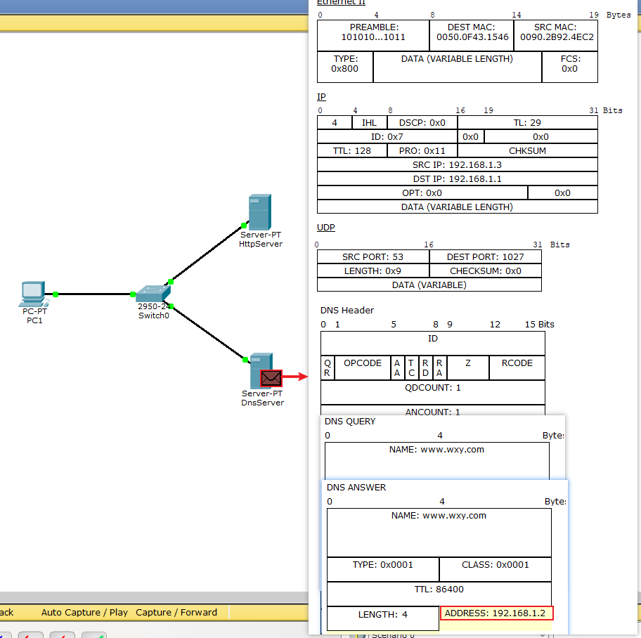
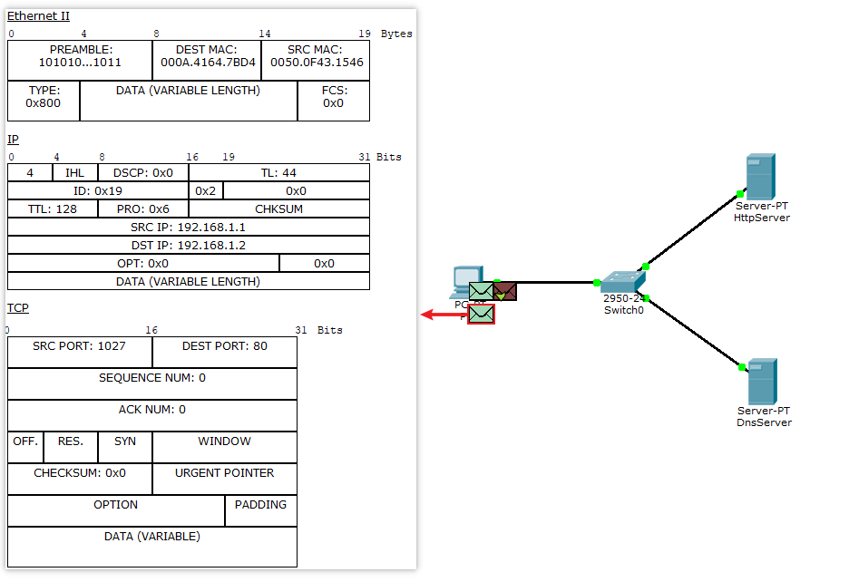

# udp-dns

DNS协议是客户端发送域名, DNS返回对应的IP

## 创建网络
创建如下网络:
PC1:
    IP: 192.168.1.1
    MASK: 255.255.255.0
    MAC: 0050.0F43.1546
    DNS: 192.168.1.3
HttpServer:
    IP: 192.168.1.2
    MASK: 255.255.255.0
    MAC: 000A.4164.7BD4
DnsServer:
    IP: 192.168.1.3
    MASK: 255.255.255.0
    MAC: 0090.2B92.4EC2

如下图

在DnsServer中添加映射: 域名:www.wxy.com  Http服务:192.168.1.2

## 模拟请求

1. 在`PC1`浏览器中输入`www.wxy.com`后, 创建DNS包. 根据本机配置的DNS地址 发送给192.168.1.3

2. `DnsServer`收到`PC1`的DNS包后, 将对应域名的IP返回

3. `PC1`收到`DnsServer`返回的域名IP后, 开始发起TCP请求
