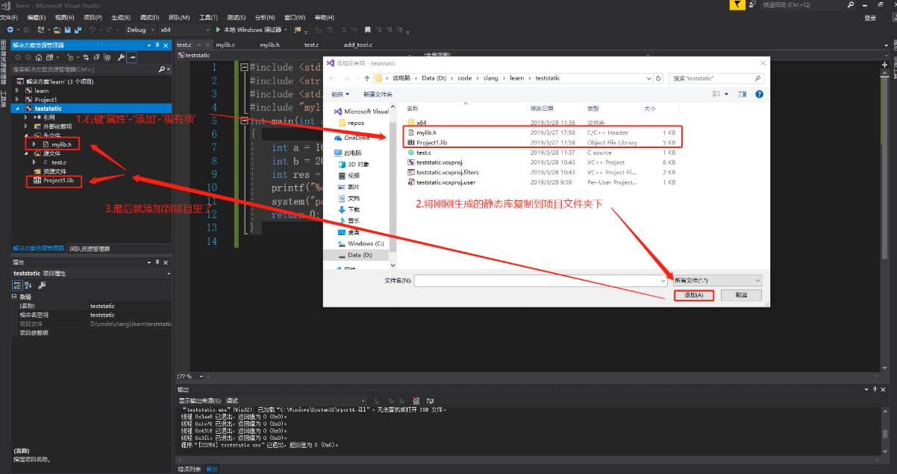

# 静态库创建

1.创建头文件`mylib.h`

```
#pragma once
int myadd(int a, int b);
```

2.创建源文件`mylib.c`
```
#include "mylib.h"
int myadd(int a, int b) {
	return a + b;
}
```

3.右键项目,选择属性,在常规里将配置类型改为**静态库(.lib)**
4.右键项目,重新生成,在Debug文件夹下得到**project.lib (对象文件库)**,库的名称是项目名称
我们需要把`project.lib`文件和`mylib.h`发给别人使用


# 静态库使用




# 静态库优缺点
优点
静态库在编译时期完成
缺点
1.浪费内存和磁盘空间
2.一旦程序中有任何模块更新，整个程序就要重新编译链接、发布给用户，用户要重新安装整个程序