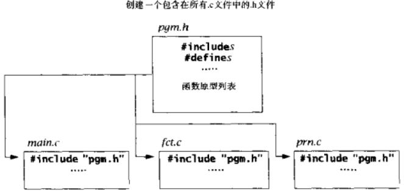

在一个单独的目录中编写一个大型程序,行程一个.h和.c文件集,每个.c文件含有一个或多个函数定义.按需要重新编译每个.c文件,这样可节省时间.

假设我们正在开发一个pgm的大程序,在每一个.c文件的头部都含有一条
`#include "pgm.h"`
当处理器遇到这条命令时,它首先在当前的目录中寻找文件pgm.h.如果存在这个文件,就引入它;如果不存在,预处理器就在与机器相关的目录中寻找它;如果找不到pgm.h,预处理器就会给出一个错误信息,停止编译.

头文件中,可以包含#include和#define,枚举类型声明,结构类型声明,函数原型列表.这样头文件包含了所需要的所有程序元素.由于头文件出现在每一个.c文件的头部,它是把程序结合在一起的胶水.





# 事例
主文件名和头文件要对应上.

gcc编译的时候把三者一块作为参数填进去就行了


主文件名:`test.c`
```
#include <stdio.h>
#include "test.h"
int main(){
	int a = 5, b = 10;
	int result = add(a, b); // 函数的调用

	printf("result = %d\n", result);
	getchar();
	return 0;
}

```


被调用文件名:`add_tool.c`
```
// 函数的定义
#include "test.h"
int add(int x, int y){
	return x + y;
}
```


头文件名:`test.h`

```
#pragma once
//头文件在编译时会将其内容(引入的系统库和自己的库)复制到主文件中
//1.函数与变量的声明
//2.系统库的调用(好像不行)
int add(int x, int y); // 函数的声明，分号不能省略
```

# 其他
参考:https://www.cnblogs.com/chengjian-physique/p/9835924.html
1. 函数可以多个声明,只能一处定义
2. 原则上要先声明函数,再实现函数(这样函数实现即使在调用之后也没关系),如果函数定义在调用之前(定义,就包含了声明)
3. .h文件声明函数后,编译器会在所有的.c文件里面寻找是否有.h文件里声明的函数,所以.h和.c可以不重名
4. 引入.h文件本质就是复制了.h文件的内容,放在.c文件中

`test.h`
```c
int add(int x, int y); // 函数的声明，分号不能省略
```
`main`
```c
#include <stdio.h>
#include "test.h"
int main(){
	int a = 5, b = 10;
	int result = add(a, b); // 函数的调用
	printf("result = %d\n", result);
	getchar();
	return 0;
}
```
mian.c#include "test.h"中的相当于
```c
#include <stdio.h>
int add(int x, int y); // 直接赋值过来
int main(){
	int a = 5, b = 10;
	int result = add(a, b); // 函数的调用
	printf("result = %d\n", result);
	getchar();
	return 0;
}
```

5. 双引号和尖括号引用
	1. 双引号括起来的文件名,编译器会在本地查找文件,如果加上目录文件名,编译器就会在相对路径下寻找
	2. 尖括号括起来的文件名,编译器在标准库里找,在unix系统中,头文件一般放在`/usr/local/include`或`/usr/include`这些地方

参考:https://blog.csdn.net/weixin_40763897/article/details/87181359


6. .h文件是头文件，内含函数声明、宏定义、结构体定义等内容
7. .c文件是程序文件，内含函数实现，变量定义等内容。
8. ` //a.h void foo(); //a.c #include "a.h" `库.c文件包含.h文件是否多余?
xx.h 其实只是让需要写 xx.c 中函数声明的地方调用（可以少写几行字）,至于 include 这个 .h 文件是谁，是 .h 还是 .c，还是与这个 .h 同名的 .c，都没有任何必然关系。
虽然这样宏替换后出现了很多无用的声明,反正多些声明（.h一般只用来放声明，而放不定义）也无害处，又不会影响编译
这个例子中显然是多余的。但是如果.c中的函数也需要调用同个.c中的其它函数，那么这个.c往往会include同名的.h这样就不需要为声明和调用顺序而发愁了


参考:
https://www.cnblogs.com/chengjian-physique/p/9835924.html