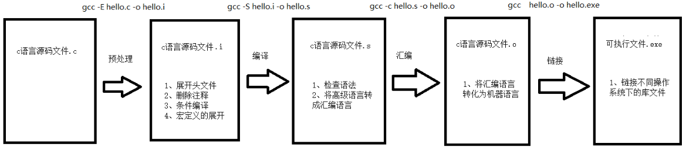

# 编译过程



1.预处理：gcc -E hello.c -o hello.i
宏定义展开、头文件展开、条件编译等，同时将代码中的注释删除，这里并不会检查语法
2.汇编：gcc -S hello.i -o hello.s
检查语法，将预处理后文件编译生成汇编文件
3.二进制：gcc -c hello.s -o hello.o
将汇编文件生成目标文件(二进制文件)
4.链  接：gcc    hello.o -o hello_elf
C语言写的程序是需要依赖各种库的，所以编译之后还需要把库链接到最终的可执行程序中去


# 四步编译实例
现在有一个头文件hello.h,一个主程序hello.c
```c
//hello.h文件
#define A 1
int add(int x,int y);
```

```c
//hello.c
#include "hello.h"

main(){
    int a= A;
    int result = add(a,a);
}

int add(int x,int y){
    return x+y;
}
```


## 预处理
1. 处理头文件.define等
2. 语法:`gcc -E hello.c -o hello.i`

`hello.i`文件
```c
# 1 "hello.c"
# 1 "<built-in>"
# 1 "<command-line>"
# 1 "/usr/include/stdc-predef.h" 1 3 4
# 1 "<command-line>" 2
# 1 "hello.c"

# 1 "hello.h" 1


int add(int x,int y); //将#include "hello.h"展开
# 3 "hello.c" 2

main(){
    int a= 1; //将#define A 1替换
    int result = add(a,a);
}

int add(int x,int y){
    return x+y;
}
```
所以预处理阶段的主要作用是:
1)将`#include`的头文件内容插入到`.c`文件
2)将`#define`定义的宏替换,就是字符串替换,例如将`int a = A`替换为`int a = 1`
3)删除所有注释
4)添加行号和文件标识,做以后debug用
5)保留`#pragma`指令,编译器后续需要用到


## 汇编转换
1.将预处理的文件转换为汇编语言
2.语法:`gcc -S hello.i -o hello.s`
```c
    .file   "hello.c"
    .text
    .globl  main
    .type   main, @function
main:
.LFB0:
    .cfi_startproc
    pushq   %rbp
    .cfi_def_cfa_offset 16
    .cfi_offset 6, -16
    movq    %rsp, %rbp
    .cfi_def_cfa_register 6
    subq    $16, %rsp
    movl    $1, -8(%rbp)
    movl    -8(%rbp), %edx
    movl    -8(%rbp), %eax
    movl    %edx, %esi
    movl    %eax, %edi
    call    add
    movl    %eax, -4(%rbp)
    movl    $0, %eax
    leave
    .cfi_def_cfa 7, 8
    ret
    .cfi_endproc
.LFE0:
    .size   main, .-main
    .globl  add
    .type   add, @function
add:
.LFB1:
    .cfi_startproc
    pushq   %rbp
    .cfi_def_cfa_offset 16
    .cfi_offset 6, -16
    movq    %rsp, %rbp
    .cfi_def_cfa_register 6
    movl    %edi, -4(%rbp)
    movl    %esi, -8(%rbp)
    movl    -4(%rbp), %edx
    movl    -8(%rbp), %eax
    addl    %edx, %eax
    popq    %rbp
    .cfi_def_cfa 7, 8
    ret
    .cfi_endproc
.LFE1:
    .size   add, .-add
    .ident  "GCC: (Ubuntu 5.4.0-6ubuntu1~16.04.12) 5.4.0 20160609"
    .section    .note.GNU-stack,"",@progbits
```


## 二进制转换
1. 将汇编语言转换为机器码
2. 语法:`gcc -c hello.s -o hello.o`

```c


```

## 链接
1. 如果需要用到其他的库,需要在这一步链接上
2. 语法:`gcc hello.o -o hello`
3. 使用:`gcc -v hello.o -o hello`查看默认的链接选项
4. 默认链接中的`-lc`就是连接`libc`标准库,既包含`printf`函数.(unix的命名是libname.o,其中lib和.o可以省略)

```c
Using built-in specs.
COLLECT_GCC=gcc
COLLECT_LTO_WRAPPER=/usr/lib/gcc/x86_64-linux-gnu/5/lto-wrapper
Target: x86_64-linux-gnu
Configured with: ../src/configure -v --with-pkgversion='Ubuntu 5.4.0-6ubuntu1~16.04.12' --with-bugurl=file:///usr/share/doc/gcc-5/README.Bugs --enable-languages=c,ada,c++,java,go,d,fortran,objc,obj-c++ --prefix=/usr --program-suffix=-5 --enable-shared --enable-linker-build-id --libexecdir=/usr/lib --without-included-gettext --enable-threads=posix --libdir=/usr/lib --enable-nls --with-sysroot=/ --enable-clocale=gnu --enable-libstdcxx-debug --enable-libstdcxx-time=yes --with-default-libstdcxx-abi=new --enable-gnu-unique-object --disable-vtable-verify --enable-libmpx --enable-plugin --with-system-zlib --disable-browser-plugin --enable-java-awt=gtk --enable-gtk-cairo --with-java-home=/usr/lib/jvm/java-1.5.0-gcj-5-amd64/jre --enable-java-home --with-jvm-root-dir=/usr/lib/jvm/java-1.5.0-gcj-5-amd64 --with-jvm-jar-dir=/usr/lib/jvm-exports/java-1.5.0-gcj-5-amd64 --with-arch-directory=amd64 --with-ecj-jar=/usr/share/java/eclipse-ecj.jar --enable-objc-gc --enable-multiarch --disable-werror --with-arch-32=i686 --with-abi=m64 --with-multilib-list=m32,m64,mx32 --enable-multilib --with-tune=generic --enable-checking=release --build=x86_64-linux-gnu --host=x86_64-linux-gnu --target=x86_64-linux-gnu
Thread model: posix
gcc version 5.4.0 20160609 (Ubuntu 5.4.0-6ubuntu1~16.04.12)
COMPILER_PATH=/usr/lib/gcc/x86_64-linux-gnu/5/:/usr/lib/gcc/x86_64-linux-gnu/5/:/usr/lib/gcc/x86_64-linux-gnu/:/usr/lib/gcc/x86_64-linux-gnu/5/:/usr/lib/gcc/x86_64-linux-gnu/
LIBRARY_PATH=/usr/lib/gcc/x86_64-linux-gnu/5/:/usr/lib/gcc/x86_64-linux-gnu/5/../../../x86_64-linux-gnu/:/usr/lib/gcc/x86_64-linux-gnu/5/../../../../lib/:/lib/x86_64-linux-gnu/:/lib/../lib/:/usr/lib/x86_64-linux-gnu/:/usr/lib/../lib/:/usr/lib/gcc/x86_64-linux-gnu/5/../../../:/lib/:/usr/lib/
COLLECT_GCC_OPTIONS='-v' '-o' 'hello' '-mtune=generic' '-march=x86-64'
 /usr/lib/gcc/x86_64-linux-gnu/5/collect2 -plugin /usr/lib/gcc/x86_64-linux-gnu/5/liblto_plugin.so -plugin-opt=/usr/lib/gcc/x86_64-linux-gnu/5/lto-wrapper -plugin-opt=-fresolution=/tmp/ccuySMi5.res -plugin-opt=-pass-through=-lgcc -plugin-opt=-pass-through=-lgcc_s -plugin-opt=-pass-through=-lc -plugin-opt=-pass-through=-lgcc -plugin-opt=-pass-through=-lgcc_s --sysroot=/ --build-id --eh-frame-hdr -m elf_x86_64 --hash-style=gnu --as-needed -dynamic-linker /lib64/ld-linux-x86-64.so.2 -z relro -o hello /usr/lib/gcc/x86_64-linux-gnu/5/../../../x86_64-linux-gnu/crt1.o /usr/lib/gcc/x86_64-linux-gnu/5/../../../x86_64-linux-gnu/crti.o /usr/lib/gcc/x86_64-linux-gnu/5/crtbegin.o -L/usr/lib/gcc/x86_64-linux-gnu/5 -L/usr/lib/gcc/x86_64-linux-gnu/5/../../../x86_64-linux-gnu -L/usr/lib/gcc/x86_64-linux-gnu/5/../../../../lib -L/lib/x86_64-linux-gnu -L/lib/../lib -L/usr/lib/x86_64-linux-gnu -L/usr/lib/../lib -L/usr/lib/gcc/x86_64-linux-gnu/5/../../.. hello.o -lgcc --as-needed -lgcc_s --no-as-needed -lc -lgcc --as-needed -lgcc_s --no-as-needed /usr/lib/gcc/x86_64-linux-gnu/5/crtend.o /usr/lib/gcc/x86_64-linux-gnu/5/../../../x86_64-linux-gnu/crtn.o
```

## 静态连接
1. 使用`静态库`,生成的程序包含运行所需要的全部库,文件较大
2. 语法:`gcc -static -o hello hello.o`


## 动态连接
1.使用`动态库`,在程序执行时调用,文件较小
2. 语法:`gcc -o hello hello.o`

## -nostdlib
1. 不链接系统标准启动文件和标准库文件,常用不linux内核程序,因为他们不需要启动文件和标准库文件
2. 语法:`gcc -v -nostdlib -o hello hello.o`


# 其他
[C语言  Win静态库](https://blog.csdn.net/claroja/article/details/88862957)|[C语言  Win动态库](https://blog.csdn.net/claroja/article/details/88867023)
[C语言  gcc 静态库](https://blog.csdn.net/claroja/article/details/89021503)|[C语言  gcc 动态库](https://blog.csdn.net/claroja/article/details/89026052)

参考:
[clang 编译过程](https://blog.csdn.net/claroja/article/details/88714654)