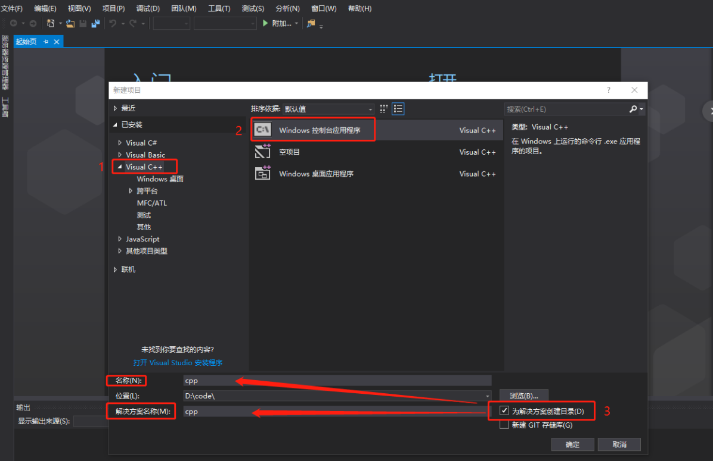
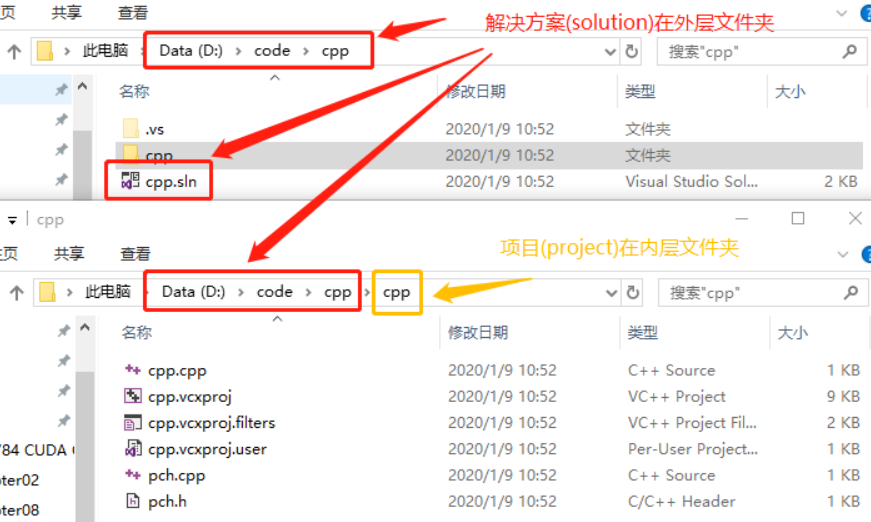
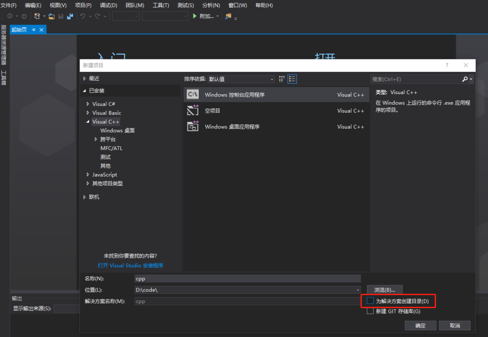
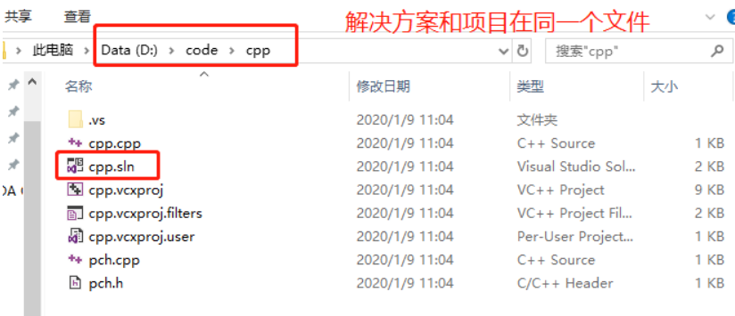
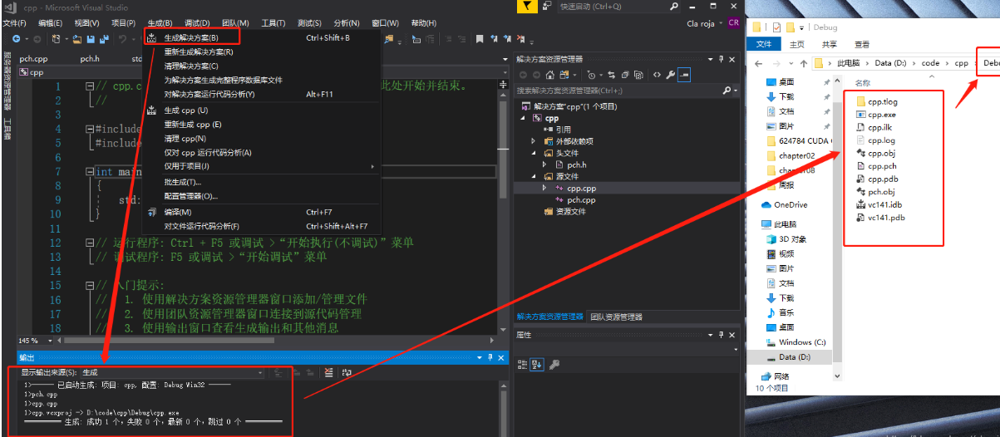
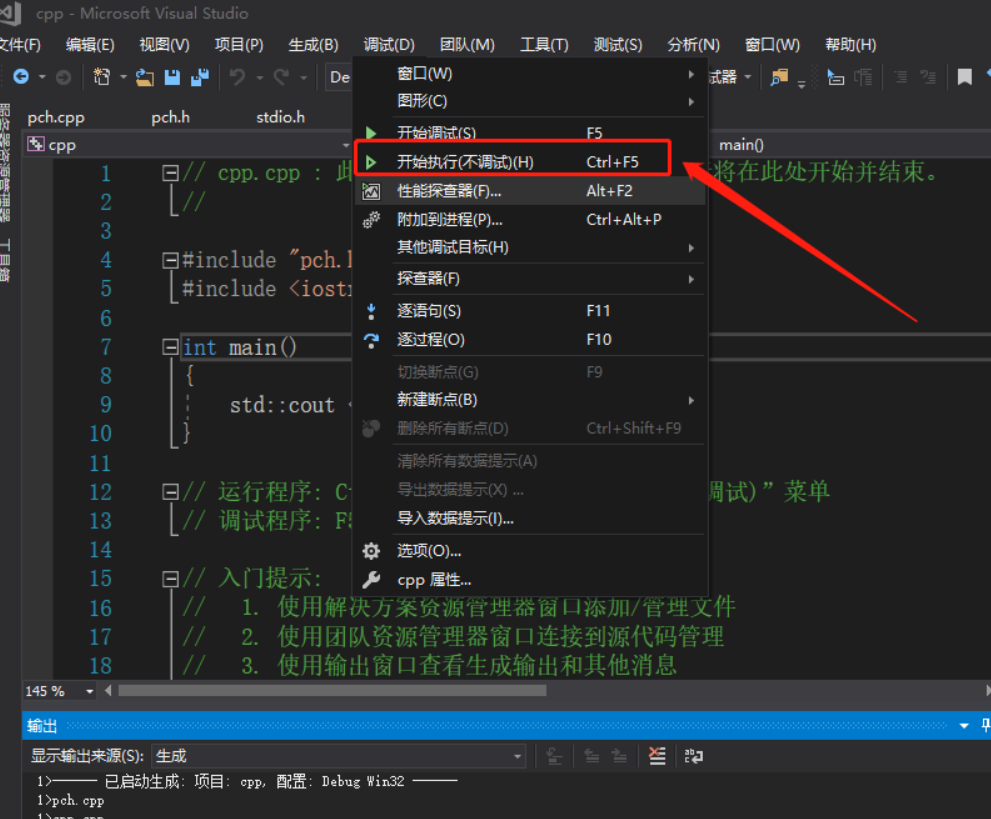
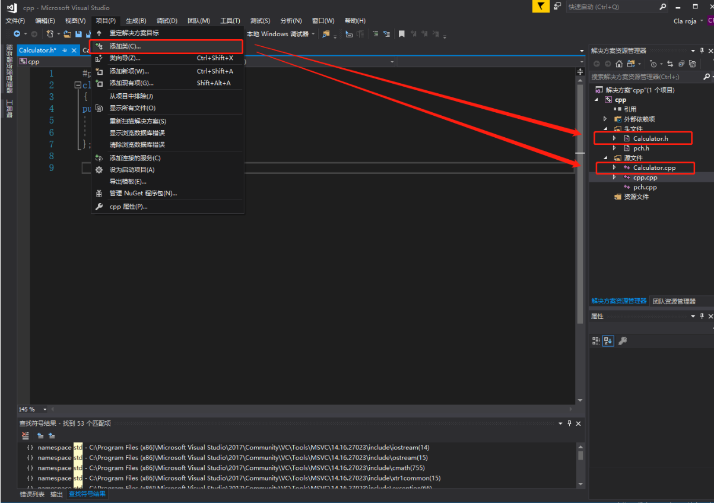

1.“文件” > “新建” > “项目”
2.“Visual C++” “Windows 控制台应用程序” "解决方案和项目名称"

# 运行项目

# pch
https://blog.csdn.net/deniece1/article/details/101013968

# 添加类

参考:
https://docs.microsoft.com/zh-cn/cpp/get-started/tutorial-console-cpp?view=vs-2017