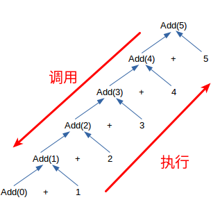

所有的循环都可以写成递归，但递归不一定能写成循环

```
# include <stdio.h>//引用函数库
//递归实现累加
int add_r(int num){
	if (num == 0){
		return 0;
	}
	else{
		return add_r(num-1) + num;
	}
}
//循环实现累加
int add_l(int num){
	int n1 = 0;
	int n2;
	for (int i = 0; i < num; i++){
		n2 = n1+i+1;
		n1 = n2;
	}
	return n2;
}

int main(){
	printf("%d", add_r(15));
	printf("%d", add_l(15));
}
```





最内层的函数最后调用，最先执行，最先调用的函数，要等后一个调用的函数执行完才能执行