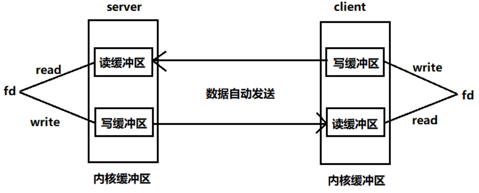

socket(套接字|插座)

网络通信的函数接口
封装了传输层协议(TCP,UDP,)

浏览器-http-tcp

分为:
1.服务器端(插座-被动)
2.客户端(插头-主动)

socket编程-网络IO编程
1.读写操作(read/write)-文件描述符
创建一个套接字,得到的是文件描述符

管道:内核缓冲区(内核的存储空间),管道的读写两端分别对应一个文件描述符
套接字:创建成功得到文件描述符fd,fd操作的是一块内存缓冲区

