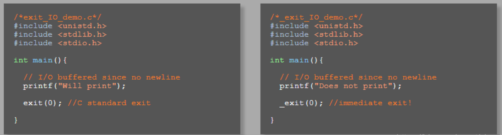

# 基础
1. 在`main`中终断自己,并返回
2. 1.0:sucess;1:failure;2:error
```c
_exit(int status);
exit(int status);
_Exit(int status);
```
# exit() and _exit() and _Exit()
1. 三种终断进程的方法
方法|描述
--|--
_exit()|请求OS立刻终断进程,强行,不回收资源
exit()|C标准库函数,先回收资源,再终断
_Exit()|C标准库函数,本质是`_exit()`的包装


1.左图`exit`会先将buffer里的内容输出的屏幕,再退出
2.右图`_exit`不会等待,直接退出
3.可以调用`fflush()`将buffer内容输出




# atexit() 退出回调
1.终断`exit()`时回调其他函数
```c
/*exit_handler_demo.c*/
#include <stdio.h>
#include <stdlib.h>

void my_exit1(){
  printf("FIRST Exit Handler\n");
}

void my_exit2(){
  printf("SECOND Exit Handler\n");
}

int main(){

  //exit handers execute in reverse order of registration                                                                                                                    
  atexit(my_exit1);
  atexit(my_exit2);
  //my_exit2 will run before my_exit1                                                                                                                                        

  return; //implicitly calls exit()                                                                                                                                         
}
```
