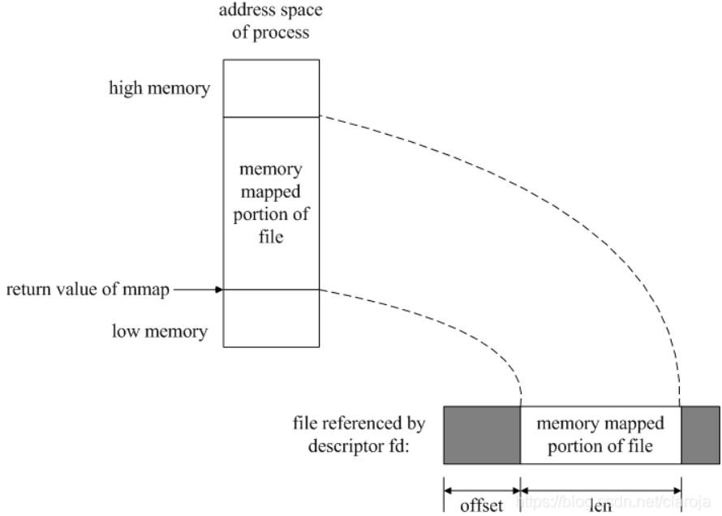

`mmap`()Memory-mapped I/O)将文件映射到内存缓冲区中,从缓冲区读数据,就相当于读文件中的字节,将数据存入缓冲区,相应的字节就会写入文件.(可以不使用read,write函数情况下,使用地址(指针)来完成I/O操作)
多进程映射同一个文件,来完成进程中的通信

`void *mmap(void *addr, size_t len, int prot, int flags, int fd, off_t offset);`
同malloc函数申请内存空间类似的，mmap建立的映射区在使用结束后也应调用类似free的函数来释放。


参数|描述
--|--
addr|映射到进程空间的起始地址,内核指定,直接传递NULL
fd|文件描述符,由open()返回
len|映射空间字节数,从offset算起
prot|共享内存的访问权限(PROT_READ可读,PROT_WRITE可写,PROT_EXEC可执行,PROT_NONE不可访问)
flags|MAP_SHARED对内存的修改同时影响到文件, MAP_PRIVATE对内存修改只对该进程可见,文件未修改, MAP_FIXED
offset|默认0,从文件头开始映射





```c
#include <stdio.h>
#include <unistd.h>
#include <sys/types.h>
#include <sys/stat.h>
#include <fcntl.h>
#include <sys/mman.h>
#include <string.h>
int main()
{
	int fd = open("test.txt",O_RDWR);
	//创建映射区
	char *mem = mmap(NUll,8,PROT_READ|PROT_WRITE,MAP_SHARED,fd,0);
	if(mem == MAP_FAILED){
		perror("mmap err");
		return -1;
	}
	//拷贝数据
	strcpy(mem, "hello");
	//释放
	munmap(mem,8);
	close(fd);
	return 0;
}
```


参考:
https://www.cnblogs.com/xiaoshiwang/p/10823291.html
https://blog.csdn.net/weixin_33775572/article/details/93538003
https://blog.csdn.net/zdy0_2004/article/details/53200250
https://www.cnblogs.com/bwbfight/p/11181631.html