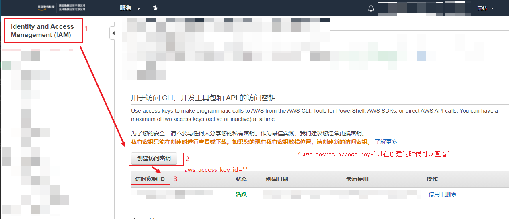
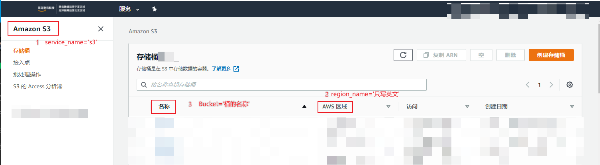
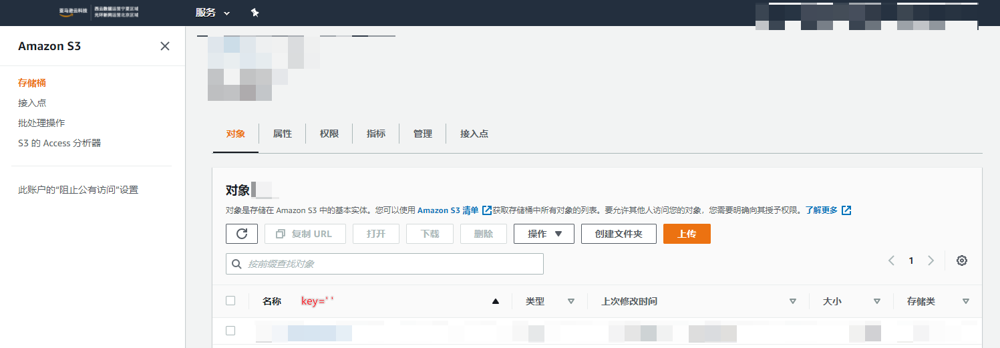

# process_pool

常用命令：
https://awscli.amazonaws.com/v2/documentation/api/latest/reference/s3/index.html


aws的s3文件存储系统, 下载接口.
<!--more-->
```python
from boto3.session import Session
session = Session(aws_access_key_id=s3_access_key_id, aws_secret_access_key=s3_secret_access_key)
s3_client = session.client(service_name='s3', region_name=s3_region)
s3_client.download_file(Bucket=s3_bucket, Key=s3_key, Filename=local_name)
```

- `aws_access_key_id` 访问秘钥ID 1.png
- `s3_secret_access_key` 访问秘钥 1.png
- `service_name` 服务名, `s3`就是存储和内容分发服务 2.png
- `region_name` 区名, 就是服务器的物理地址, 只写英文部分 2.png
- `Bucket` 桶名, 有点类似HBase 2.png
- `key` 文件的key, 类似HBase 3.png
- `Filename` 保存的文件名




