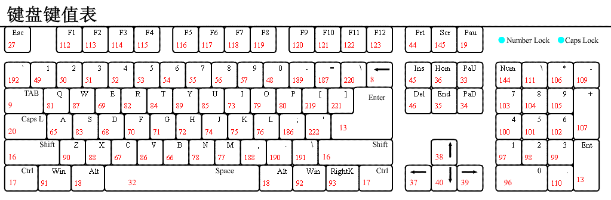

# pywin32api

win32api模块主要用来控制:
1. 鼠标
2. 键盘


## 鼠标
鼠标的控制分为两个:
1. 移动, 使用`SetCursorPos`方法
2. 点击, 使用`mouse_event`, 然后在第一个参数输入按键值


### 移动鼠标
```python
import win32api,win32con
## 将鼠标移动到坐标处
win32api.SetCursorPos((200, 200))
```

### 点击鼠标
```python
#给光标定位的位置进行单击操作
win32api.mouse_event(win32con.MOUSEEVENTF_LEFTUP | win32con.MOUSEEVENTF_LEFTDOWN, 0, 0, 0, 0)
#给光标定位的位置进行右击操作
win32api.mouse_event(win32con.MOUSEEVENTF_RIGHTUP | win32con.MOUSEEVENTF_RIGHTDOWN, 0, 0, 0, 0)
```
另一种写法
```python
## 鼠标左键按下-放开
win32api.mouse_event(win32con.MOUSEEVENTF_LEFTDOWN, 0, 0, 0, 0)
win32api.mouse_event(win32con.MOUSEEVENTF_LEFTUP, 0, 0, 0, 0)
## 鼠标右键按下-放开
win32api.mouse_event(win32con.MOUSEEVENTF_LEFTDOWN, 0, 0, 0, 0)
win32api.mouse_event(win32con.MOUSEEVENTF_LEFTUP, 0, 0, 0, 0)
```

## 鼠标值常量

```python
MOUSEEVENTF_MOVE = 1
MOUSEEVENTF_LEFTDOWN = 2
MOUSEEVENTF_LEFTUP = 4
MOUSEEVENTF_RIGHTDOWN = 8
MOUSEEVENTF_RIGHTUP = 16
MOUSEEVENTF_MIDDLEDOWN = 32
MOUSEEVENTF_MIDDLEUP = 64
MOUSEEVENTF_XDOWN = 128
MOUSEEVENTF_XUP = 256
MOUSEEVENTF_WHEEL = 2048
```


## 键盘
键盘控制有两个要点:
1. 按哪个按键, 第一个参数`bVk`控制
2. 动作是按下还是抬起, 第三个参数`dwFlags`控制

    ```python
    KEYEVENTF_EXTENDEDKEY = 1
    KEYEVENTF_KEYUP = 2
    ```

控制按键的方法:

`keybd_event(bVk, bScan, dwFlags, dwExtraInfo)`

- `bVk`: 虚拟键码（键盘键码对照表见附录）；
- `bScan`: 硬件扫描码，一般设置为0即可；
- `dwFlags`: 如果值为`KEYEVENTF_EXTENDEDKEY`(对应值1)则该键被按下，如果值为`KEYEVENTF_KEYUP`(对应值2)则该按键被释放；
- `dwExtraInfo`: 定义与击键相关的附加的32位值，一般设置为0即可。


### 单一按键
1. 查询keycode
2. 按下时`dwFlags`设为1, 抬起时`dwFlags`设为2
```python
win32api.keybd_event(keycode,0,1,0)  # 按下
win32api.keybd_event(keycode,0,2,0)  # 抬起
``` 
例如点击`Enter`
```python
win32api.keybd_event(13,0,1,0)
win32api.keybd_event(13,0,2,0)
```

### 组合按键

```python
win32api.keybd_event(18, 0, 1, 0)  # 按下Alt
win32api.keybd_event(70, 0, 1, 0)  # 按下F
win32api.keybd_event(70, 0, 2, 0)  # 释放F
win32api.keybd_event(18, 0, 2, 0)  # 释放Alt
```


## 按键和键值对应表

### 图片形式


### python字典形式 
```python
VK_CODE = {
    'backspace': 0x08,
    'tab': 0x09,
    'clear': 0x0C,
    'enter': 0x0D,
    'shift': 0x10,
    'ctrl': 0x11,
    'alt': 0x12,
    'pause': 0x13,
    'caps_lock': 0x14,
    'esc': 0x1B,
    'spacebar': 0x20,
    'page_up': 0x21,
    'page_down': 0x22,
    'end': 0x23,
    'home': 0x24,
    'left_arrow': 0x25,
    'up_arrow': 0x26,
    'right_arrow': 0x27,
    'down_arrow': 0x28,
    'select': 0x29,
    'print': 0x2A,
    'execute': 0x2B,
    'print_screen': 0x2C,
    'ins': 0x2D,
    'del': 0x2E,
    'help': 0x2F,
    '0': 0x30,
    '1': 0x31,
    '2': 0x32,
    '3': 0x33,
    '4': 0x34,
    '5': 0x35,
    '6': 0x36,
    '7': 0x37,
    '8': 0x38,
    '9': 0x39,
    'a': 0x41,
    'b': 0x42,
    'c': 0x43,
    'd': 0x44,
    'e': 0x45,
    'f': 0x46,
    'g': 0x47,
    'h': 0x48,
    'i': 0x49,
    'j': 0x4A,
    'k': 0x4B,
    'l': 0x4C,
    'm': 0x4D,
    'n': 0x4E,
    'o': 0x4F,
    'p': 0x50,
    'q': 0x51,
    'r': 0x52,
    's': 0x53,
    't': 0x54,
    'u': 0x55,
    'v': 0x56,
    'w': 0x57,
    'x': 0x58,
    'y': 0x59,
    'z': 0x5A,
    'numpad_0': 0x60,
    'numpad_1': 0x61,
    'numpad_2': 0x62,
    'numpad_3': 0x63,
    'numpad_4': 0x64,
    'numpad_5': 0x65,
    'numpad_6': 0x66,
    'numpad_7': 0x67,
    'numpad_8': 0x68,
    'numpad_9': 0x69,
    'multiply_key': 0x6A,
    'add_key': 0x6B,
    'separator_key': 0x6C,
    'subtract_key': 0x6D,
    'decimal_key': 0x6E,
    'divide_key': 0x6F,
    'F1': 0x70,
    'F2': 0x71,
    'F3': 0x72,
    'F4': 0x73,
    'F5': 0x74,
    'F6': 0x75,
    'F7': 0x76,
    'F8': 0x77,
    'F9': 0x78,
    'F10': 0x79,
    'F11': 0x7A,
    'F12': 0x7B,
    'F13': 0x7C,
    'F14': 0x7D,
    'F15': 0x7E,
    'F16': 0x7F,
    'F17': 0x80,
    'F18': 0x81,
    'F19': 0x82,
    'F20': 0x83,
    'F21': 0x84,
    'F22': 0x85,
    'F23': 0x86,
    'F24': 0x87,
    'num_lock': 0x90,
    'scroll_lock': 0x91,
    'left_shift': 0xA0,
    'right_shift ': 0xA1,
    'left_control': 0xA2,
    'right_control': 0xA3,
    'left_menu': 0xA4,
    'right_menu': 0xA5,
    'browser_back': 0xA6,
    'browser_forward': 0xA7,
    'browser_refresh': 0xA8,
    'browser_stop': 0xA9,
    'browser_search': 0xAA,
    'browser_favorites': 0xAB,
    'browser_start_and_home': 0xAC,
    'volume_mute': 0xAD,
    'volume_Down': 0xAE,
    'volume_up': 0xAF,
    'next_track': 0xB0,
    'previous_track': 0xB1,
    'stop_media': 0xB2,
    'play/pause_media': 0xB3,
    'start_mail': 0xB4,
    'select_media': 0xB5,
    'start_application_1': 0xB6,
    'start_application_2': 0xB7,
    'attn_key': 0xF6,
    'crsel_key': 0xF7,
    'exsel_key': 0xF8,
    'play_key': 0xFA,
    'zoom_key': 0xFB,
    'clear_key': 0xFE,
    '+': 0xBB,
    ',': 0xBC,
    '-': 0xBD,
    '.': 0xBE,
    '/': 0xBF,
    '`': 0xC0,
    ';': 0xBA,
    '[': 0xDB,
    '\\': 0xDC,
    ']': 0xDD,
    "'": 0xDE,
    '`': 0xC0
}
```
### win32con
在`win32con.py`中定义的常量

```python
VK_LBUTTON = 1
VK_RBUTTON = 2
VK_CANCEL = 3
VK_MBUTTON = 4
VK_BACK = 8
VK_TAB = 9
VK_CLEAR = 12
VK_RETURN = 13
VK_SHIFT = 16
VK_CONTROL = 17
VK_MENU = 18
VK_PAUSE = 19
VK_CAPITAL = 20
VK_KANA = 21
VK_HANGEUL = 21  # old name - should be here for compatibility
VK_HANGUL = 21
VK_JUNJA = 23
VK_FINAL = 24
VK_HANJA = 25
VK_KANJI = 25
VK_ESCAPE = 27
VK_CONVERT = 28
VK_NONCONVERT = 29
VK_ACCEPT = 30
VK_MODECHANGE = 31
VK_SPACE = 32
VK_PRIOR = 33
VK_NEXT = 34
VK_END = 35
VK_HOME = 36
VK_LEFT = 37
VK_UP = 38
VK_RIGHT = 39
VK_DOWN = 40
VK_SELECT = 41
VK_PRINT = 42
VK_EXECUTE = 43
VK_SNAPSHOT = 44
VK_INSERT = 45
VK_DELETE = 46
VK_HELP = 47
VK_LWIN = 91
VK_RWIN = 92
VK_APPS = 93
VK_NUMPAD0 = 96
VK_NUMPAD1 = 97
VK_NUMPAD2 = 98
VK_NUMPAD3 = 99
VK_NUMPAD4 = 100
VK_NUMPAD5 = 101
VK_NUMPAD6 = 102
VK_NUMPAD7 = 103
VK_NUMPAD8 = 104
VK_NUMPAD9 = 105
VK_MULTIPLY = 106
VK_ADD = 107
VK_SEPARATOR = 108
VK_SUBTRACT = 109
VK_DECIMAL = 110
VK_DIVIDE = 111
VK_F1 = 112
VK_F2 = 113
VK_F3 = 114
VK_F4 = 115
VK_F5 = 116
VK_F6 = 117
VK_F7 = 118
VK_F8 = 119
VK_F9 = 120
VK_F10 = 121
VK_F11 = 122
VK_F12 = 123
VK_F13 = 124
VK_F14 = 125
VK_F15 = 126
VK_F16 = 127
VK_F17 = 128
VK_F18 = 129
VK_F19 = 130
VK_F20 = 131
VK_F21 = 132
VK_F22 = 133
VK_F23 = 134
VK_F24 = 135
VK_NUMLOCK = 144
VK_SCROLL = 145
VK_LSHIFT = 160
VK_RSHIFT = 161
VK_LCONTROL = 162
VK_RCONTROL = 163
VK_LMENU = 164
VK_RMENU = 165
VK_PROCESSKEY = 229
VK_ATTN = 246
VK_CRSEL = 247
VK_EXSEL = 248
VK_EREOF = 249
VK_PLAY = 250
VK_ZOOM = 251
VK_NONAME = 252
VK_PA1 = 253
VK_OEM_CLEAR = 254
```


参考:
https://blog.csdn.net/afgasdg/article/details/85795883