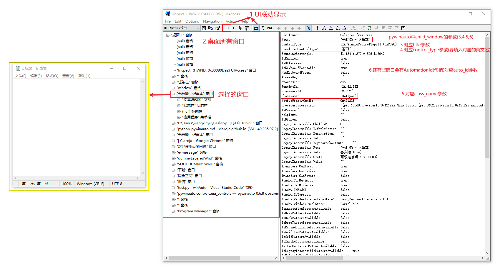

# pywinauto

操作控件需要以下几个步骤： 
第一步 实例化要操作的进程：得到的app是Application对象
```python
from pywinauto.application import Application
app = Application(backend="uia").connect(process=13296)
```
第二步 选择窗口 ：`app.top_window()`或`app.window()` 得到的窗口是`WindowSpecification`对象
```python
mainWindow = app.window(class_name="WeChatMainWndForPC") # 用于窗口的查找
mainWindow.draw_outline()
```

第三步：基于WindowSpecification对象使用其方法再往下查找，定位到具体的控件

```python
chat = mainWindow.child_window(title="聊天")
chat.draw_outline()
```
第四步：使用控件的方法属性执行我们需要的操作
```python
chat.click_input()
```

## 第一步, 创建Application对象
### backend
```python
from pywinauto.application import Application
app = Application(backend='win32')
```

Windows 有两种访问技术：
`Win32 API（backend="win32"）`：默认的后端访问技术，适用于 MFC、VB6、简单的 WinForms 控件及大多数老旧的应用。
`MS UI Automation（backend="uia"）`：适用于 WinForms、WPF、应用商店、Qt5、浏览器等。

<font style="background: hotpink">注意</font>:pywinauto 不支持 Java AWT/Swing、GTK + 及 Tkinter 等。Linux 上的 AT SPI 及 Apple Accessibility API 未来有支持计划。


### 打开新程序并连接: start()
`start()`方法可启动目标应用，并连接到其进程
```python
from pywinauto.application import Application
app = Application(backend='win32').start('notepad.exe')
```

`start(self, cmd_line, timeout=app_start_timeout)`

参数|描述
--|--
`cmd_line`|`r"c:\path\to\your\application --arguments"`
`timeout`|超时时间


### 连接已启动的窗口: connect()
connect() 方法则用于连接到已经启动的进程，可以向该方法传入应用的进程 ID（可在任务管理器中查看 PID）、应用的窗口句柄、可执行文件的路径，或者是各种窗口参数的任意组合。例如：
```python
## 传入 PID
app = Application().connect(process=2341)
## 传入句柄
app = Application().connect(handle=0x010f0c)
## 传入可执行文件路径
app = Application().connect(path=r"c:\windows\system32\notepad.exe")
## 参数组合，这些参数被传递给 pywinauto.findwindows.find_elements() 函数
app = Application().connect(title_re=".*Notepad", class_name="Notepad")
```
<font style="background: hotpink">注意</font>:使用`connect()`方法时，通常需要编写一个循环来等待应用完全完成启动。


### application对象, [参考官网](https://pywinauto.readthedocs.io/en/latest/code/pywinauto.application.html#pywinauto.application.Application)


```python
app.top_window()
## 返回应用程序当前顶部窗口，是WindowSpecification对象，可以继续使用对象的方法往下继续查找控件
## eg:如：app.top_window().child_window(title='地址和搜索栏', control_type='Edit')
app.window(**kwargs)
## 根据筛选条件，返回一个窗口， 是WindowSpecification对象，可以继续适用对象的方法往下继续查找控件
## eg: 微信主界面 app.window(class_name='WeChatMainWndForPC')
app.windows(**kwargs)
## 根据筛选条件返回一个窗口列表，无条件默认全部，列表项为wrapped对象，可以使用wrapped对象的方法，注意不是WindowSpecification对象
## eg：[<uiawrapper.UIAWrapper - '李渝的早报 - Google Chrome', Pane, -2064264099699444098>]
app.kill(soft=False) # 强制关闭
app.cpu_usage() # 返回指定秒数期间的CPU使用率百分比
app.wait_cpu_usage_lower(threshold=2.5, timeout=None, usage_interval=None) # 等待进程CPU使用率百分比小于指定的阈值threshold
app.is64bit() # 如果操作的进程是64-bit，返回True
```


## 第二步, 获得application窗口, 

1. 通过`app.top_window()`直接获取最顶层的窗口
```python
winSp = app.top_window()
```

2. 通过`window()`获得主窗口
```python
winSp = app.window(class_name='WeChatMainWndForPC')
```


## 第三步, 获得指定的窗口
使用`child_window()`搜索子控件:
```python
chat = mainWindow.child_window(title="聊天")
chat.draw_outline()
```

1. 参数
```python
child_window(title=None,control_type=None,class_name=None) # 可以不管层级的找后代中某个符合条件的元素，最常用
```

参数|描述
--|--
title=None|控件的标题文字，对应inspect中Name字段, 另外title_re=None, # 正则匹配文字
control_type=None|控件类型，inspect界面LocalizedControlType字段的英文名
class_name=None|类型名, 对应inspect中ClassName, 另外class_name_re=None, # 正则匹配类名

一般使用`title`即可, 不行再一次辅助`control_type`和`class_name`来定位


2. 返回 WindowSpecification对象, 

   1. WindowSpecification对象本身的一些方法, [参考官网](https://pywinauto.readthedocs.io/en/latest/code/pywinauto.application.html#pywinauto.application.WindowSpecification)
   
   方法|描述
   --|--
   `child_window(**criteria)`|子窗口搜索
   `dump_tree(depth=None, filename=None)`|打印子窗口的结构
   `exists(timeout=None, retry_interval=None)`|查看窗口是否存在
   `print_control_identifiers(depth=None, filename=None)`|打印子窗口
   `print_ctrl_ids(depth=None, filename=None)`|
   `wait(wait_for, timeout=None, retry_interval=None)`|等待
   `wait_not(wait_for_not, timeout=None, retry_interval=None)`|
   `wrapper_object()`|可以使用`HwndWrapper object`的方法

   2. 包装方法, [参考官网](https://pywinauto.readthedocs.io/en/latest/code/code.html#controls-reference)


## 第四步, 对控件进行操作
### 鼠标操作
1. 点击操作
使用`click_input()`方法, 来操作
`click_input(button='left', coords=(None, None), button_down=True, button_up=True, double=False, wheel_dist=0, use_log=True, pressed='', absolute=False, key_down=True, key_up=True)`

参数|描述
--|--
button|‘left’, ‘right’, ‘middle’(Default: ‘left’)
coords|点击的位置(Default: the center of the control)
double|是否双击 (Default: False)
wheel_dist|滚轮(default: 0)

2. 拖拽操作
   - 指定位置单击`press_mouse_input(coords = (None, None))`
   - 指定位置释放`release_mouse_input(coords = (None, None))`
   - 移动到指定位置`move_mouse_input(coords=(0, 0))`
   - 将ctrl拖动到dst,是press-move-release操作集合|`drag_mouse_input(dst=(0, 0))`
3. 滚动

```python
ctrl.scroll(direction, amount, count=1,) # 滚动
    # direction ："up", "down", "left", "right"
    # amount："line" or "page"
    # count：int 滚动次数
```

### 文本输入
```python
ctrl.type_keys(keys, pause = None, with_spaces = False,)
    # keys：要输入的文字内容
    # pause：每输入一个字符后等待时间，默认0.01就行
    # with_spaces：是否保留keys中的所有空格，默认去除0
```

### 下拉菜单
```python
from pywinauto.application import Application
app = Application(backend="uia").start("notepad.exe")
mainwin = app['无标题 - 记事本']
mainwin.menu_select('帮助 -> 关于记事本') # "帮助" 菜单中选择了"关于记事本"，打开了"关于记事本"对话框
app['Dialog']['确定'].click()  # 关闭"关于记事本"对话框
```
<font style="background: hotpink">注意</font>: 若上面代码未能关闭 “关于记事本” 对话框，可再重复运行一次。若频繁出现这种现象，甚至需要数量不定的多次单击 “确定” 按钮，或许可考虑使用一个循环来解决问题.如下:

```python
while app['关于记事本'].visible
   app['关于记事本']['确定'].click()
```

测试中发现，同样用代码来打开和关闭 “编辑 | 替换” 对话框，则不存在这个问题。


### 最大化最小化
只有空间是窗口模式的时候可以使用

```python
dlg.close() # 关闭界面
dlg.minimize() # 最小化界面
dlg.maximize() # 最大化界面
dlg.restore() # 将窗口恢复为正常大小，比如最小化的让他正常显示在桌面
dlg.get_show_state() # 正常0，最大化1，最小化2
```

### 等待与确认
```python
exists(timeout=None, retry_interval=None) # 判断是否存在
#timeout：等待时间，一般默认5s
#retry_interval：timeout内重试时间
wait(wait_for, timeout=None, retry_interval=None) # 等待窗口处于特定状态
wait_not(wait_for_not, timeout=None, retry_interval=None) # 等待窗口不处于特定状态，即等待消失
## wait_for/wait_for_not:
## * 'exists' means that the window is a valid handle
## * 'visible' means that the window is not hidden
## * 'enabled' means that the window is not disabled
## * 'ready' means that the window is visible and enabled
## * 'active' means that the window is active
```

### 控件信息获取
```python
window_text() # 控件的标题文字，对应inspect中Name字段, 等价ctrl.element_info.name
class_name() # 控件的类名，对应inspect中ClassName字段，有些控件没有类名, 等价ctrl.element_info.class_name
element_info.control_type # 控件类型，inspect界面LocalizedControlType字段的英文名
legacy_properties().get('Value') # 获得编辑器中已经输入的内容
```

### 控件位置获取

```python
ret = ctrl.rectangle() # 控件上下左右坐标，(L430, T177, R1490, B941)，可.输出上下左右
```

### 控件辅助

```python
ctrl.draw_outline(colour='green') # 空间外围画框，便于查看，支持'red', 'green', 'blue'
ctrl.print_control_identifiers(depth=None, filename=None) # 打印其包含的元素，详见打印元素
ctrl.capture_as_image() # 返回控件的 PIL image对象，可继续使用其方法如下：ctrl.capture_as_image().save(img_path)
```

#### print_control_identifiers

`print_control_identifiers()`来查看控件的identifier.
```python
from pywinauto.application import Application
app = Application(backend="uia").start("notepad.exe")
mainwin = app['无标题 - 记事本']
mainwin.print_control_identifiers()
"""
Dialog - '无标题 - 记事本'    (L2050, T110, R3490, B869)    
['Dialog', '无标题 - 记事本', '无标题 - 记事本Dialog']      
child_window(title="无标题 - 记事本", control_type="Window")
|
| Edit - '文本编辑器'    (L2058, T161, R3482, B839)
| ['Edit']
| child_window(title="文本编辑器", auto_id="15", control_type="Edit")
|    |
|    | ScrollBar - '垂直滚动条'    (L3465, T161, R3482, B822)
|    | ['ScrollBar', '垂直滚动条ScrollBar', '垂直滚动条', 'ScrollBar0', 'ScrollBar1']
|    | child_window(title="垂直滚动条", auto_id="NonClientVerticalScrollBar", control_type="ScrollBar")
|    |    |
|    |    | Button - '上一行'    (L3465, T161, R3482, B178)
|    |    | ['上一行', '上一行Button', 'Button', 'Button0', 'Button1']
|    |    | child_window(title="上一行", auto_id="UpButton", control_type="Button")
|    |    |
|    |    | Button - '下一行'    (L3465, T805, R3482, B822)
|    |    | ['下一行', 'Button2', '下一行Button']
|    |    | child_window(title="下一行", auto_id="DownButton", control_type="Button")
|    |
|    | ScrollBar - '水平滚动条'    (L2058, T822, R3465, B839)
|    | ['ScrollBar2', '水平滚动条', '水平滚动条ScrollBar']
|    | child_window(title="水平滚动条", auto_id="NonClientHorizontalScrollBar", control_type="ScrollBar")       
|    |    |
|    |    | Button - '左移一列'    (L2058, T822, R2075, B839)
|    |    | ['左移一列', '左移一列Button', 'Button3']
|    |    | child_window(title="左移一列", auto_id="UpButton", control_type="Button")
|    |    |
|    |    | Button - '右移一列'    (L3448, T822, R3465, B839)
|    |    | ['右移一列Button', 'Button4', '右移一列']
|    |    | child_window(title="右移一列", auto_id="DownButton", control_type="Button")
|    |
|    | Thumb - ''    (L3465, T822, R3482, B839)
|    | ['Thumb']
...
"""
```


#### inspect
`C:\Program Files (x86)\Windows Kits\10\bin\10.0.19041.0\x64`





参考:
https://www.cnblogs.com/xp1315458571/p/13892205.html
https://pywinauto.readthedocs.io/en/latest/getting_started.html
https://dc1y.github.io/pywinauto-auto-your-gui/
https://www.cnblogs.com/baihuitestsoftware/articles/9317988.html
https://www.cnblogs.com/xp1315458571/p/13892205.html
https://www.cnblogs.com/Simple-Small/p/12035446.html


