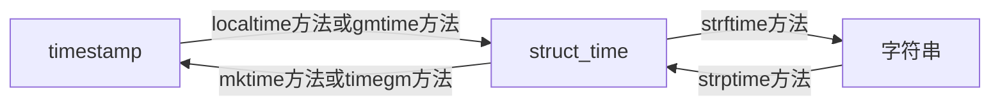

# time

epoch: 计时初始点
timezone, tz: 时区
localtime: 本地时间
timestamp: 时间戳
struct_time: 结构化时间

## 总结



## 基本概念

### UTC和TimeZone
UTC (Coordinated Universal Time)是世界的标准时间(0经度为标准), Time Zone是根据UTC来划分的, 比如:

1. North and South America, 是Central Time Zone (CT)计时法, 在UTC之后的5小时或6小时, 记作UTC-5:00 or UTC-6:00
2. Sydney, Australia, 是Australian Eastern Time Zone (AET)计时法, 在UTC之前10小时或11小时, 记作UTC+10:00 or UTC+11:00

0经度的时间也称为GMT(Greenwich Mean Time)时间. 


### Daylight Savings Time(DST)
CT是偏移 -5或-6,  AET是偏移+10或+11是因为考虑了夏令时(Daylight Saving Time, DST).

夏天相比冬天, 有更长的日照时间, 所以有些地区会观测日照时间来更好的利用它. 这些地区的时间会在春季将时间前移1个小时(丢失了1小时), 在秋季将时间复原.

字母`S`和`D`表示当前时间是standard time(标准时间)还是daylight savings time(夏令), 所以更准的表示为:

1. Central Standard Time (C`S`T) 或 Central Daylight Time (C`D`T)
2. Australian Eastern Standard Time (AE`S`T) 或 Australian Eastern Daylight Time (AE`D`T)


## 时间戳
基本上所有的电脑都以`Unix epoch`, 作为计时的起点,`January 1, 1970, at 00:00:00 UTC`, 可以使用`time`模块获得`Unix epoch`以来的秒数.

```python
import time
time.time()
```

<font style="background: hotpink">注意:</font>

`time.time()`返回的秒数, 也是本地时间, 而不是GMT时间. 可以看到本地时间(中国), 比GMT时间快了8小时.
```python
time.gmtime(time.time())  # time.struct_time(tm_year=2023, tm_mon=3, tm_mday=6, tm_hour=11, tm_min=43, tm_sec=38, tm_wday=0, tm_yday=65, tm_isdst=0)
time.localtime(time.time())  # time.struct_time(tm_year=2023, tm_mon=3, tm_mday=6, tm_hour=19, tm_min=43, tm_sec=38, tm_wday=0, tm_yday=65, tm_isdst=0)
```


## GMT时间(gmtime)

GMT(Greenwich Mean Time), 就是没有偏移量的UTC时间(UTC±00:00)  
`gmtime()`使用UTC将流逝的时间转化为`struct_time`, 如果传入0, 就是获得最初的时间(epoch):

```python
import time
time.gmtime(0)
## time.struct_time(tm_year=1970, tm_mon=1, tm_mday=1, tm_hour=0, tm_min=0, tm_sec=0, tm_wday=3, tm_yday=1, tm_isdst=0)
```

`gmtime()`GMT时间即(UTC无偏移时间),`localtime()`是东八区时间(中国), 即(UTC+8)
```python
import time
time.gmtime()
## time.struct_time(tm_year=2023, tm_mon=3, tm_mday=6, tm_hour=11, tm_min=32, tm_sec=33, tm_wday=0, tm_yday=65, tm_isdst=0)
time.localtime()
## time.struct_time(tm_year=2023, tm_mon=3, tm_mday=6, tm_hour=19, tm_min=32, tm_sec=33, tm_wday=0, tm_yday=65, tm_isdst=0)
```

### timegm
有趣的是, time模块没有`gmtime`的逆方法, 将结构化时间转化为时间戳, 我们需要借用`calendar`模块的的`timegm()`方法:
```python
import calendar
import time
time.gmtime()  # time.struct_time(tm_year=2019, tm_mon=2, tm_mday=28, tm_hour=13, tm_min=23, tm_sec=12, tm_wday=3, tm_yday=59, tm_isdst=0)
calendar.timegm(time.gmtime())  # 1551360204
```


## 本地时间(localtime)
`time`模块提供了`localtime()`方法获得本地区的流逝的时间

```python
import time
time.time()  # 1551448206.86196
time.localtime(1551448206.86196)  # time.struct_time(tm_year=2019, tm_mon=3, tm_mday=1, tm_hour=7, tm_min=50, tm_sec=6, tm_wday=4, tm_yday=60, tm_isdst=0)
```
注意此时的`tm_isdst=0`, 也就是说此刻的时间(March 1, 2019)是标准时间. 美国2019年的夏令时间开始于March 10, 我们可以验证一下:
```python
new_secs = 1551448206.86196 + (86400 * 9)
time.localtime(new_secs)  # time.struct_time(tm_year=2019, tm_mon=3, tm_mday=10, tm_hour=8, tm_min=50, tm_sec=6, tm_wday=6, tm_yday=69, tm_isdst=1)
```
此时`tm_isdst=1`, 也就是说3月10号变成了夏令时, 注意此时的`tm_hour`从7变成了8, 说明我们的时间向前调了1个小时

`localtime()`方法返回的`struct_time`包含了时区信息, 如果是在美国则返回:
```python
import time
current_local = time.localtime()
current_local.tm_zone  # 'CST'
current_local.tm_gmtoff  # -21600
current_local.tm_isdst  # 0
```
在中国则返回:
```python
import time
current_local = time.localtime()
current_local.tm_zone  # '中国标准时间'
current_local.tm_gmtoff  # 28800
current_local.tm_isdst  # 0
```

### mktime(t)
`localtime()`的逆方法, 参数是`struct_time`, 将结构化时间转换为时间戳.
特别注意`mktime()`传入的local time, 不能是GMT时间:
```python
import time
## 1. 获得GMT时间
current_utc = time.gmtime()
current_utc  # time.struct_time(tm_year=2023, tm_mon=3, tm_mday=6, tm_hour=11, tm_min=40, tm_sec=0, tm_wday=0, tm_yday=65, tm_isdst=0)
## 2. 将GMT误当成UTC+8时间转为秒数
current_utc_secs = time.mktime(current_utc)
current_utc_secs  # 1678074000.0
## 3. 将错误的秒数重新转化为GMT时间, 发现差了8小时
time.gmtime(current_utc_secs)  # time.struct_time(tm_year=2023, tm_mon=3, tm_mday=6, tm_hour=3, tm_min=40, tm_sec=0, tm_wday=0, tm_yday=65, tm_isdst=0)
```


## struct_time
`gmtime()`,`localtime()`和`strptime()`可以将时间戳转换为`struct_time`, 包含了详细的时间信息.

[参考官方](https://docs.python.org/3/library/time.html#time.struct_time)


## 时间和字符串之间的转换

### strftime(format[, t])
将`struct_time`转化为字符串, str`f`time中的`f`是指format(格式化)


```python
import time
time.strftime('%Y-%m-%d', time.localtime())  # '2019-03-01'
```

### strptime(string[, format])
将字符转解析成结构化时间, str`p`time中的`p`是parse(解析)
```python
import time
time.strptime("30 Nov 00", "%d %b %y")
```


参考:
https://docs.python.org/3/library/time.html