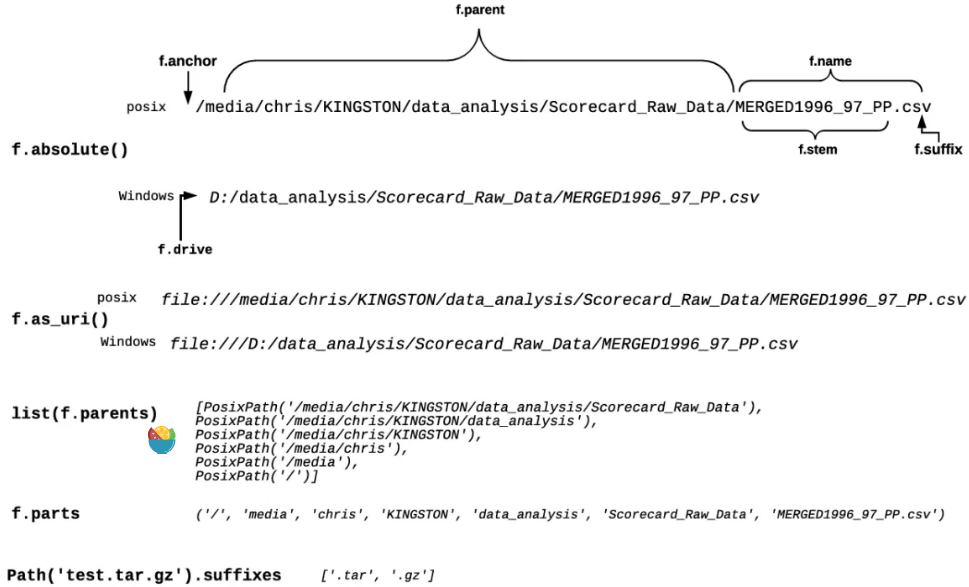

# pathlib

## 创建Path对象
- `Path.home()`, 用户路径
- `Path.cwd()`, 当前工作目录(current work directory)
- `Path()`, 指定路径
    > 在Windows中, 路径分隔符是`\`, 但更多的场景里`\`代表的是转义字符(escape character), 可以使用原始字符(raw string literals), 来规避这个问题, 如`r"C:\Users"`等价于`'C:\\Users'`
    > 另外使用`joinpath`也可以避免windows和linux路径处理的区别, 如`Path.home().joinpath("python")`, 结果为`PosixPath('/home/user/python)`
    > 还有一种方法是`wave_absolute = Path(Path.home(), "ocean", "wave.txt")`
    > 最后还可以使用`/`运算符 `Path.cwd() / "test.md"`

注意, 以上获得的都是相对路径, 可以使用`resolve()`转化为绝对路径
```python
path.resolve()  # 将相对路径转化为绝对路径
```

## 将Path对象转化为字符串

```python
>>> from pathlib import Path
>>> str(Path(r"C:\Users"))
'C:\\Users'
```

## 获得Path对象的局部
- `.name`: 文件名称和类型, 不包含路径, 而包含`.stem`和`.suffix`
- `.stem`: 文件名称, 不包含类型`.suffix`
- `.suffix`: 文件类型, 仅包含`.suffix`
- `.anchor`: 盘符
- `.parent`: 文件的路径, `.parent`表示文件的路径, 而`.parent.parent`表示上一级路径




```python
from pathlib import Path
path = Path(r"C:\Users\gahjelle\realpython\test.md")
path  # WindowsPath('C:/Users/gahjelle/realpython/test.md')
path.name  # 'test.md'
path.stem  # 'test'
path.suffix  # '.md'
path.anchor # 'C:\\'
path.parent # WindowsPath('C:/Users/gahjelle/realpython")
path.parent.parent # WindowsPath('C:/Users/gahjelle')
```

## 文件操作

### 读写文件
- 默认调用`open()`方法

    ```python
    from pathlib import Path

    path = Path.cwd() / "test.md"
    with path.open(mode="r", encoding="utf-8") as md_file:
        content = md_file.read()
    ```

- 也提供的便利的方法如

    - `.read_text()` 等价于`open('./test.md', mode='r')`
    - `.read_bytes()` 等价于`open('./test.md', mode='rb')`
    - `.write_text()` 等价于`open('./test.md', mode='w')`
    - `.write_bytes()` 等价于`open('./test.md', mode='wb')`

    以上的方法自动关闭文件, 所以不必再写`with`.

    ```python
    from pathlib import Path
    path = Path.cwd() / "test.md"
    content = path.read_text(encoding="utf-8")
    ```

### 更改文件名称

- `.with_stem()`, 仅更改`stem()`部分
- `.with_suffix()`, 仅更改`suffix()`部分
- `.with_name()`, 更改`name()`部分

```python
from pathlib import Path
txt_path = Path("/home/gahjelle/realpython/hello.txt")
"""
PosixPath("/home/gahjelle/realpython/hello.txt")
"""
# 创建更改`suffix`后的Path对象, 此时并没有实际更改文件名
md_path = txt_path.with_suffix(".md")
"""
PosixPath('/home/gahjelle/realpython/hello.md')
"""
# 替换为新的Path对象, 即实际更改文件类型
txt_path.replace(md_path)
```

### 复制文件

```python
from pathlib import Path
source = Path("test.md")
destination = source.with_stem("test2")
destination.write_bytes(source.read_bytes())
```


### 移动文件

```python
from pathlib import Path

source = Path("test.py")
destination = Path("test1.py")
source.replace(destination)
```
### 删除文件

```python
from pathlib import Path

source = Path("test.py")
source.unlink()
```
### 创建和删除路径
```python
path.rmdir() #
path.mkdir()  # 创建
```


## 迭代路径下的文件和目录

```python
[x for x in path.iterdir() if x.is_dir()]  # 目录下所有目录
[x for x in path.iterdir() if x.is_file()]  # 目录下所有文件
list(path.glob('**/*.py'))  # 目录及递归所有子目录下所有py文件, **代表递归所有子目录
list(path.glob('*/*.py'))  # 目录下所有一级子目录下所有py文件, *达标通配符
```


## 判断路径是否存在
```python
from pathlib import Path
path = Path('/tmp/myfile.txt')
path.exists()
```

## 判断路径类型(文件?目录?软连接)
```python
from pathlib import Path
path = Path('/tmp', 'myfile.txt')
path.touch()
path.is_file()  # True
path.is_dir()  # False
path.is_symlink()  # False
```


## 获得文件详细信息

```python
from pathlib import Path
path = Path('/tmp', 'myfile.txt')
path.touch()
path.write_text('HelloWorld')
path.stat() # os.stat_result(st_mode=33188, st_ino=20705682, st_dev=16777224, st_nlink=1, st_uid=501, st_gid=0, st_size=10, st_atime=1602572294, st_mtime=1602572354, st_ctime=1602572354)
```

## 实践
- 统计文件数量

    ```python
    from pathlib import Path
    from collections import Counter
    Counter(path.suffix for path in Path.cwd().iterdir())  # Counter({'.md': 2, '.txt': 4, '.pdf': 2, '.py': 1})
    Counter(path.suffix for path in Path.cwd().glob("*.p*"))  # Counter({'.pdf': 2, '.py': 1})
    ```

- 路径的树结构

    ```python
    from pathlib import Path
    def tree(directory):
        print(f"+ {directory}")
        for path in sorted(directory.rglob("*")):
            depth = len(path.relative_to(directory).parts)
            spacer = "    " * depth
            print(f"{spacer}+ {path.name}")

    tree(Path.cwd())
    """
    + /home/gahjelle/realpython
        + directory_1
            + file_a.md
        + directory_2
            + file_a.md
            + file_b.pdf
            + file_c.py
        + file_1.txt
        + file_2.txt
    """
    ```


## 参考:
- [python-pathlib](https://realpython.com/python-pathlib/)
- https://docs.python.org/3/library/pathlib.html
- https://myapollo.com.tw/zh-tw/python-pathlib/
