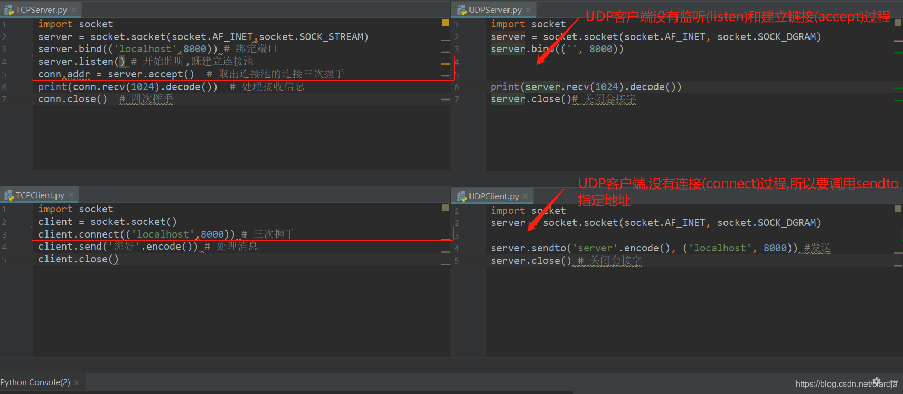

# udp


## UDP连接
服务端
```python
import socket
server = socket.socket(socket.AF_INET, socket.SOCK_DGRAM)
server.bind(('', 8000))
print(server.recv(1024).decode())
server.close()# 关闭套接字
```

客户端
```python
import socket
server = socket.socket(socket.AF_INET, socket.SOCK_DGRAM)
server.sendto('server'.encode(), ('localhost', 8000)) # 这里要用sendto,因为udp没有建立链接
server.close() # 关闭套接字
```





## UDP广播
```python
import socket
dest = ('<broadcast>', 7788)# 这里<broadcst>可以写成当前网段的广播地址
s = socket.socket(socket.AF_INET, socket.SOCK_DGRAM) # 创建udp套接字
s.setsockopt(socket.SOL_SOCKET, socket.SO_BROADCAST,1)# 设置成能发送广播数据
s.sendto("Hi", dest)# 发送广播
```