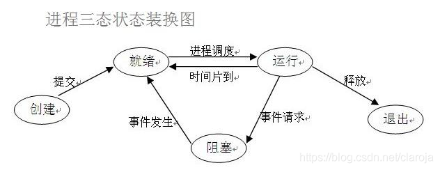

# multiprocessing




Ready：进程已分配到除CPU以为的所有必要的资源，只要获得处理机便可立即执行
Running：当进程已获得处理机，其程序正在处理机上执行
Blocked：引起进程阻塞的时间有多种，例如：等待I/O完成、申请缓冲区不能满足、等待信件（信号）

```python
#程序开始,进入ready状态(注意不是running)
import time # 程序开始运行
print("running")
time.sleep(1)# 进入blocked状态,input方法也是blocked状态
print("over")#sleep后进入running状态
#结束
```

`multiprocessing.Process`的接口设计类似于`threading.Thread`

进程主要模块包括:

1. 进程
Process

2. 进程通信
Pipes
Queues

3. 共享对象
Value
Array
dict

4. 锁
lock: 最基本的锁
rlock: 可重入锁
semaphore: 计数锁, 当小于规定阈值线程数量时, 可执行, 并获得锁
barrier: 计数锁, 当小于规定阈值线程数量时, 会阻塞, 知道大于阈值时, 才可执行
condition: 调用wait()来进入等待室, 调用notify()方法来唤醒, 好处是一个线程可以反复使用
event: 类似于condition
