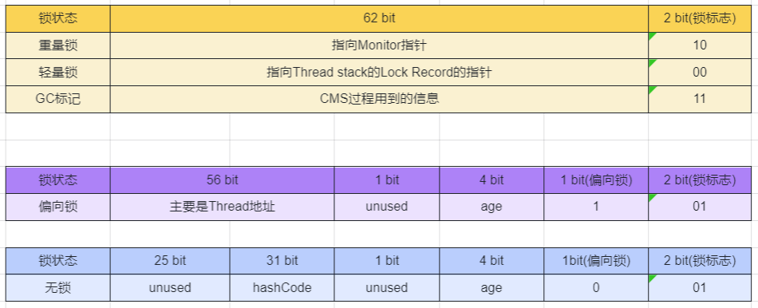

# object


## synchronized
synchronized(对象锁)它采用互斥的方式让同一时刻至多只有一个线程能持有对象锁,其它线程再想获取这个对象锁时就会阻塞住。

### 语法1:
```java
synchronized(instance) // 线程1， 线程2(blocked)
{
    Critical Section
}
```
`synchronized(instance)`上锁, instance和业务代码可以毫不相关, 其他Thread再使用`synchronized(instance)`上锁时, 就要等待之前的Thread释放锁.如果后来的Thread没有`synchronized(instance)`, 则不能起到保护作用.
```java
static int counter = 0;
static Object lock = new Object();
public static void main(String[] args) throws InterruptedException {
    Thread t1 = new Thread(() -> {
        for (int i = 0; i < 5000; i++) {
            synchronized (lock){
                counter++;
            }

        }
    }, "t1");
    Thread t2 = new Thread(() -> {
        for (int i = 0; i < 5000; i++) {
            synchronized (lock){
                counter--;
            }
        }
    }, "t2");
    t1.start();
    t2.start();
    t1.join();
    t2.join();
    log.debug("{}",counter);//结果不为0
}
```
由于`synchronized (lock)`也可以改变为`synchronized (this)`, 以上代码既可以改变为:
```java
@Slf4j(topic = "test")
public class Test17 {
    public static void main(String[] args) throws InterruptedException {
        Room room = new Room();
        Thread t1 = new Thread(() -> {
            for (int i = 0; i < 5000; i++) {
                room.increment();
            }
        }, "t1");

        Thread t2 = new Thread(() -> {
            for (int i = 0; i < 5000; i++) {
                room.decrement();
            }
        }, "t2");

        t1.start();
        t2.start();
        t1.join();
        t2.join();
        log.debug("{}", room.getCounter());
    }
}
class Room {
    private int counter = 0;
    public void increment() {
        synchronized(this){
            counter++;
        }
        
    }
    public synchronized void decrement() {
        synchronized(this){
            counter--;
        }
    }
    public synchronized int getCounter() {
        return counter;
    }
}
```

### 语法2:
synchronized作为关键字加在方法上
```java
class Test{
    public synchronized void test() {
    }
}
等价于
class Test{
    public void test() {
        synchronized(this) {
        }
    }
}
```
之前的代码可以改写为
```java
class Room {
    private int counter = 0;
    public synchronized void increment() {
        counter++;
    }
    public synchronized void decrement() {
        counter--;
    }
    public synchronized int getCounter() {
        return counter;
    }
}
```

### 语法3:
class 也当成普通的object来看待
```java
class Test{
    public synchronized static void test() {
    }
}
等价于
class Test{
    public static void test() {
        synchronized(Test.class) {
        }
    }
}

```

## 变量线程安全分析
### 成员变量和静态变量
- 如果它们没有共享，则线程安全
- 如果它们被共享了，根据它们的状态是否能够改变，又分两种情况
    - 如果只有读操作，则线程安全
    - 如果有读写操作，则这段代码是临界区，需要考虑线程安全

`list`成员变量是`method1`和`method2`共享的, 使用多线程调用二者, 不安全
```java
class ThreadUnsafe {
    ArrayList<String> list = new ArrayList<>();
    private void method1() {
        list.add("1");
        list.remove(0);
    }
    private void method2() {
        list.add("1");
        list.remove(0);
    }
}
```

### 局部变量
- primitive 局部变量是线程安全的
- reference 局部变量要分情况
    - 如果该对象没有逃离方法的作用访问，它是线程安全的
    ```java
    class ThreadUnsafe {
        private void method1() {
        ArrayList<String> list = new ArrayList<>();
            list.add("1");
            list.remove(0);
        }
        private void method2() {
        ArrayList<String> list = new ArrayList<>();
            list.add("1");
            list.remove(0);
        }
    }
    ```

    - 如果该对象逃离方法的作用范围，需要考虑线程安全
    ```java
    class ThreadUnsafe {
        private void method1() {
        ArrayList<String> list = new ArrayList<>();
            list.add("1");
            list.remove(0);
        }
        private void method2() {
        ArrayList<String> list = new ArrayList<>();
            list.add("1");
            list.remove(0);
            new Thread(() -> {
                list.add("1");
                list.remove(0);
            }).start();
        }
    }
    ```

## synchronized 原理

### Mark Word
每个object字节码前64bit是Mark Word部分, 记录了该对象的基本信息.
如果一个对象, 没有锁, 则它的Mark Word部分是:


### 重量级锁
Monitor原理
每个 Java 对象都可以关联一个 Monitor 对象，如果使用 synchronized 给对象上锁（重量级）之后，该对象头的Mark Word 中就被设置指向 Monitor 对象的指针


JVM底层解释
```java
static final Object object = new Object();
static int counter = 0;
public static void main(String[] args) {
    synchronized (object) {
    counter++;
    }
}
```

```java
Code:               //从main()开始
 0: getstatic #2    // 拿到object引用, synchronized开始
 3: dup             // 复制一份
 4: astore_1        // 将object引用存储到临时变量slot 1(解锁时使用)
 5: monitorenter    // 执行synchronized, 将object对象MarkWord置为指向Monitor的地址
 6: getstatic #3    // 获得count变量
 9: iconst_1        // 准备常数 1
 10: iadd           // +1
 11: putstatic #3   // 放回count变量
 14: aload_1        // 从slot 1中拿到object的引用
 15: monitorexit    // 将object对象 MarkWord重置, 唤醒 EntryList, 让下一个Thread上
 16: goto 24        //执行24行的代码(19开始是处理异常的)
 19: astore_2       // 把异常对象存到slot 2
 20: aload_1        // 获得lock引用
 21: monitorexit    // 将 lock对象 MarkWord 重置, 唤醒 EntryList
 22: aload_2        // 获得异常, slot 2 (e)
 23: athrow         // 抛出异常throw e
 24: return
 Exception table:   //监控报异常的代码
 from to target type
 6 16 19 any        //如果6~16行代码出异常, 则直接跳到19.
 19 22 19 any
 LineNumberTable:
 line 8: 0
 line 9: 6
 line 10: 14
 line 11: 24
```

### 轻量级锁
如果一个对象虽然有多线程要加锁，但加锁的时间是错开的（也就是没有竞争），那么可以
使用轻量级锁来优化。语法仍是`synchronized()`


```java
static final Object obj = new Object();
public static void method1() {
    synchronized( obj ) {
    method2();
    }
}
public static void method2() {
    synchronized( obj ) {
    }
}
```

### 自旋优化

重量级锁竞争的时候，后来的Thread不直接进入EntryList，而是多尝试几次,如果当前线程自旋成功（即这时候持锁线程已经退出了同步块，释放了锁），这时当前线程就可以避免阻塞。
- 自旋会占用 CPU 时间，单核 CPU 自旋就是浪费，多核 CPU 自旋才能发挥优势。
- 自旋锁是自适应的，比如对象刚刚的一次自旋操作成功过，那么认为这次自旋成功的可能性会
高，就多自旋几次；反之，就少自旋甚至不自旋。
- 不能控制是否开启自旋功能

### 偏向锁
轻量级锁在没有竞争时（就自己这个线程），每次重入仍然需要执行CAS操作。
偏向锁优化: 只有第一次使用 CAS 将线程 ID 设置到对象的 Mark Word 头，之后发现
这个线程 ID 是自己的就表示没有竞争，不用重新 CAS。以后只要不发生竞争，这个对象就归该线程所有

- 如果开启了偏向锁（默认开启）, 那么对象创建后, markword 值为 0x05 即最后3位为101，这时它的thread、epoch、age都为0
- 偏向锁是默认是延迟的，不会在程序启动时立即生效，如果想避免延迟，可以加 VM 参数 -
XX:BiasedLockingStartupDelay=0 来禁用延迟
- 如果没有开启偏向锁，那么对象创建后，markword 值为0x01即最后3位为 001, 这时它的 hashcode、
age 都为 0，第一次用到 hashcode 时才会赋值
- 如果项目中, 不存在重入锁, 都是多个Thread竞争, 则可以关闭偏向锁, VM 参数 -XX:-UseBiasedLocking 禁用偏向锁

撤销偏向:
- 当一个可偏向的对象 ,调用hashCode(), 就会撤销可偏向的状态(倒数第3bit置为0), 变为正常状态的对象(轻量锁和重量锁不会出现这样的情况:轻量级锁会在锁记录中记录 hashCode, 重量级锁会在 Monitor 中记录 hashCode)
- 当有其它线程使用偏向锁对象时，会将偏向锁升级为轻量级锁
- 调用 wait/notify
- 批量重偏向
如果对象虽然被多个线程访问，但没有竞争，比如先被Thread 1访问, 再多次被Thread2 访问, 如果访问Thread 2大于20次, 这时重新偏向T2, 重偏向会重置对象的Thread ID.
- 批量撤销
当撤销偏向锁阈值超过 40 次后，jvm将整个类的所有对象都会变为不可偏向的，新建的对象也是不可偏向的
- 锁消除
jvm会对不需要锁的代码段, 删除`synchronized()`, 自动优化.


## 犹豫模式
Balking （犹豫）模式用在一个线程发现另一个线程或本线程已经做了某一件相同的事，那么本线程就无需再做
了，直接结束返回
```java
public class MonitorService {
    private boolean starting;
    public void start() {
        log.info("尝试启动监控线程...");
        synchronized (this) {//先判断是否已经启动
            if (starting){
                return;
            }
            starting = true;
        }
        // 真正启动监控线程...
    }
}
```

## 线程安全类
- String
`subString()`是返回`new String()`, 并没有改变原先的字符串, 是不可变类, 所以是线程安全的.
String的final修饰,就是为了避免子类改变`subString()`这样的方法, 造成线程不安全.
- Integer
- StringBuffer
- Random
- Vector
- Hashtable
- java.util.concurrent

线程不安全:
HashMap
Date