# shotcut


## Park/Unpark
- LockSupport.park();// 暂停当前线程
- LockSupport.unpark(暂停线程对象)// 恢复某个线程的运行

每个线程都有自己的一个Parker对象，由三部分组成`_counter`,`_cond`和`_mutex`.

先 park 再 unpark
```java
Thread t1 = new Thread(() -> {
    log.debug("start...");
    sleep(1);
    log.debug("park...");
    LockSupport.park();
    log.debug("resume...");
},"t1");
t1.start();
sleep(2);
log.debug("unpark...");
LockSupport.unpark(t1);
```
1. 当前线程调用Unsafe.park() 方法
2. 检查 _counter, 为 0, 这时, 获得 _mutex 互斥锁, 线程进入 _cond 条件变量阻塞
3. 设置 _counter = 0
4. 调用 Unsafe.unpark(Thread_0) 方法，设置 _counter 为 1
5. 唤醒 _cond 条件变量中的 Thread_0
6. 设置 _counter 为 0


先unpark再park
```java
Thread t1 = new Thread(() -> {
    log.debug("start...");
    sleep(2);
    log.debug("park...");
    LockSupport.park();
    log.debug("resume...");
}, "t1");
t1.start();
sleep(1);
log.debug("unpark...");
LockSupport.unpark(t1);
```
1. 调用 Unsafe.unpark(Thread_0) 方法，设置 _counter 为 1
2. 当前线程调用 Unsafe.park() 方法
3. 检查 _counter ，本情况为 1，这时线程无需阻塞，继续运行
4. 设置 _counter 为 0


## 对比
与 Object 的 wait & notify 相比
- wait，notify 和 notifyAll 必须配合 Object Monitor 一起使用，而 park，unpark 不必
- park & unpark 是以线程为单位来，而 notify 只能随机唤醒一个等待线程，notifyAll,是唤醒所有等待线程，就不那么精确
- park & unpark 可以先 unpark，而 wait & notify 不能先 notify

## 顺序执行设计模式
park/unpark实现
```java
public static void main(String[] args) {

    Thread t1 = new Thread(() -> {
        LockSupport.park();
        log.debug("1");
    }, "t1");
    t1.start();

    new Thread(() -> {
        log.debug("2");
        LockSupport.unpark(t1);
    },"t2").start();
}
```
## 交替执行设计模式
park/unpark实现
```java
public class Test31 {

    static Thread t1;
    static Thread t2;
    static Thread t3;
    public static void main(String[] args) {
        ParkUnpark pu = new ParkUnpark(5);
        t1 = new Thread(() -> {
            pu.print("a", t2);
        });
        t2 = new Thread(() -> {
            pu.print("b", t3);
        });
        t3 = new Thread(() -> {
            pu.print("c", t1);
        });
        t1.start();
        t2.start();
        t3.start();

        LockSupport.unpark(t1);
    }
}

class ParkUnpark {
    public void print(String str, Thread next) {
        for (int i = 0; i < loopNumber; i++) {
            LockSupport.park();
            System.out.print(str);
            LockSupport.unpark(next);
        }
    }
    private int loopNumber;
    public ParkUnpark(int loopNumber) {
        this.loopNumber = loopNumber;
    }
}
```

## 原理
