# word2vector


## 读写锁
当读操作远远高于写操作时，这时候使用读写锁, 让读-读可以并发，提高性能。 类似于数据库中的`select ...from ... lock in share mode`
读锁是为了在读的同时, 别的线程不能来写, 就是读和写互斥, 写和写互斥, 但读和读不互斥

```java
@Slf4j(topic = "test0")
public class TestReadWriteLock {
    public static void main(String[] args) throws InterruptedException {
        DataContainer dataContainer = new DataContainer();
        new Thread(() -> {
            dataContainer.read();
        }, "t1").start();

        Thread.sleep(100);
        new Thread(() -> {
            dataContainer.write();
        }, "t2").start();
    }
}

@Slf4j(topic = "test1")
class DataContainer {
    private Object data;
    private ReentrantReadWriteLock rw = new ReentrantReadWriteLock();
    private ReentrantReadWriteLock.ReadLock r = rw.readLock();
    private ReentrantReadWriteLock.WriteLock w = rw.writeLock();
    public Object read() {
        log.debug("获取读锁...");
        r.lock();
        try {
            log.debug("读取");
            sleep(1);
            return data;
        } finally {
            log.debug("释放读锁...");
            r.unlock();
        }
    }
    public void write() {
        log.debug("获取写锁...");
        w.lock();
        try {
            log.debug("写入");
            sleep(1);
        } finally {
            log.debug("释放写锁...");
            w.unlock();
        }
    }
}
```
注意:
- 读锁不支持条件变量
- 重入时升级不支持：即持有读锁的情况下去获取写锁，会导致获取写锁永久等待
- 重入时降级支持：即持有写锁的情况下去获取读锁
## 读写锁原理




## 乐观读锁
在使用读锁、写锁时都必须配合【戳】使用, 读锁时检验戳, 如果相同, 说明没被改变, 就直接读, 如果改变, 再加锁.
注意:
- StampedLock 不支持条件变量
- StampedLock 不支持可重入


```java
@Slf4j(topic = "test0")
public class TestStampedLock {
    public static void main(String[] args) throws InterruptedException {
        Stamped stamped = new Stamped(1);
        new Thread(() -> {
            try {
                stamped.read();
            } catch (InterruptedException e) {
                e.printStackTrace();
            }
        }, "t1").start();
        Thread.sleep(500);
        new Thread(() -> {
            stamped.write();
        }, "t2").start();
    }
}

@Slf4j(topic = "test1")
class Stamped {
    private int data;
    private final StampedLock lock = new StampedLock();

    public Stamped(int data) {
        this.data = data;
    }

    public int read() throws InterruptedException {
        long stamp = lock.tryOptimisticRead();
        log.debug("optimistic read locking...{}", stamp);
        Thread.sleep(1);
        if (lock.validate(stamp)) {
            log.debug("read finish...{}, data:{}", stamp, data);
            return data;
        }
        //锁升级 - 读锁
        log.debug("updating to read lock... {}", stamp);
        try {
            stamp = lock.readLock();
            log.debug("read lock {}", stamp);
            Thread.sleep(1);
            log.debug("read finish...{}, data:{}", stamp, data);
            return data;
        } finally {
            log.debug("read unlock {}", stamp);
            lock.unlockRead(stamp);
        }
    }

    public void write() {
        long stamp = lock.writeLock();
        log.debug("write lock {}", stamp);
        try {
            sleep(2);
        } finally {
            log.debug("write unlock {}", stamp);
            lock.unlockWrite(stamp);
        }
    }
}
