# F检验


相对于 synchronized 它具备如下特点
- 可中断
- 可以设置超时时间
- 可以设置为公平锁
- 支持多个条件变量
另外和synchronized一样, 都支持可重入

## 基本语法:
```java
reentrantLock.lock();// 获取锁
try {

} finally {
    reentrantLock.unlock();// 释放锁
}
```

## 锁重入
可重入锁是指同一个线程如果首次获得了这把锁, 那么因为它是这把锁的拥有者, 因此有权利再次获取这把锁
可重入锁，那么第二次获得锁时，自己也会被锁挡住.

下面代码中`main()`方法调用`lock()`上锁, 然后进入`m()`方法继续上锁.
```java
private static ReentrantLock lock = new ReentrantLock();
public static void main(String[] args) {
    lock.lock();
    try{
        log.debug("enter main");
        m();//调用方法再次获得锁
    }finally{
        lock.unlock();
    }
}
public static void m(){
    lock.lock();
    try{
        log.debug("enter m1");
    }finally {
        lock.unlock();
    }
}
```

## 可打断
`lockInterruptibly()`方法获得可打断的锁
```java
private static ReentrantLock lock = new ReentrantLock();
public static void main(String[] args) throws InterruptedException {
    Thread t1 = new Thread(()->{
        try{
            log.debug("尝试获得锁");
            lock.lockInterruptibly();
        } catch (InterruptedException e) {
            e.printStackTrace();
            return;
        }
        try{
            log.debug("t1获得锁");
        }finally{
            lock.unlock();
        }
    },"t1");
    lock.lock();
    t1.start();
    Thread.sleep(1000);
    log.debug("打断t1");
    t1.interrupt();
}
```

## 支持锁超时
`tryLock()`超时不能获得锁, 则直接抛出异常.
```java
private static ReentrantLock lock = new ReentrantLock();
public static void main(String[] args) {
    Thread t1 = new Thread(() -> {
        log.debug("尝试获得锁");
        try {
            if (! lock.tryLock(2, TimeUnit.SECONDS)) {
                log.debug("获取不到锁");
                return;
            }
        } catch (InterruptedException e) {
            e.printStackTrace();
            log.debug("不能获取锁");
            return;
        }
        try {
            log.debug("获得锁");
        } finally {
            lock.unlock();
        }
    }, "t1");

    lock.lock();
    log.debug("获得锁");
    t1.start();
    sleep(1);
    log.debug("释放锁");
    lock.unlock();
}
```

## 支持 公平锁
公平锁一般没有必要，会降低并发度
默认是不公平的:
ReentrantLock lock = new ReentrantLock(false);
可以改成:
ReentrantLock lock = new ReentrantLock(true);
之后EntryList将会按顺序获得锁, 而不是争抢


## 支持条件变量
synchronized 中也有条件变量，就是我们讲原理时那个waitSet休息室, 当条件不满足时进入 waitSet等待
而ReentrantLock支持多个支持多个条件变量的, 就是可以设置多个`waitSet`休息室(Condition)
使用要点：
- await 前需要获得锁
- await 执行后，会释放锁，进入 conditionObject 等待
- await 的线程被唤醒取重新竞争 lock 锁, 竞争 lock 锁成功后，从 await 后继续执行

```java
static boolean condition1 = false;
static boolean condition2 = false;
static ReentrantLock ROOM = new ReentrantLock();
static Condition waitCondition1Set = ROOM.newCondition();
static Condition waitCondition2Set = ROOM.newCondition();

public static void main(String[] args) {
    new Thread(() -> {
        ROOM.lock();
        try {
            log.debug("满足condition1？[{}]", condition1);
            while (!condition1) {
                log.debug("await");
                try {
                    waitCondition1Set.await();
                } catch (InterruptedException e) {
                    e.printStackTrace();
                }
            }
            log.debug("working");
        } finally {
            ROOM.unlock();
        }
    }, "t1").start();
    new Thread(() -> {
        ROOM.lock();
        try {
            log.debug("满足condition2？[{}]", condition2);
            while (!condition2) {
                log.debug("await");
                try {
                    waitCondition2Set.await();
                } catch (InterruptedException e) {
                    e.printStackTrace();
                }
            }
            log.debug("working");
        } finally {
            ROOM.unlock();
        }
    }, "t2").start();

    sleep(1);
    new Thread(() -> {
        ROOM.lock();
        try {
            condition2 = true;
            waitCondition2Set.signal();
        } finally {
            ROOM.unlock();
        }
    }, "condition2").start();

    sleep(1);

    new Thread(() -> {
        ROOM.lock();
        try {
            condition1 = true;
            waitCondition1Set.signal();
        } finally {
            ROOM.unlock();
        }
    }, "condition1").start();
}
```

## 交替执行设计模式
不同的线程进入不同的condition中等待
```java
public class Test28 {
    public static void main(String[] args) {
        AwaitSignal2 as = new AwaitSignal2(3);
        as.start(new Thread(() -> {
            as.print("a");
        }), new Thread(() -> {
            as.print("b");
        }), new Thread(() -> {
            as.print("c");
        }), new Thread(() -> {
            as.print("d");
        }));

    }
}

class AwaitSignal2 extends ReentrantLock {
    private Map<Thread, Condition[]> map = new HashMap<>();

    public void start(Thread... threads) {
        Condition[] temp = new Condition[threads.length];
        for (int i = 0; i < threads.length; i++) {
            temp[i] = this.newCondition();
        }
        for (int i = 0; i < threads.length; i++) {
            Condition current = temp[i];
            Condition next;
            if (i == threads.length - 1) {
                next = temp[0];
            } else {
                next = temp[i + 1];
            }
            map.put(threads[i], new Condition[]{current, next});
        }
        for (Thread thread : map.keySet()) {
            thread.start();
        }
        try {
            Thread.sleep(500);
        } catch (InterruptedException e) {
            e.printStackTrace();
        }
        this.lock();
        try {
            map.get(threads[0])[0].signal();
        } finally {
            this.unlock();
        }
    }

    public void print(String str) {
        for (int i = 0; i < loopNumber; i++) {
            this.lock();
            try {
                Condition[] conditions = map.get(Thread.currentThread());
                conditions[0].await();
                log.debug(str);
                conditions[1].signal();
            } catch (InterruptedException e) {
                e.printStackTrace();
            } finally {
                this.unlock();
            }
        }
    }

    private int loopNumber;
    public AwaitSignal2(int loopNumber) {
        this.loopNumber = loopNumber;
    }
}
```

## 原理
### 可重入原理
1. 线程还是当前线程, 表示发生了锁重入, state会+1
```java
 else if (current == getExclusiveOwnerThread()) {
    // state++
    int nextc = c + acquires;
    if (nextc < 0) // overflow
    throw new Error("Maximum lock count exceeded");
    setState(nextc);
    return true;
}
```
2. 释放重入锁相当于state--, 所有重入锁释放完后, 且线程释放锁, 才会改变Owner

```java
protected final boolean tryRelease(int releases) {
    // state--
    int c = getState() - releases;
    if (Thread.currentThread() != getExclusiveOwnerThread())
    throw new IllegalMonitorStateException();
    boolean free = false;
    // 支持锁重入, 只有 state 减为 0, 才释放成功
    if (c == 0) {
    free = true;
    setExclusiveOwnerThread(null);
    }
    setState(c);
    return free;
}
```

### 可打断原理
- 不可打断模式
被打断后，仍会驻留在 AQS 队列中，一直要等到获得锁后方能得知自己被打断了
- 可打断模式
直接抛出异常

### 公平锁实现原理
- 非公平锁
直接用cas获得, 不去检查AQS队列
- 公平锁
先检查 AQS 队列中是否有前驱节点(队列中还有没有老二), 没有才去竞争

### 条件变量实现原理


