# scatter


## Semaphore
信号量，用来限制能同时访问共享资源的线程上限。
使用 Semaphore 限流，在访问高峰期时，让请求线程阻塞，高峰期过去再释放许可,

```java
@Slf4j(topic = "test")
public class TestSemaphore {
    public static void main(String[] args) {
        Semaphore semaphore = new Semaphore(3);// 最多允许3个线程
        for (int i = 0; i < 10; i++) {// 10个线程同时运行
            new Thread(() -> {
                try {
                    semaphore.acquire();
                } catch (InterruptedException e) {
                    e.printStackTrace();
                }
                try {
                    log.debug("running...");
                    sleep(1);
                    log.debug("end...");
                } finally {
                    semaphore.release();
                }
            }).start();
        }
    }
}
```



## CountdownLatch
如果计数线程不为0, 主线程会阻塞等待, 直到为0.
- 其中构造参数用来初始化等待计数值
- await() 用来等待计数归零
- countDown() 用来让计数减一

应用场景, 比如王者荣耀加载必须10个人同时加载完成
```java
private static void main() throws InterruptedException {
    CountDownLatch latch = new CountDownLatch(3);
    new Thread(() -> {
        log.debug("begin...");
        sleep(1);
        latch.countDown();
        log.debug("end...{}", latch.getCount());
    }).start();

    new Thread(() -> {
        log.debug("begin...");
        sleep(2);
        latch.countDown();
        log.debug("end...{}", latch.getCount());
    }).start();

    new Thread(() -> {
        log.debug("begin...");
        sleep(3);
        latch.countDown();
        log.debug("end...{}", latch.getCount());
    }).start();

    log.debug("waiting...");
    latch.await();
    log.debug("wait end...");
}
```

## CyclicBarrier
相比`CountdownLatch`,在计数为0后
- 传入方法执行
- 可以重置, 既重复使用.
```java
public static void main(String[] args) {
    ExecutorService service = Executors.newFixedThreadPool(2);
    CyclicBarrier barrier = new CyclicBarrier(2, ()-> {
        log.debug("task1, task2 finish...");
    });
    for (int i = 0; i < 3; i++) { // task1  task2  task1
        service.submit(() -> {
            log.debug("task1 begin...");
            sleep(1);
            try {
                barrier.await(); // 2-1=1
            } catch (InterruptedException | BrokenBarrierException e) {
                e.printStackTrace();
            }
        });
        service.submit(() -> {
            log.debug("task2 begin...");
            sleep(2);
            try {
                barrier.await(); // 1-1=0
            } catch (InterruptedException | BrokenBarrierException e) {
                e.printStackTrace();
            }
        });
    }
    service.shutdown();

}
```