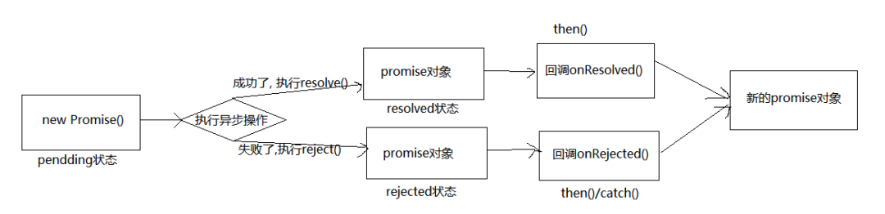

# 基础

## 同步异步

- 同步任务: 在主线程上执行, 形成一个任务队列
- 异步任务: 通过回调函数实现, 形成一个任务队列
    - 普通事件, 如: click, resize
    - 资源加载, 如: load, error
    - 定时器, 如: setInterval, setTimeout

js的执行机制:

1. 先执行同步任务队列中的任务
2. 将异步任务(回调函数)放入任务队列中, 最新解决方案是promise
3. 所有的同步任务执行结束后, 执行异步任务队列中的任务


## 简介
- promise 是 JS 中进行异步编程的新解决方案, 旧方案是单纯使用回调函数
- promise 对象用来封装一个异步操作并可以获取其成功/失败的结果值

常见的异步操作: 

- fs 文件操作

    ```js
    require('fs').readFile('./index.html', (err,data)=>{})
    ```

- 数据库操作, AJAX 

    ```js
    $.get('/server', (data)=>{})
    ```

- 定时器 

    ```js
    setTimeout(()=>{}, 2000);
    ```

优势: 

- 旧的就掉函数: 必须在启动异步任务前指定回调函数
- promise: 启动异步任务  =>  返回 promie 对象  =>  给 promise 对象绑定回调函数(甚至可以在异步任务结束后指定/多个) 


## 状态(PromiseState)



1. 创建Promise对象(new Promise())时, 状态是pending
2. 执行异步操作
    - 成功的话`pending` 变为 `resolved `
    - 失败的话`pending` 变为 `rejected `

    > - 一个 promise 对象只能改变一次 
    > - 无论变为成功还是失败,  都会有一个结果数据 成功的结果数据一般称为`value`,  失败的结果数据一般称为`reason `

3. 最终返回一个新的Promise对象

## promise结果(PromiseResult)

保存着异步任务『成功/失败』的结果, `resolve()`和`reject()`对`PromiseResult`的值进行修改


## 代码
```js
// 1. 创建 promise 对象(pending 状态), 指定执行器函数 
const p = new Promise((resolve, reject) => { 
    // 2. 在执行器函数中启动异步任务 
    setTimeout(() => { 
        const time = Date.now() 
        // 3. 根据结果做不同处理 
        // 3.1 如果成功了, 调用 resolve(), 指定成功的value(参数就是value), 对应.then方法的第一个参数, 变为 resolved 状态 
        if (time%2===1) { 
            successRes = '成功的值 '+ time
            resolve(value = successRes) 
        // 3.2 如果失败了, 调用 reject(), 指定失败的 reason(参数就是value)对应.then方法的第二个参数, 变为rejected 状态 
        } else { 
            failure = '失败的值' + time
            reject(value = failure) 
        } 
    }, 2000) 
}) 

// 4. 能promise指定成功或失败的回调函数来获取成功的 vlaue 或失败的 reason 
p.then( 
    value => { // 成功的回调函数 onResolved, 得到成功的 vlaue 
        console.log('成功的 value: ', value) 
    }, 
    reason => { // 失败的回调函数 onRejected, 得到失败的 reason 
        console.log('失败的 reason: ', reason) 
    } 
) 
```


## 修改promise对象状态
1. resolve(value):  如果当前是 pending 就会变为 resolved 
2. reject(reason):  如果当前是 pending 就会变为 rejected 
3. 抛出异常:  如果当前是 pending 就会变为 rejected 
```js
let p = new Promise((resolve, reject) => {
    //1. resolve 函数
    // resolve('ok'); // pending   => fulfilled (resolved)
    //2. reject 函数
    // reject("error");// pending  =>  rejected 
    //3. 抛出错误
    // throw '出问题了';
});
console.log(p);
```

## 一个 promise 指定多个成功/失败回调函数,  都会调用当 promise 改变为对应状态时都会调用 

```js
let p = new Promise((resolve, reject) => {
    resolve('OK');
});

///指定回调 - 1
p.then(value => {
    console.log(value);
});

//指定回调 - 2
p.then(value => {
    alert(value);
});
```
## 改变 promise 状态和指定回调函数谁先谁后? 
1. 都有可能, 正常情况下是先指定回调再改变状态, 但也可以先改状态再指定回调 
2. 如何先改状态再指定回调? 
    - 在执行器中直接调用 resolve()/reject() 
    - 延迟更长时间才调用 then() 
3. 什么时候才能得到数据? 
    - 如果先指定的回调,  那当状态发生改变时,  回调函数就会调用,  得到数据 
    - 如果先改变的状态,  那当指定回调时,  回调函数就会调用,  得到数据

```js
let p = new Promise((resolve, reject) => {
    setTimeout(() => {
        resolve('OK');
    }, 1000);
});

p.then(value => {
    console.log(value);
},reason=>{
    
})
```

## promise.then()返回的新 promise 的结果状态由什么决定? 
- 简单表达:  由 then()指定的回调函数执行的结果决定 
- 详细表达: 
    - 如果抛出异常,  新 promise 变为 rejected, reason 为抛出的异常 
    - 如果返回的是非 promise 的任意值,  新 promise 变为 resolved, value 为返回的值 
    - 如果返回的是另一个新 promise,  此 promise 的结果就会成为新 promise 的结果 

```js
let p = new Promise((resolve, reject) => {
    resolve('ok');
});
//执行 then 方法
let result = p.then(value => {
    // console.log(value);
    //1. 抛出错误
    // throw '出了问题';
    //2. 返回结果是非 Promise 类型的对象
    // return 521;
    //3. 返回结果是 Promise 对象
    // return new Promise((resolve, reject) => {
    //     // resolve('success');
    //     reject('error');
    // });
}, reason => {
    console.warn(reason);
});
console.log(result);
```

## promise 如何串连多个操作任务? 
1.promise 的 then()返回一个新的 promise,  可以开成 then()的链式调用 
2.通过 then 的链式调用串连多个同步/异步任务 
```js
let p = new Promise((resolve, reject) => {
    setTimeout(() => {
        resolve('OK');
    }, 1000);
});

p.then(value => {
    return new Promise((resolve, reject) => {
        resolve("success");
    });
}).then(value => {
    console.log(value);
}).then(value => {
    console.log(value);
})
```

## promise 异常传透? 
1.当使用 promise 的 then 链式调用时,  可以在最后指定失败的回调,   
2.前面任何操作出了异常,  都会传到最后失败的回调中处理 
```js
let p = new Promise((resolve, reject) => {
    setTimeout(() => {
        resolve('OK');
        // reject('Err');
    }, 1000);
});

p.then(value => {
    // console.log(111);
    throw '失败啦!';
}).then(value => {
    console.log(222);
}).then(value => {
    console.log(333);
}).catch(reason => {
    console.warn(reason);
});
```

## 中断 promise 链
1. 当使用 promise 的 then 链式调用时,  在中间中断,  不再调用后面的回调函数 
2. 办法:  在回调函数中返回一个 pendding 状态的 promise 对象 

```js
let p = new Promise((resolve, reject) => {
    setTimeout(() => {
        resolve('OK');
    }, 1000);
});

p.then(value => {
    console.log(111);
    //有且只有一个方式, 返回pending状态的promise对象
    return new Promise(() => {});
}).then(value => {
    console.log(222);
}).then(value => {
    console.log(333);
}).catch(reason => {
    console.warn(reason);
});
```


## api


### Promise 构造函数: 
`Promise (excutor) {}`
1. executor 函数, 执行器`(resolve, reject) => {}`   executor 会在 Promise 内部立即同步调用
2. resolve 函数, 内部定义成功时我们调用的函数`value => {}`
3. reject 函数, 内部定义失败时我们调用的函数`reason => {}`


### Promise.prototype.then 

方法: (onResolved, onRejected) => {} 
1. onResolved 函数:  成功的回调函数    (value) => {} 
2. onRejected 函数:  失败的回调函数  (reason) => {} 
说明:  指定用于得到成功 value 的成功回调和用于得到失败 reason 的失败回调 
返回一个新的 promise 对象 

### Promise.prototype.catch 
方法: (onRejected) => {} 
1. onRejected 函数:  失败的回调函数  (reason) => {} 
说明: then()的语法糖,  相当于: then(undefined, onRejected)

```js
let p = new Promise((resolve, reject) => {
    // ** 同步调用
    // console.log(111);
    //修改 promise 对象的状态
    reject('error');
});

// console.log(222);

//执行 catch 方法
p.catch(reason => {
    console.log(reason);
});
```


### Promise.resolve 
方法: (value) => {} 是类方法, 不是实例方法
1. value:  成功的数据或 promise 对象 
说明:  返回一个成功/失败的 promise 对象

```js
let p1 = Promise.resolve(521);
//如果传入的参数为 非Promise类型的对象, 则返回的结果为成功promise对象
//如果传入的参数为 Promise 对象, 则参数的结果决定了 resolve 的结果
let p2 = Promise.resolve(new Promise((resolve, reject) => {
    // resolve('OK');
    reject('Error');
}));
// console.log(p2);
p2.catch(reason => {
    console.log(reason);
})
```

### Promise.reject 
方法: (reason) => {} 是类方法, 不是实例方法
1. reason:  失败的原因 
说明:  返回一个失败的 promise 对象 
```js
// let p = Promise.reject(521);
// let p2 = Promise.reject('iloveyou');
let p3 = Promise.reject(new Promise((resolve, reject) => {
    resolve('OK');
}));

console.log(p3);
```

1. Promise.all 方法: (promises) => {} 是类方法, 不是实例方法
1. promises:  包含 n 个 promise 的数组 
说明:  返回一个新的 promise,  只有所有的 promise 都成功才成功,  只要有一个失败了就
直接失败 
```js
let p1 = new Promise((resolve, reject) => {
    resolve('OK');
})
// let p2 = Promise.resolve('Success');
let p2 = Promise.reject('Error');
let p3 = Promise.resolve('Oh Yeah');

const result = Promise.all([p1, p2, p3]);
console.log(result);
```

### Promise.race 
方法: (promises) => {} 
1. promises:  包含 n 个 promise 的数组 
说明:  返回一个新的 promise,  第一个完成的 promise 的结果状态就是最终的结果状态
```js
let p1 = new Promise((resolve, reject) => {
    setTimeout(() => {
        resolve('OK');
    }, 1000);
})
let p2 = Promise.resolve('Success');
let p3 = Promise.resolve('Oh Yeah');

//调用
const result = Promise.race([p1, p2, p3]);
console.log(result);
```

参考:
[参考1](https://www.digitalocean.com/community/tutorials/understanding-the-event-loop-callbacks-promises-and-async-await-in-javascript)
[参考2](https://blog.csdn.net/qq_43660897/article/details/102655873)