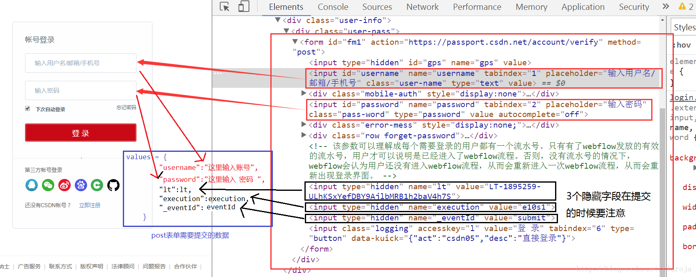

# 模拟登录



```python
import requests
from bs4 import BeautifulSoup
url="https://passport.csdn.net/account/login"  # 登录页的网址
s = requests.Session()  # 创建一个回话
response = s.get(url)  # 获得登录页面
soup = BeautifulSoup(response.text)
lt = soup.form.find("input",{"name":"lt"})["value"]  # 获得隐藏字段
execution = soup.form.find("input",{"name":"execution"})["value"]  # 获得隐藏字段
eventId = soup.form.find("input",{"name":"_eventId"})["value"]  # 获得隐藏字段
headers = {"User-Agent": "Mozilla/5.0 (Windows NT 6.1; Win64; x64) AppleWebKit/537.36 (KHTML, like Gecko) Chrome/61.0.3163.100 Safari/537.36"}
values = {  # 填写post信息
        "username":"账号",
        "password":"密码",
        "lt":lt,
        "execution":execution,
        "_eventId":eventId
    }
r = s.post(url, data = values, headers=headers)  # 提交表单
url = "http://my.csdn.net/my/mycsdn"
html=s.get(url,headers=headers)  # 访问其他网页

print(html.text)
```


参考文献:
https://www.cnblogs.com/anny-1980/p/4537922.html