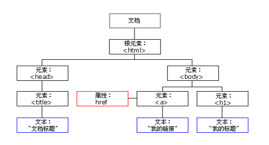

# intro

文档对象模型（Document Object Model，简称 DOM），是 W3C 组织推荐的处理可扩展标记语言（HTML或者XML）的标准编程接口。可以改变网页的内容、结构和样式。

DOM主要理解`Node`, `Element`和`HTMLElement`三个类, 一次是继承关系. 为了方便, 我们使用`Element`代指三者.

## dom树

- 文档: 一个页面就是一个文档, 使用document表示
- 元素: 页面中所有标签都是元素, 使用element表示
- 节点：网页中的`所有内容`都是节点(标签、`属性`、`文本`、`注释`等), 使用 node 表示. 
    注意, 节点不仅是指标签, 标签的属性, 文本也都是节点.

## 节点的增删改查

- 使用`Node`中的属性和方法对节点进行增删改查
- 使用`Element`的`querySelector`对元素进行查找

