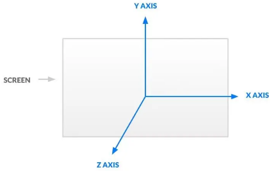
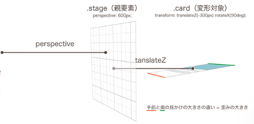
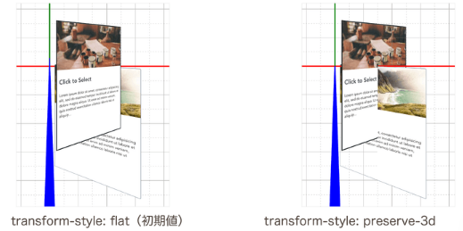

# CSS三维

## [三维空间轴](https://juejin.cn/post/7306749023473041445)

三维空间有三个轴:

1. X轴，水平方向从左往右，值变大
2. Y轴，垂直方向从下往上，值变大
3. Z轴，垂直于屏幕方向，值越大，说明越靠近用户



## 3个基本操作

转换包含了3个基本操作——平移、旋转和缩放, 所有的转换会围绕3个轴进行.

1. 对于2D的平移，可以使用translate、translateX、translateY。在3D中，还可以使用translateZ和translate3d进行深度移动。[现场演示](https://ics-creative.github.io/210519_css3d/3dlive/index.html)

    ```css
    transform: translateX(100px) translateZ(300px) translateY(200px);
    transform: translate3d(100px, 200px, 300px);
    ```

2. 与平行移动相比，3D旋转有点复杂，有四个可用:rotateX、rotateY、rotateZ、rotate3d。其中rotateX、rotateY、rotateZ三个将围绕XYZ的每个轴进行简单的旋转（结果rotateZ将与2D的rotate相同）.[现场演示](https://ics-creative.github.io/210519_css3d/3dlive/index.html)

    另一个变形操作rotate3d有点特殊。与前面提到的translate3d和后面提到的scale3d不同，rotate3d不仅仅是总结XYZ的旋转。rotate3d有四个参数，前三个参数定义旋转轴的XYZ，最后一个参数指定绕轴旋转的角度。在下面的示例中，当光标悬停在卡片上时，卡片将以对角线（45度斜线）为轴翻转。

    ```js
    .card {
      transform: rotate3d(1, 1, 0, 0deg);
      transition: transform 1s;
    }
    .card:hover {
      transform: rotate3d(1, 1, 0, 180deg);
    }
    ```

3. 每个方向的缩放都可以使用scaleX、scaleY、scaleZ，但可以使用scale3d进行批量操作。由于原始的html元素只是一个没有深度的平面，因此单独使用scaleZ也没有效果。首先使用rotateX或rotateY向深度方向旋转，然后应用scaleZ才能看到效果。

## perspective: 设置放置元素的距离

理解表示深度所需的两个属性:perspective和perspective-origin。

在2D世界中，大小为100px的div元素总是以100px显示。但是在现实的3D空间中呢?前面（眼睛附近）的元素应该看起来很大，后面（眼睛远处）的元素应该看起来很小。决定这个距离的是perspective属性。

perspective:设置放置元素的阶段距离.

```html
<div class="stage">
  <div class="card">Card1</div>
  <div class="card">Card2</div>
  ...
</div>
```

```css
.stage {
  perspective: 600px;
}
.card {
  width: 200px;
  height: 300px;
  transform: translateZ(-300px) rotateX(90deg);
}
```

舞台的perspective是600px，里面的卡是translateZ，再向300px深处移动，所以卡的前面在离眼睛600px + 300px - 300px / 2 = 750px的位置，同样，卡的后面在1050px的位置。✨300/2是因为图片高度是300, 且绕X轴旋转了90度



## perspective-origin: 操作视线方向

与透视一样，将其指定为要变形的元素的父元素。值指定视点X和Y的位置。

1. 初始值为50% 50%（即使写成=center center也是如此），这表明您正直视元素的中心。

    ```css
    .stage {
    perspective: 600px;
    perspective-origin: left top;
    }
    ```

2. 相反，要从正下方向上看，请在Y方向指定较大的值，如bottom或120%。

    ```css
    .stage {
    perspective: 600px;
    perspective-origin: center 150%;
    }
    ```

## transform-style: preserve-3d: 按深度（Z坐标）的顺序显示

CSS Transform的3D变形基本上只是按顺序绘制每个元素。在初始状态下，元素的重叠取决于z-index或html中元素的顺序。因此，即使在translateZ中向后移动，相同的z-index后面的元素也总是绘制在前面。可以通过指定父元素transform-style: preserve-3d来根据深度（Z坐标）叠加元素。在下面的例子中，由于#card1元素在html上首先出现，因此原本隐藏在#card2元素的下面（后面），但是通过指定preserve-3d，通过translateZ的Z坐标显示在前面。

```html
<div class="stage">
  <div id="card1" class="card">Card1</div>
  <div id="card2" class="card">Card2</div>
</div>

```

```css
.stage {
  transform-style: preserve-3d;
  perspective: 600px;
}
#card1 {
  transform: translateZ(0px);
}
#card2 {
  transform: translateZ(-200px);
}

```


preserve-3d的效果不仅仅是元素的显示顺序。为了在多个元素相交时只绘制重叠的前侧部分”，还需要进行设置。如果不指定preserve-3d，则按照元素的显示顺序，其中一个元素全部显示在前面，但如果指定preserve-3d，则可以看到只有斜交叉的卡的前面部分正确显示。



## 参考

[CSS Transform完全入门(3D编)](https://ics.media/entry/210519/)
