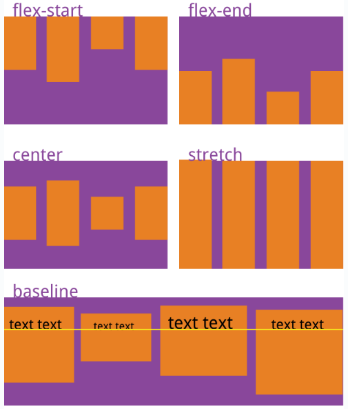
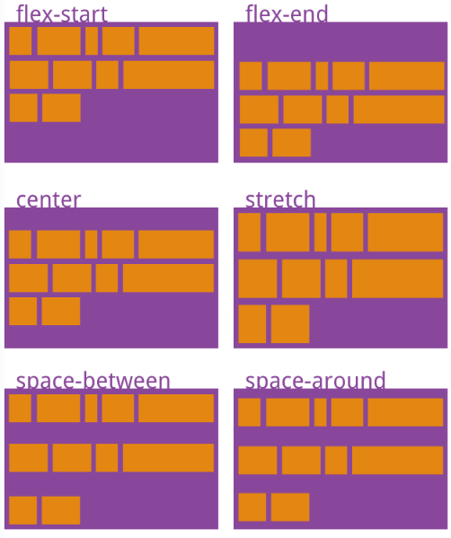

# flex

flex 是 flexible Box 的缩写，意为"弹性布局"，任何一个容器都可以指定为 flex 布局。

当我们为父盒子设为 flex 布局以后，子元素的 float、clear 和 vertical-align 属性将失效。


## 最佳实践

1. 设置主轴, flex-direction, 水平排列row, 垂直排列column
2. 设置主轴的对齐方式, justify-content
    1. 左(上)对齐, flex-start
    2. 右(下)对齐, flex-end
    3. 居中对齐, center
    4. 第一个项目靠主轴起点，最后一个项目靠主轴终点，中间的项目等间距分布, space-around
    5. 在每个弹性项目两侧均匀分配剩余空间，使得项目之间的间隔是项目到容器边缘间隔的两倍, space-between
3. 设置交叉轴的对齐方式
    1. align-content
    2. align-items


## 父属性

1. flex-direction：设置主轴的方向
2. justify-content：设置主轴上的子元素排列方式
3. flex-wrap：设置子元素是否换行
4. align-content：设置侧轴上的子元素的排列方式（多行）
5. align-items：设置侧轴上的子元素排列方式（单行）
6. flex-flow：复合属性，相当于同时设置了 flex-direction 和 flex-wrap


### flex-direction

容器默认存在两根轴：水平的主轴（main axis）和垂直的交叉轴（cross axis）。主轴的开始位置（与边框的交叉点）叫做main start，结束位置叫做main end；交叉轴的开始位置叫做cross start，结束位置叫做cross end。

项目默认沿主轴排列。单个项目占据的主轴空间叫做main size，占据的交叉轴空间叫做cross size。


属性|描述
--|--
row（默认值）|主轴为水平方向，起点在左端。项目沿水平方向从左到右排列。
row-reverse|主轴为水平方向，起点在右端。项目沿水平方向从右到左排列。
column|主轴为垂直方向，起点在上沿。项目沿垂直方向从上到下排列。
column-reverse|主轴为垂直方向，起点在下沿。项目沿垂直方向从下到上排列。


### flex-wrap

如果子项超过了容器的限制, 是否换行, 默认不换行(压缩子项), flex布局中默认是不换行的。

属性|描述
--|--
nowrap| 默认值，不换行
wrap |换行
wrap-reverse|换行, 第一行在上方


1. nowrap（默认）：不换行。

    

2. wrap：换行，第一行在上方。

    


3. wrap-reverse：换行，第一行在下方。

    


### flex-flow

flex-flow属性是flex-direction属性和flex-wrap属性的简写形式，默认值为row nowrap。

```css
.box {
  flex-flow: <flex-direction> <flex-wrap>;
}
```


### justify-content

调整弹性项目在主轴方向上的对齐方式。

属性|描述
--|--
flex-start|默认值, 将弹性项目沿主轴起点对齐。如果主轴是水平方向，项目会靠容器的左侧对齐；如果主轴是垂直方向，项目会靠容器的顶部对齐。
flex-end|将弹性项目沿主轴终点对齐。如果主轴是水平方向，项目会靠容器的右侧对齐；如果主轴是垂直方向，项目会靠容器的底部对齐。
center|将弹性项目在主轴方向上居中对齐。
space-around|在弹性项目之间均匀分配剩余空间，使得第一个项目靠主轴起点，最后一个项目靠主轴终点，中间的项目等间距分布。
space-between|在每个弹性项目两侧均匀分配剩余空间，使得项目之间的间隔是项目到容器边缘间隔的两倍。


### align-items
是控制子项在侧轴（默认是y轴）上的排列方式, 注意 在子项为单项（单行）的时候使用

属性值|说明
--|--
stretch（默认值）|交叉轴方向上没有明确的尺寸限制，则项目会被拉伸以填满整个交叉轴方向的容器高度。
flex-start|将弹性项目在交叉轴的起点对齐。如果交叉轴是垂直方向，项目会靠容器顶部对齐；如果交叉轴是水平方向，项目会靠容器左侧对齐。
flex-end |将弹性项目在交叉轴的终点对齐。如果交叉轴是垂直方向，项目会靠容器底部对齐；如果交叉轴是水平方向，项目会靠容器右侧对齐。
center |将弹性项目在交叉轴方向上居中对齐。





###  align-content

align-content属性定义了多根轴线的对齐方式。如果项目只有一根轴线，该属性不起作用。

属性值|说明
--|--
flex-start| 默认值在侧轴的头部开始排列
flex-end |在侧轴的尾部开始排列
center |在侧轴中间显示
space-around |子项在侧轴平分剩余空间
space-between |子项在侧轴先分布在两头，再平分剩余空间
stretch |设置子项元素高度平分父元素高度





## 子项常见属性


### order

order属性定义项目的排列顺序。数值越小，排列越靠前，默认为0。


```css
.item {
  order: <integer>;
}
```


### flex-grow属性
flex-grow属性定义项目的放大比例，默认为0，即如果存在剩余空间，也不放大。如果所有项目的flex-grow属性都为1，则它们将等分剩余空间（如果有的话）。如果一个项目的flex-grow属性为2，其他项目都为1，则前者占据的剩余空间将比其他项多一倍。


```css
.item {
  flex-grow: <number>; /* default 0 */
}
```


### flex-shrink
flex-shrink属性定义了项目的缩小比例，默认为1，即如果空间不足，该项目将缩小。如果所有项目的flex-shrink属性都为1，当空间不足时，都将等比例缩小。如果一个项目的flex-shrink属性为0，其他项目都为1，则空间不足时，前者不缩小。

负值对该属性无效。


```css

.item {
  flex-shrink: <number>; /* default 1 */
}
```


### flex-basis
flex-basis属性定义了在分配多余空间之前，项目占据的主轴空间（main size）。浏览器根据这个属性，计算主轴是否有多余空间。它的默认值为auto，即项目的本来大小。它可以设为跟width或height属性一样的值（比如350px），则项目将占据固定空间。

```css

.item {
  flex-basis: <length> | auto; /* default auto */
}
```


### flex

flex属性是flex-grow, flex-shrink 和 flex-basis的简写，默认值为0 1 auto。后两个属性可选。该属性有两个快捷值：auto (1 1 auto) 和 none (0 0 auto)。

建议优先使用这个属性，而不是单独写三个分离的属性，因为浏览器会推算相关值。

```css
.item {
  flex: none | [ <'flex-grow'> <'flex-shrink'>? || <'flex-basis'> ]
}

```
### align-self 
 控制子项自己在侧轴上的排列方式, 可覆盖 align-items 属性。
默认值为 auto，表示继承父元素的 align-items 属性，如果没有父元素，则等同于 stretch。
`align-self: flex-end;`

```css
.item {
  align-self: auto | flex-start | flex-end | center | baseline | stretch;
}
```


## 参考

1. https://www.runoob.com/w3cnote/flex-grammar.html